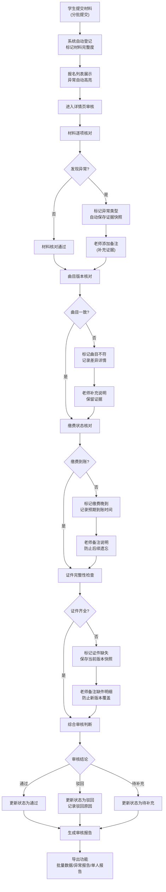

## 1. 产品概述

乐器考级报名审核本地Web工作台，解决学生报名材料分批提交导致的审核漏项问题，特别是曲目版本不符、缴费晚到、证件缺失等高频风险点。通过统一后端数据，将列表、详情、修正、历史、下载功能串联，保留完整审核证据链，确保日常处理与事后复盘口径一致。

- 核心用户：考级机构运营人员、审核老师
- 核心价值：杜绝审核漏项、保留证据链、输出通俗易懂的审核报告
- 目标市场：各类音乐考级机构的内部运营管理

## 2. 核心 Features

### 2.1 用户角色

| 角色 | 注册方式 | 核心权限 |
|------|----------|----------|
| 运营人员 | 本地账号 | 报名列表查看、状态更新、批量导出、异常查看、报告生成 |
| 审核老师 | 本地账号 | 详情审核、备注补充、曲目核对、缴费确认、证件查验 |

### 2.2 功能模块

1. **报名列表页**：报名总览、状态筛选、搜索、批量操作、异常提示
2. **报名详情页**：材料清单、曲目核对、缴费记录、证件查验、老师备注、证据快照
3. **修正功能**：信息修改、状态流转、操作留痕、历史版本对比
4. **历史记录页**：完整操作日志、版本快照、变更对比、操作人追溯
5. **导出与报告**：批量导出Excel、异常汇总报告、单份审核报告（人话版）

### 2.3 页面详情

| 页面名称 | 模块名称 | 功能描述 |
|----------|----------|----------|
| 报名列表页 | 数据筛选区 | 按考试级别、报名状态、提交日期、异常类型筛选 |
| 报名列表页 | 报名表格 | 学生基本信息、报名状态、材料完整度、异常标记、操作按钮 |
| 报名列表页 | 批量操作区 | 批量导出、批量状态更新、异常批量标记 |
| 报名列表页 | 异常提示栏 | 高亮显示缴费晚到、曲目不符、证件缺失等异常 |
| 报名详情页 | 学生信息卡 | 姓名、性别、身份证号、报考级别、指导老师 |
| 报名详情页 | 材料清单区 | 报名表、曲目版本页、缴费回执、证件照片的提交状态与预览 |
| 报名详情页 | 曲目核对区 | 报名曲目 vs 实际曲目对比、版本差异标记、老师审核意见 |
| 报名详情页 | 缴费确认区 | 缴费金额、到账时间、缴费凭证、晚到标记、滞纳金记录 |
| 报名详情页 | 证件查验区 | 身份证、考级证书、照片等证件的完整性与有效期检查 |
| 报名详情页 | 老师备注区 | 补充说明、证据留痕、与系统结论不一致时的人工说明 |
| 报名详情页 | 操作按钮区 | 通过、驳回、修正、补充材料、生成报告 |
| 历史记录页 | 时间线 | 按时间顺序展示所有操作记录、操作人、操作内容 |
| 历史记录页 | 版本对比 | 任意两个版本的数据差异对比高亮 |
| 历史记录页 | 证据快照 | 每次修改时自动保存的材料快照，防止新版本覆盖 |
| 导出与报告 | 批量导出 | 按筛选条件导出报名数据Excel |
| 导出与报告 | 异常报告 | 汇总所有异常报名，分类统计与详情列表 |
| 导出与报告 | 审核报告 | 单份报名的完整审核报告，用通俗语言说明不通过原因 |

## 3. 核心流程

### 报名审核主流程

学生分批提交报名材料（报名表、曲目版本、缴费回执、证件），系统自动标记材料完整度，运营人员在列表页查看所有报名，点击进入详情页逐项核对。遇到曲目不符、缴费晚到、证件缺失等问题时，系统自动标记异常并保留证据快照。审核老师可添加备注作为补充证据，特别是当系统结论与人工判断不一致时。审核完成后生成状态更新，事后可批量导出数据和异常报告进行复盘，也可生成通俗易懂的审核报告转给非技术同事。

## 4. 用户界面设计

### 4.1 设计风格

- **主色调**：深蓝 #1E3A5F（专业、稳重），搭配暖橙 #FF7A45（异常警示）
- **辅助色**：墨绿 #2D5A4C（通过）、深红 #C53030（驳回）、琥珀 #D69E2E（待处理）
- **按钮风格**：微立体边框、圆角8px，悬停有微妙阴影变化
- **字体**：标题用 "Noto Serif SC"（人文气息，契合音乐主题），正文用 "Inter"（清晰易读）
- **布局风格**：卡片式布局，左侧导航 + 主内容区，信息密度适中
- **图标风格**：线性图标，辅以音乐元素装饰（五线谱、音符等 subtle 元素）

### 4.2 页面设计概述

| 页面名称 | 模块名称 | UI 元素 |
|----------|----------|----------|
| 报名列表页 | 顶部筛选区 | 深色背景，圆角下拉选择器，搜索框带放大镜图标 |
| 报名列表页 | 数据表格 | 斑马纹行，异常行带橙色背景高亮，状态标签带颜色编码 |
| 报名列表页 | 异常提示栏 | 顶部横幅，图标+文字，点击可筛选对应异常 |
| 报名详情页 | 学生信息卡 | 左侧头像区，右侧信息网格，关键信息加粗 |
| 报名详情页 | 材料进度条 | 四色进度条，分别对应四类材料，鼠标悬停显示详情 |
| 报名详情页 | 曲目对比区 | 左右两栏对比布局，差异处红色高亮，连接线标识 |
| 报名详情页 | 证据快照区 | 时间轴卡片，可展开查看历史版本，缩略图预览 |
| 报名详情页 | 老师备注区 | 浅黄色背景，带老师签名和时间戳，不可删除 |
| 历史记录页 | 时间线 | 左侧垂直线+圆点，右侧操作卡片，颜色区分操作类型 |
| 报告预览页 | 报告卡片 | 白色背景，大号标题，通俗语言解释，避免技术术语 |

### 4.3 响应式设计

- 采用桌面优先设计，主内容区最小宽度 1280px
- 中屏（>1024px）：保持双栏布局，适当缩小间距
- 平板（>768px）：单栏布局，导航折叠为汉堡菜单
- 不强制支持手机端，主要面向桌面办公场景

### 4.4 动效设计

- 页面加载：卡片依次淡入，stagger 动画 50ms 间隔
- 状态切换：颜色渐变过渡 300ms，配合轻微缩放
- 异常标记：脉冲动画吸引注意，但不干扰正常操作
- 展开/收起：高度平滑过渡，配合旋转箭头图标
- 证据快照：悬停时轻微放大 1.02 倍，阴影加深
