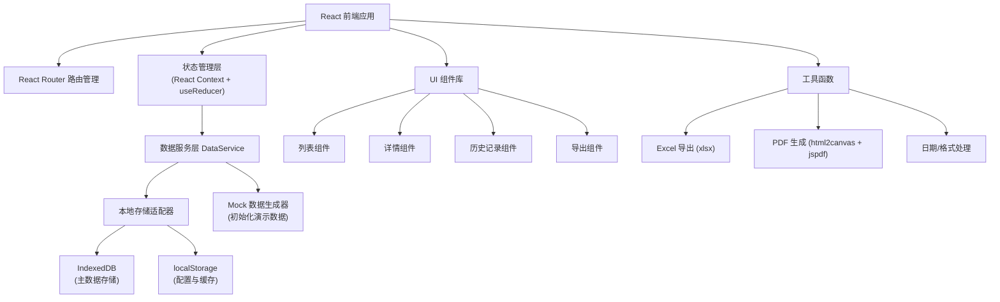
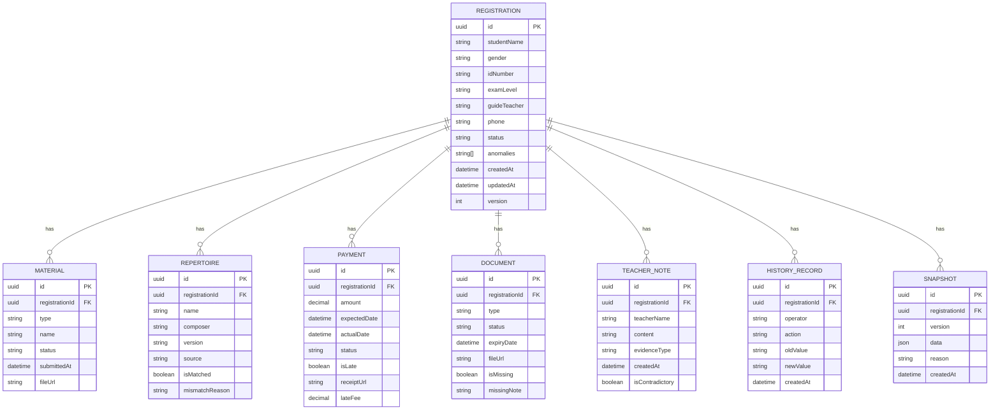

## 1. 架构设计

本系统采用前端单页应用 + 本地数据存储的架构，适合考级机构内部本地使用。所有数据操作通过统一的数据服务层完成，确保列表、详情、修正、历史、下载功能使用同一份数据源，保证数据一致性。



## 2. 技术描述

- **前端框架**：React@18.2.0 + TypeScript@5
- **构建工具**：Vite@5
- **样式方案**：TailwindCSS@3.4 + CSS Variables
- **路由管理**：React Router DOM@6
- **状态管理**：React Context + useReducer（轻量，适合本地应用）
- **本地数据存储**：IndexedDB（idb@8 封装）
- **图标库**：Lucide React（线性图标，契合设计风格）
- **Excel导出**：xlsx@0.18
- **PDF导出**：jspdf@2.5 + html2canvas@1.4
- **日期处理**：dayjs@1.11
- **后端**：无（纯前端本地应用，所有数据存储在浏览器本地）
- **数据库**：IndexedDB（本地浏览器存储）+ Mock数据初始化

### 设计考量

1. **本地优先**：考虑到考级机构可能需要离线使用、数据敏感性，采用纯前端架构，数据不离开本地
2. **数据一致性**：所有组件通过统一的 DataService 访问数据，避免多源数据不一致
3. **证据保留**：每次修改自动创建版本快照，历史数据不可删除，只可追加
4. **导入导出**：支持数据的完整导入导出，便于机构间数据迁移和备份

## 3. 路由定义

| 路由路径 | 页面名称 | 功能说明 |
|----------|----------|----------|
| `/` | 报名列表页 | 默认首页，展示所有报名记录，支持筛选、搜索、批量操作 |
| `/registration/:id` | 报名详情页 | 展示单条报名的完整信息，支持审核操作 |
| `/registration/:id/history` | 历史记录页 | 展示报名的完整操作历史和版本快照 |
| `/export` | 导出中心 | 批量数据导出、异常报告生成、审核报告预览与下载 |
| `/settings` | 系统设置 | 数据备份与恢复、导出格式配置、用户管理（本地） |

## 4. 数据模型

### 4.1 实体关系图



### 4.2 数据定义语言（TypeScript 类型）

```typescript
// 报名状态枚举
type RegistrationStatus = 
  | 'pending'      // 待审核
  | 'materials_incomplete'  // 材料不齐
  | 'reviewing'    // 审核中
  | 'repertoire_mismatch'   // 曲目不符
  | 'payment_late' // 缴费晚到
  | 'document_missing'      // 证件缺失
  | 'passed'       // 审核通过
  | 'rejected'     // 审核驳回
  | 'supplement'   // 待补充材料

// 异常类型
type AnomalyType = 
  | 'repertoire_mismatch'
  | 'payment_late'
  | 'document_missing'
  | 'teacher_contradiction'
  | 'material_incomplete'

// 报名主记录
interface Registration {
  id: string
  studentName: string
  gender: 'male' | 'female'
  idNumber: string
  examLevel: '1' | '2' | '3' | '4' | '5' | '6' | '7' | '8' | '9' | '10'
  guideTeacher: string
  phone: string
  status: RegistrationStatus
  anomalies: AnomalyType[]
  createdAt: string
  updatedAt: string
  version: number
}

// 材料记录
interface Material {
  id: string
  registrationId: string
  type: 'application_form' | 'repertoire_page' | 'payment_receipt' | 'photo'
  name: string
  status: 'submitted' | 'pending' | 'rejected'
  submittedAt: string
  fileUrl?: string
}

// 曲目记录
interface Repertoire {
  id: string
  registrationId: string
  name: string
  composer: string
  version: string
  source: 'application' | 'actual'
  isMatched: boolean
  mismatchReason?: string
}

// 缴费记录
interface Payment {
  id: string
  registrationId: string
  amount: number
  expectedDate: string
  actualDate?: string
  status: 'pending' | 'paid' | 'overdue'
  isLate: boolean
  receiptUrl?: string
  lateFee?: number
}

// 证件记录
interface Document {
  id: string
  registrationId: string
  type: 'id_card' | 'previous_certificate' | 'photo' | 'other'
  status: 'valid' | 'expired' | 'missing'
  expiryDate?: string
  fileUrl?: string
  isMissing: boolean
  missingNote?: string
}

// 老师备注
interface TeacherNote {
  id: string
  registrationId: string
  teacherName: string
  content: string
  evidenceType: 'repertoire' | 'payment' | 'document' | 'other'
  createdAt: string
  isContradictory: boolean  // 是否与系统结论不一致
}

// 历史记录
interface HistoryRecord {
  id: string
  registrationId: string
  operator: string
  action: string
  oldValue?: string
  newValue?: string
  createdAt: string
}

// 版本快照
interface Snapshot {
  id: string
  registrationId: string
  version: number
  data: Record<string, any>
  reason: string
  createdAt: string
}
```

### 4.3 数据库初始化（IndexedDB）

```typescript
// 数据库配置
const DB_CONFIG = {
  name: 'ExamRegistrationDB',
  version: 1,
  stores: {
    registrations: { keyPath: 'id', indexes: ['status', 'examLevel', 'createdAt'] },
    materials: { keyPath: 'id', indexes: ['registrationId', 'type'] },
    repertoires: { keyPath: 'id', indexes: ['registrationId', 'source'] },
    payments: { keyPath: 'id', indexes: ['registrationId', 'status'] },
    documents: { keyPath: 'id', indexes: ['registrationId', 'type', 'status'] },
    teacherNotes: { keyPath: 'id', indexes: ['registrationId', 'createdAt'] },
    historyRecords: { keyPath: 'id', indexes: ['registrationId', 'createdAt'] },
    snapshots: { keyPath: 'id', indexes: ['registrationId', 'version'] },
  }
}
```

## 5. 核心模块设计

### 5.1 DataService 层

统一的数据访问接口，所有组件必须通过此层访问数据：

```typescript
interface DataService {
  // 报名记录 CRUD
  getRegistrations(filter?: FilterOptions): Promise<Registration[]>
  getRegistration(id: string): Promise<Registration | null>
  createRegistration(data: Partial<Registration>): Promise<Registration>
  updateRegistration(id: string, data: Partial<Registration>, operator: string, reason: string): Promise<Registration>
  
  // 材料管理
  getMaterials(registrationId: string): Promise<Material[]>
  updateMaterial(id: string, data: Partial<Material>): Promise<Material>
  
  // 曲目核对
  getRepertoires(registrationId: string): Promise<Repertoire[]>
  compareRepertoires(registrationId: string): Promise<{ matched: boolean; differences: string[] }>
  
  // 缴费管理
  getPayment(registrationId: string): Promise<Payment | null>
  confirmPayment(id: string, actualDate: string): Promise<Payment>
  
  // 证件管理
  getDocuments(registrationId: string): Promise<Document[]>
  
  // 老师备注
  getTeacherNotes(registrationId: string): Promise<TeacherNote[]>
  addTeacherNote(registrationId: string, note: Omit<TeacherNote, 'id' | 'registrationId' | 'createdAt'>): Promise<TeacherNote>
  
  // 历史记录
  getHistory(registrationId: string): Promise<HistoryRecord[]>
  
  // 快照管理
  getSnapshots(registrationId: string): Promise<Snapshot[]>
  getSnapshotDiff(snapshotId1: string, snapshotId2: string): Promise<DiffResult>
  
  // 导出功能
  exportToExcel(ids: string[]): Promise<Blob>
  exportAnomalyReport(filter?: FilterOptions): Promise<Blob>
  generateAuditReport(id: string): Promise<{ html: string; plainText: string }>
  
  // 数据备份
  exportAllData(): Promise<Blob>
  importAllData(blob: Blob): Promise<void>
}
```

### 5.2 状态管理

使用 React Context + useReducer 管理全局状态，确保数据一致性：

```typescript
interface AppState {
  registrations: Registration[]
  currentRegistration: Registration | null
  filters: FilterOptions
  loading: boolean
  error: string | null
}

type Action =
  | { type: 'SET_REGISTRATIONS'; payload: Registration[] }
  | { type: 'SET_CURRENT'; payload: Registration | null }
  | { type: 'UPDATE_REGISTRATION'; payload: Registration }
  | { type: 'SET_FILTERS'; payload: Partial<FilterOptions> }
  | { type: 'SET_LOADING'; payload: boolean }
  | { type: 'SET_ERROR'; payload: string | null }
```

### 5.3 审核报告生成（人话版）

核心转换逻辑，将技术状态转换为通俗语言：

```typescript
const REPORT_TEMPLATES: Record<RegistrationStatus, { title: string; reason: string; suggestion: string }> = {
  repertoire_mismatch: {
    title: '曲目版本不符',
    reason: (data) => `报名时填写的《${data.appliedPiece}》与实际提交的《${data.actualPiece}》不是同一个曲目版本。具体差异：${data.differences}`,
    suggestion: '请确认学生实际演奏的曲目，并与指导老师核对是否需要更换报考曲目或补充说明材料。'
  },
  payment_late: {
    title: '缴费未按时到账',
    reason: (data) => `应缴费用 ${data.amount} 元，应到账日期为 ${data.expectedDate}，但截至今日尚未到账。`,
    suggestion: '请联系学生家长确认缴费情况，如已缴费请提供缴费凭证；如未缴费请提醒尽快缴纳，避免影响考试资格。'
  },
  document_missing: {
    title: '证件材料不完整',
    reason: (data) => `缺少以下证件：${data.missingDocuments.join('、')}。`,
    suggestion: '请尽快补充缺失的证件材料，所有证件必须在有效期内。'
  }
}
```
