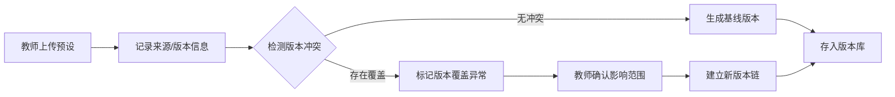
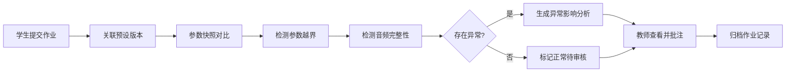

## 1. 产品概述

面向电子音乐教学场景的音色预设版本管理系统，解决参数快照与教师批注冲突、版本追溯混乱等问题。通过集中管理预设文件、参数快照和作业记录，实现版本可追溯、异常可检测、结果可回放。

- **核心问题**：参数快照与教师批注频繁冲突，版本来源不明确，参数越界/版本覆盖等异常无法及时发现
- **目标用户**：电子音乐教师、学生、教学管理人员
- **产品价值**：建立稳定的版本管理基线，让每一次参数调整都有迹可循，异常问题清晰可查

## 2. 核心功能

### 2.1 用户角色

| 角色 | 注册方式 | 核心权限 |
|------|----------|----------|
| 教师 | 账号登录 | 预设导入、版本审核、异常标注、批注管理 |
| 学生 | 账号登录 | 作业提交、参数快照上传、版本对比查看 |
| 管理员 | 账号登录 | 用户管理、系统配置、数据统计 |

### 2.2 功能模块

1. **预设版本库首页**：概览统计、最近版本、异常告警、快速操作
2. **预设管理页**：预设文件上传、版本列表、来源信息、版本详情
3. **参数快照页**：快照导入、参数对比、越界检测、历史追溯
4. **作业管理页**：作业记录、关联预设/快照、批注管理
5. **版本对比页**：多版本参数对比、差异高亮、异常说明
6. **测试沙箱页**：隔离环境测试、结果预览、重复运行验证

### 2.3 页面详情

| 页面名称 | 模块名称 | 功能描述 |
|----------|----------|----------|
| 预设版本库首页 | 数据概览 | 显示预设总数、版本数量、异常数量、作业数量统计卡片 |
| 预设版本库首页 | 最近活动 | 时间线展示最近的版本导入、快照提交、异常检测记录 |
| 预设版本库首页 | 异常告警 | 高亮显示待处理的版本覆盖、参数越界、音频缺失告警 |
| 预设管理页 | 预设上传 | 支持拖拽上传预设文件，自动提取元数据、记录来源信息 |
| 预设管理页 | 版本列表 | 树形展示预设的所有历史版本，标记版本覆盖关系 |
| 预设管理页 | 版本详情 | 展示版本的完整参数、来源、创建时间、关联快照和作业 |
| 参数快照页 | 快照导入 | 导入学生提交的参数快照，自动关联对应预设版本 |
| 参数快照页 | 参数对比 | 与基线版本逐参数对比，高亮显示差异项 |
| 参数快照页 | 越界检测 | 自动检测参数是否在合理范围内，标记越界参数及影响 |
| 作业管理页 | 作业列表 | 展示所有作业记录，关联预设、快照、音频文件 |
| 作业管理页 | 批注管理 | 教师对作业添加批注，关联具体参数项 |
| 版本对比页 | 多版本对比 | 支持2-3个版本并行对比，参数差异清晰标记 |
| 版本对比页 | 异常分析 | 分析版本覆盖、参数越界对结果的具体影响 |
| 测试沙箱页 | 隔离测试 | 在独立目录中运行测试，不影响正式数据 |
| 测试沙箱页 | 幂等验证 | 验证同一批文件重复运行结果一致性 |

## 3. 核心流程

### 3.1 预设版本管理流程

教师上传音色预设文件 → 系统自动记录来源和版本信息 → 生成初始基线版本 → 后续导入时自动检测是否覆盖 → 若检测到版本覆盖则标记异常 → 教师确认后建立新版本链

### 3.2 作业提交与异常检测流程

学生上传参数快照 + 音频文件 + 作业记录 → 系统关联对应预设版本 → 执行参数对比 → 检测参数越界 → 检测音频缺失 → 生成异常报告 → 教师审核批注

### 3.3 问题追溯流程

从作业结果出发 → 查看关联的参数快照 → 追溯到预设版本 → 对比版本差异 → 回放对应音频 → 联系相关人员确认

## 4. 用户界面设计

### 4.1 设计风格

- **主色调**：深靛蓝 (#1e3a5f) 作为主色，代表专业和稳定；电子紫 (#7c3aed) 作为强调色，呼应电子音乐主题
- **辅助色**：警告橙 (#f59e0b) 标记参数越界，危险红 (#ef4444) 标记版本覆盖，成功绿 (#10b981) 标记正常状态
- **背景**：深色模式为主，深蓝灰渐变背景 (#0f172a → #1e293b)，营造专业音频工作站氛围
- **按钮风格**：微圆角 (6px)，悬停时有微妙的发光效果，按下时有轻微凹陷感
- **字体**：标题使用 Space Grotesk（现代感强），正文使用 Inter（清晰易读），等宽数据使用 JetBrains Mono（参数对比更清晰）
- **布局风格**：卡片式布局，清晰的层级划分，左侧导航 + 主内容区 + 右侧详情面板
- **图标风格**：线性图标，使用 Remix Icon 库，保持简洁现代感
- **装饰元素**：微妙的网格背景、音频波形装饰、参数滑块样式的进度条

### 4.2 页面设计概述

| 页面名称 | 模块名称 | UI 元素 |
|----------|----------|---------|
| 预设版本库首页 | 数据概览 | 渐变统计卡片，带微妙的音频波形动效，数字动画递增 |
| 预设版本库首页 | 异常告警 | 醒目的告警卡片，颜色编码异常类型，可展开查看详情 |
| 预设管理页 | 版本列表 | 树形结构，版本节点用连接线表示继承关系，覆盖版本用红色边框标记 |
| 参数快照页 | 参数对比 | 三列布局：基线参数 → 差异标记 → 快照参数，差异项高亮闪烁提示 |
| 参数快照页 | 越界检测 | 参数卡片带有正常/越界状态指示，越界参数显示合理范围和影响说明 |
| 版本对比页 | 多版本对比 | 可横向滚动的参数表格，差异单元格背景色区分，悬停显示详细变化 |
| 测试沙箱页 | 隔离测试 | 沙箱容器带有虚线边框和"测试环境"标识，运行结果显示幂等性验证状态 |

### 4.3 响应性

- **设计优先**：桌面端优先设计 (1280px+)，满足教师在工作室使用大屏设备的场景
- **平板适配**：1024px 断点，侧栏可收起，卡片重新排列
- **移动适配**：768px 断点，底部导航，纵向堆叠布局，触摸优化的交互区域
- **触摸优化**：最小点击区域 44x44px，滑动手势支持列表操作

### 4.4 动效设计

- **页面加载**：内容区域淡入 + 轻微上移，卡片按顺序交错出现 (stagger 100ms)
- **异常标记**：新检测到的异常有脉冲高亮动画，吸引注意力但不干扰
- **参数对比**：差异项出现时有高亮闪烁效果，从黄色渐变过渡到目标色
- **悬停效果**：卡片悬停时轻微上浮 (translateY -2px)，阴影加深
- **展开/收起**：平滑的高度过渡，内容淡入淡出

