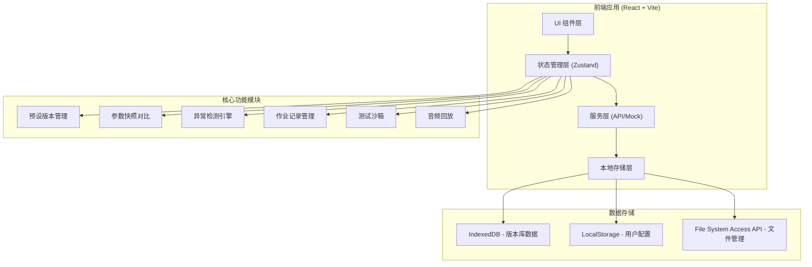
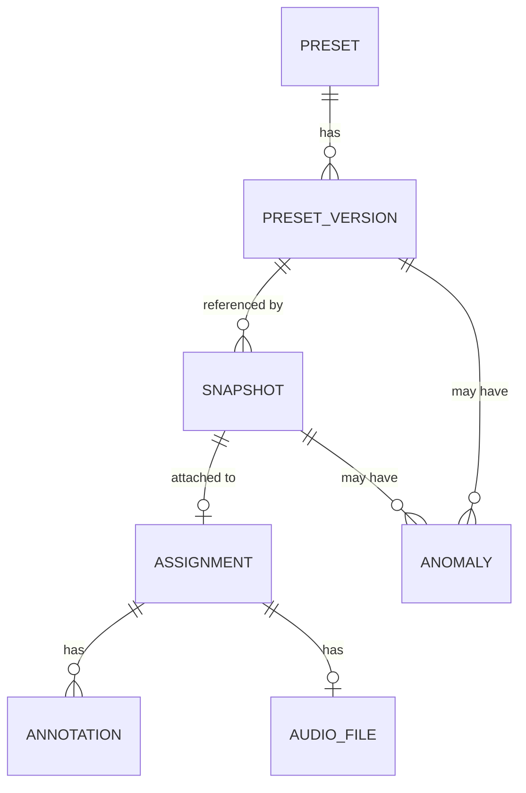

## 1. 架构设计



## 2. 技术描述

- **前端框架**: React@18.2.0 + TypeScript@5.4.0
- **构建工具**: Vite@5.2.0
- **样式方案**: TailwindCSS@3.4.0 + PostCSS
- **状态管理**: Zustand@4.5.0 (轻量级，适合复杂状态但不需要Redux的场景)
- **路由管理**: React Router@6.22.0
- **UI 组件库**: Headless UI (无样式组件，配合TailwindCSS) + Heroicons
- **数据持久化**: IndexedDB (通过 Dexie.js 封装) + LocalStorage
- **图表可视化**: Recharts (参数对比图表)
- **音频处理**: Web Audio API + WaveSurfer.js (音频波形显示和回放)
- **文件处理**: File System Access API (浏览器本地文件管理)
- **代码规范**: ESLint + Prettier

### 技术选型理由

1. **React + TypeScript**: 提供类型安全，适合复杂的参数对比和版本管理逻辑
2. **Zustand**: 轻量级状态管理，避免Redux的繁琐，同时支持中间件和devtools
3. **IndexedDB + Dexie.js**: 浏览器端数据库，可存储大量版本数据，支持复杂查询
4. **File System Access API**: 实现"在新目录里直接试"的需求，支持浏览器直接操作本地目录
5. **WaveSurfer.js**: 专业的音频波形显示，支持回放、缩放等功能，满足音频回放需求
6. **纯前端架构**: 不需要后端服务，降低部署复杂度，数据保存在用户本地，适合教学场景

## 3. 路由定义

| 路由路径 | 页面名称 | 主要功能 |
|----------|----------|----------|
| `/` | 预设版本库首页 | 数据概览、异常告警、最近活动 |
| `/presets` | 预设管理页 | 预设文件列表、版本树、上传入口 |
| `/presets/:id` | 预设详情页 | 单个预设的版本历史、参数详情、关联快照 |
| `/snapshots` | 参数快照页 | 快照列表、导入入口、对比功能 |
| `/snapshots/:id` | 快照详情页 | 快照参数、对比结果、越界检测 |
| `/assignments` | 作业管理页 | 作业列表、关联关系、批注管理 |
| `/assignments/:id` | 作业详情页 | 作业内容、关联预设/快照、音频回放 |
| `/compare` | 版本对比页 | 多版本参数对比、差异分析、异常说明 |
| `/sandbox` | 测试沙箱页 | 隔离测试、幂等性验证、结果预览 |

## 4. 数据模型

### 4.1 数据实体关系



### 4.2 实体定义

**预设 (Preset)**
```typescript
interface Preset {
  id: string;
  name: string;
  description: string;
  pluginName: string;        // 插件名称 (如 Serum, Massive)
  category: string;          // 音色分类 (贝斯、主音、鼓组等)
  createdAt: number;
  updatedAt: number;
  source: string;            // 来源 (教师创建/学生提交/外部导入)
  authorId: string;
  authorName: string;
  currentVersionId: string;
  tags: string[];
}
```

**预设版本 (PresetVersion)**
```typescript
interface PresetVersion {
  id: string;
  presetId: string;
  versionNumber: string;     // 语义化版本 (如 1.0.0, 1.1.0)
  parentVersionId: string | null;  // 父版本，用于版本链
  name: string;
  description: string;
  parameters: PresetParameter[];
  fileHash: string;          // 文件哈希，用于检测重复
  fileSize: number;
  createdAt: number;
  createdBy: string;
  sourceInfo: SourceInfo;    // 来源信息
  isOverride: boolean;       // 是否覆盖了现有版本
  overrideReason: string;    // 覆盖原因
}

interface PresetParameter {
  id: string;
  name: string;
  path: string;              // 参数路径 (如 Oscillator/1/Frequency)
  value: number;
  minValue: number;
  maxValue: number;
  unit: string;              // 单位 (Hz, dB, %, ms等)
  type: 'number' | 'boolean' | 'select';
  options?: string[];        // 选择类型的选项
}

interface SourceInfo {
  type: 'upload' | 'import' | 'snapshot' | 'manual';
  fileName: string;
  fileType: string;
  uploadDate: number;
  importedFrom?: string;     // 从哪个系统导入
  originalVersion?: string;  // 原始版本号
}
```

**参数快照 (Snapshot)**
```typescript
interface Snapshot {
  id: string;
  name: string;
  presetVersionId: string;   // 关联的预设版本
  presetName: string;
  parameters: SnapshotParameter[];
  createdAt: number;
  createdBy: string;
  creatorName: string;
  assignmentId?: string;     // 关联的作业
  notes: string;
  comparisonResult?: ComparisonResult;
}

interface SnapshotParameter {
  parameterId: string;       // 对应 PresetParameter.id
  name: string;
  path: string;
  value: number;
  isModified: boolean;       // 与基线相比是否修改
  isOutOfBounds: boolean;    // 是否越界
  boundsStatus: 'normal' | 'below_min' | 'above_max';
}

interface ComparisonResult {
  totalParameters: number;
  modifiedCount: number;
  outOfBoundsCount: number;
  anomalies: Anomaly[];
  comparedAt: number;
}
```

**作业 (Assignment)**
```typescript
interface Assignment {
  id: string;
  title: string;
  description: string;
  studentId: string;
  studentName: string;
  teacherId: string;
  teacherName: string;
  snapshotId: string;
  presetVersionId: string;
  audioFileId?: string;
  createdAt: number;
  submittedAt: number;
  status: 'submitted' | 'reviewing' | 'approved' | 'rejected';
  annotations: Annotation[];
  grade?: string;
  feedback?: string;
}

interface Annotation {
  id: string;
  assignmentId: string;
  parameterId?: string;      // 关联到具体参数
  parameterPath?: string;
  authorId: string;
  authorName: string;
  authorRole: 'teacher' | 'student';
  content: string;
  createdAt: number;
  isResolved: boolean;
}
```

**异常 (Anomaly)**
```typescript
interface Anomaly {
  id: string;
  type: 'version_override' | 'parameter_out_of_bounds' | 'audio_missing' | 'mismatch';
  severity: 'critical' | 'warning' | 'info';
  status: 'open' | 'acknowledged' | 'resolved';
  entityType: 'preset_version' | 'snapshot' | 'assignment';
  entityId: string;
  entityName: string;
  description: string;
  affectedItems: AffectedItem[];  // 影响的结果项
  impactExplanation: string;      // 影响说明
  detectedAt: number;
  detectedBy: string;
  resolvedAt?: number;
  resolverId?: string;
  resolutionNotes?: string;
}

interface AffectedItem {
  id: string;
  type: 'parameter' | 'snapshot' | 'assignment' | 'audio';
  name: string;
  path?: string;
  description: string;
}
```

**音频文件 (AudioFile)**
```typescript
interface AudioFile {
  id: string;
  name: string;
  fileName: string;
  fileType: string;
  fileSize: number;
  duration: number;            // 时长(秒)
  sampleRate: number;
  bitDepth: number;
  channels: number;
  dataUrl: string;             // 本地存储的URL
  fileHash: string;
  uploadedAt: number;
  uploadedBy: string;
  assignmentId?: string;
}
```

### 4.3 异常检测规则

**版本覆盖检测**
- 当导入的预设文件与现有版本的 fileHash 相同但版本号不同
- 当导入的预设参数与现有版本差异超过阈值但版本号未递增
- 检测到覆盖时，自动标记并生成影响分析：列出所有关联的快照和作业

**参数越界检测**
- 快照参数值 < 参数 minValue → 标记为 below_min
- 快照参数值 > 参数 maxValue → 标记为 above_max
- 生成影响说明：解释该参数越界可能对音色产生的影响
- 关联所有使用该快照的作业

**音频缺失检测**
- 作业提交但没有关联的音频文件
- 音频文件损坏或无法解码
- 标记并说明对作业评审的影响

## 5. 核心功能实现方案

### 5.1 测试沙箱与幂等性

```typescript
// 沙箱目录结构
interface Sandbox {
  id: string;
  name: string;
  createdAt: number;
  path: string;               // 本地目录路径 (通过 File System Access API)
  status: 'idle' | 'running' | 'completed' | 'error';
  runs: SandboxRun[];
}

interface SandboxRun {
  id: string;
  sandboxId: string;
  runNumber: number;
  startTime: number;
  endTime?: number;
  inputFiles: string[];       // 输入文件列表
  outputFiles: string[];      // 输出文件列表
  results: SandboxResult[];
  isIdempotent?: boolean;     // 与上一次运行结果是否一致
  diffFromPrevious?: SandboxDiff[];
}

interface SandboxResult {
  id: string;
  presetVersionId: string;
  parameters: Record<string, number>;
  outputHash: string;         // 输出文件哈希
  anomalies: Anomaly[];
}

// 幂等性验证：对比两次运行的输出哈希和参数
interface SandboxDiff {
  type: 'parameter' | 'output' | 'anomaly';
  name: string;
  expected: any;
  actual: any;
}
```

### 5.2 版本对比算法

```typescript
interface VersionDiff {
  parameterId: string;
  parameterName: string;
  parameterPath: string;
  baselineValue: number;
  comparedValue: number;
  difference: number;         // 差值
  percentage: number;         // 变化百分比
  isSignificant: boolean;     // 是否为显著变化
  isOutOfBounds: boolean;
  boundsStatus: 'normal' | 'below_min' | 'above_max';
}

function compareVersions(
  baseline: PresetParameter[],
  compared: PresetParameter[],
  significantThreshold: number = 5 // 5% 以上视为显著变化
): VersionDiff[] {
  // 1. 按参数路径匹配
  // 2. 计算数值差异和百分比
  // 3. 检查是否越界
  // 4. 标记显著变化
}
```

## 6. 状态管理设计 (Zustand Store)

```typescript
interface AppState {
  // 预设管理
  presets: Preset[];
  currentPreset: Preset | null;
  presetVersions: Record<string, PresetVersion[]>;
  
  // 快照管理
  snapshots: Snapshot[];
  currentSnapshot: Snapshot | null;
  
  // 作业管理
  assignments: Assignment[];
  currentAssignment: Assignment | null;
  
  // 异常管理
  anomalies: Anomaly[];
  
  // 音频文件
  audioFiles: AudioFile[];
  
  // 沙箱
  sandboxes: Sandbox[];
  currentSandbox: Sandbox | null;
  
  // UI 状态
  loading: boolean;
  sidebarCollapsed: boolean;
  activeTab: string;
  
  // Actions
  loadPresets: () => Promise<void>;
  addPreset: (preset: Omit<Preset, 'id'>) => Promise<string>;
  addPresetVersion: (version: Omit<PresetVersion, 'id'>) => Promise<string>;
  importSnapshot: (file: File, presetVersionId: string) => Promise<string>;
  compareWithBaseline: (snapshotId: string) => Promise<ComparisonResult>;
  detectAnomalies: (entityType: string, entityId: string) => Promise<Anomaly[]>;
  createSandbox: (name: string, directoryHandle: any) => Promise<string>;
  runSandbox: (sandboxId: string, inputFiles: File[]) => Promise<SandboxRun>;
  generateImpactExplanation: (anomaly: Anomaly) => string;
}
```

## 7. 项目目录结构

```
src/
├── components/          # 通用组件
│   ├── layout/         # 布局组件 (Sidebar, Header, Content)
│   ├── ui/             # 基础UI组件 (Button, Card, Modal, Table)
│   └── features/       # 功能组件
│       ├── preset/
│       ├── snapshot/
│       ├── assignment/
│       ├── anomaly/
│       ├── compare/
│       ├── sandbox/
│       └── audio/
├── pages/              # 页面组件
│   ├── Dashboard.tsx
│   ├── Presets.tsx
│   ├── PresetDetail.tsx
│   ├── Snapshots.tsx
│   ├── SnapshotDetail.tsx
│   ├── Assignments.tsx
│   ├── AssignmentDetail.tsx
│   ├── Compare.tsx
│   └── Sandbox.tsx
├── store/              # Zustand stores
│   ├── useAppStore.ts
│   ├── usePresetStore.ts
│   ├── useSnapshotStore.ts
│   └── useSandboxStore.ts
├── services/           # 业务逻辑服务
│   ├── presetService.ts
│   ├── snapshotService.ts
│   ├── anomalyService.ts
│   ├── comparisonService.ts
│   ├── sandboxService.ts
│   └── audioService.ts
├── db/                 # 数据库层 (Dexie.js)
│   ├── index.ts
│   └── schema.ts
├── types/              # TypeScript 类型定义
│   └── index.ts
├── utils/              # 工具函数
│   ├── fileUtils.ts
│   ├── hashUtils.ts
│   ├── parameterUtils.ts
│   └── anomalyUtils.ts
├── hooks/              # 自定义 Hooks
│   ├── useAnomalyDetection.ts
│   ├── useComparison.ts
│   └── useAudioPlayer.ts
├── data/               # Mock 数据
│   ├── mockPresets.ts
│   ├── mockSnapshots.ts
│   ├── mockAssignments.ts
│   └── mockAnomalies.ts
├── styles/             # 全局样式
│   └── index.css
├── App.tsx
├── main.tsx
└── router.tsx
```

## 8. 开发阶段优先级

### Phase 1: 核心功能 (必须)
1. 数据模型定义和数据库初始化
2. 预设版本管理（上传、列表、详情）
3. 参数快照导入和版本对比
4. 异常检测引擎（版本覆盖、参数越界）
5. 作业记录管理
6. 首页概览

### Phase 2: 增强功能 (应该有)
1. 测试沙箱和隔离测试
2. 幂等性验证
3. 音频文件管理和回放
4. 多版本并行对比
5. 批注系统

### Phase 3: 优化功能 (可以有)
1. 版本树可视化
2. 参数变化趋势图表
3. 导出报告功能
4. 批量操作
5. 高级搜索和筛选
