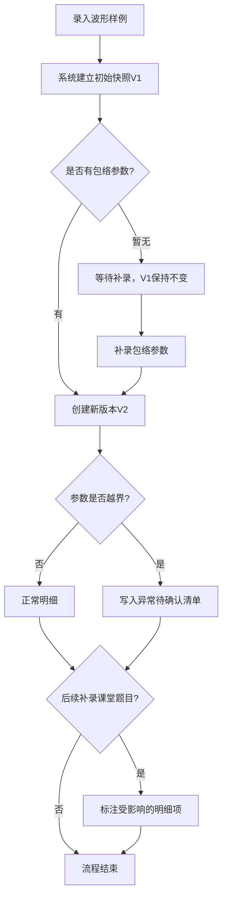
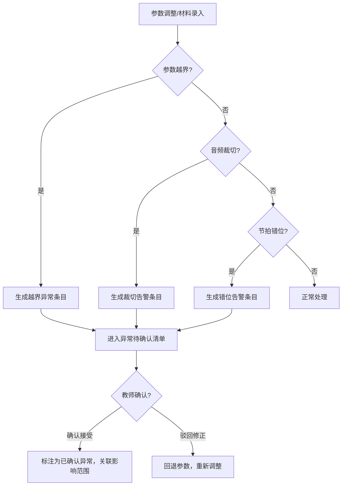
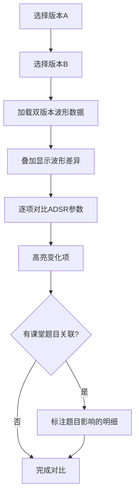

## 1. 产品概述

合成器包络教学器是面向音乐科技教师的专业教学辅助工具，核心解决波形样例与包络参数增量录入时的数据一致性、异常隔离和版本追溯问题。工具确保波形样例先到时建立的判断不被后续补录材料覆盖，参数越界/音频裁切/节拍错位进入独立待确认清单，包络参数联动变化后音频预览与历史对比同步更新，课堂题目补录时自动标注受影响的明细项。

- 目标用户：音乐科技课程教师、合成器音色设计教学人员
- 核心价值：让教学材料从"脏数据"到"可追溯结论"的过程透明可控，避免异常混入正常明细悄悄结束

## 2. 核心功能

### 2.1 用户角色

| 角色 | 注册方式 | 核心权限 |
|------|----------|----------|
| 教师 | 无需注册，单用户模式 | 全部操作权限：录入材料、调整参数、标注异常、补录题目 |

### 2.2 功能模块

1. **工作台页面**：波形显示区、包络参数控制面板、音频预览播放器、版本时间线
2. **异常待确认页面**：参数越界清单、音频裁切告警、节拍错位告警、待确认/已确认状态管理
3. **版本对比页面**：双版本波形叠加对比、参数差异高亮、课堂题目影响标注

### 2.3 页面明细

| 页面名称 | 模块名称 | 功能描述 |
|----------|----------|----------|
| 工作台 | 波形显示区 | 展示当前波形样例，支持缩放平移，叠加包络曲线可视化 |
| 工作台 | 包络参数面板 | ADSR 四段参数滑块（Attack/Decay/Sustain/Release），参数越界时实时标红并生成异常条目 |
| 工作台 | 音频预览播放器 | Web Audio API 实时合成音频预览，参数变化后自动重新合成 |
| 工作台 | 版本时间线 | 水平时间线展示所有历史版本节点，点击切换版本，显示版本元信息 |
| 工作台 | 课堂题目区 | 补录课堂题目时，自动关联受影响的明细项并标注 |
| 异常待确认 | 异常清单 | 按类型分组展示参数越界/音频裁切/节拍错位条目，支持确认/驳回操作 |
| 异常待确认 | 影响追踪 | 每条异常关联的波形样例和包络参数版本，确认后标注影响范围 |
| 版本对比 | 双版本选择器 | 左右选择两个版本进行对比 |
| 版本对比 | 波形叠加图 | 两个版本波形叠加显示，差异区域高亮 |
| 版本对比 | 参数差异表 | ADSR 参数逐项对比，变化项高亮，显示变化量 |
| 版本对比 | 题目影响标注 | 课堂题目补录后，标注该题目影响了哪些版本的哪些明细 |

## 3. 核心流程

### 3.1 材料增量录入流程

教师先录入波形样例，系统建立初始判断快照；后续补录包络参数时，系统不覆盖已有快照，而是创建新版本；补录课堂题目时，系统追溯标注受影响的已有明细项。

### 3.2 异常处理流程

### 3.3 版本对比流程

## 4. 用户界面设计

### 4.1 设计风格

- **主色调**：深色背景（近黑 #0a0a0f）+ 磷光绿（#00ff88）作为波形/活跃状态色 + 琥珀橙（#ff8800）作为异常/告警色
- **按钮风格**：圆角微凸（2px圆角），类硬件合成器旋钮/推子质感，暗面+亮边
- **字体**：显示字体使用 JetBrains Mono（等宽，适合数据/波形场景），正文字体使用 Noto Sans SC
- **布局风格**：左宽右窄分栏，左侧主波形区+参数面板，右侧版本时间线+异常摘要；顶部窄导航栏
- **图标风格**：线性图标（lucide-react），配合磷光绿描边

### 4.2 页面设计概览

| 页面名称 | 模块名称 | UI要素 |
|----------|----------|--------|
| 工作台 | 波形显示区 | 深色背景canvas，磷光绿波形线，网格线暗灰色，包络曲线用橙色虚线叠加 |
| 工作台 | 包络参数面板 | 四组竖向推子，每组含滑块+数值输入+标签，越界时滑块轨道变橙色+闪烁 |
| 工作台 | 音频预览播放器 | 底部播放条，播放/暂停/停止按钮，进度条，时长显示 |
| 工作台 | 版本时间线 | 水平滚动条，圆形版本节点+时间戳，当前版本节点放大+磷光绿高亮 |
| 工作台 | 课堂题目区 | 可折叠面板，题目列表+关联标签，新增题目时弹出输入框 |
| 异常待确认 | 异常清单 | 三列分组（越界/裁切/错位），每条含类型标签+描述+关联版本+确认/驳回按钮 |
| 异常待确认 | 影响追踪 | 点击异常条目展开影响面板，关联的波形版本+参数变化列表 |
| 版本对比 | 双版本选择器 | 两个下拉选择器，版本号+时间戳+摘要 |
| 版本对比 | 波形叠加图 | 深色canvas，两版本波形用不同颜色（绿/蓝）叠加，差异区域橙色填充 |
| 版本对比 | 参数差异表 | 四行表格（A/D/S/R），变化项橙色高亮+箭头指示方向+差值 |
| 版本对比 | 题目影响标注 | 题目卡片列表，每个卡片下方展示受影响的参数行+版本号标签 |

### 4.3 响应式设计

- 桌面优先设计，最小宽度 1024px
- 波形区和参数面板在小屏幕下纵向堆叠
- 版本时间线始终水平滚动

### 4.4 3D场景指引

不适用，本工具为2D界面。
