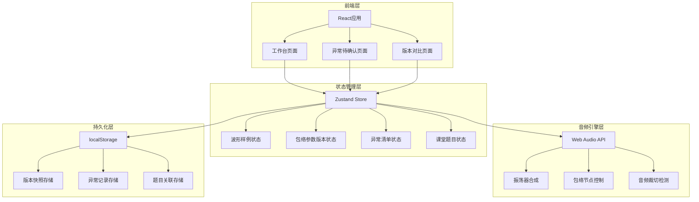
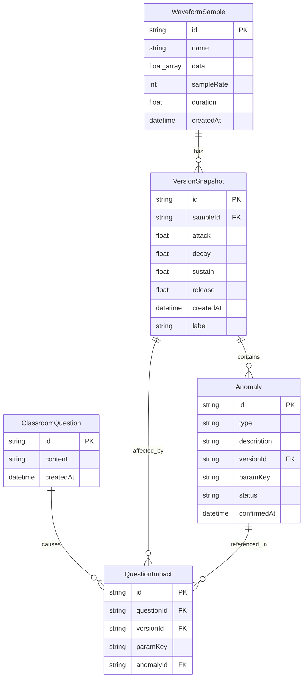

## 1. 架构设计



## 2. 技术说明

- **前端**：React@18 + TypeScript + Tailwind CSS@3 + Vite
- **初始化工具**：vite-init (react-ts 模板)
- **后端**：无（纯前端应用，数据持久化到 localStorage）
- **数据库**：无，使用 localStorage + 内存状态管理
- **音频引擎**：Web Audio API（浏览器原生），用于实时包络合成和预览
- **波形渲染**：Canvas 2D API，用于波形绘制和叠加对比
- **状态管理**：Zustand，管理波形/参数/异常/题目的增量状态

## 3. 路由定义

| 路由 | 用途 |
|------|------|
| / | 工作台主页：波形显示、包络参数控制、音频预览、版本时间线、课堂题目 |
| /anomalies | 异常待确认页面：参数越界/音频裁切/节拍错位清单 |
| /compare | 版本对比页面：双版本波形叠加、参数差异、题目影响标注 |

## 4. API定义

无后端API。所有数据通过 Zustand store 管理，持久化到 localStorage。

### 4.1 核心数据类型

```typescript
interface WaveformSample {
  id: string
  name: string
  data: Float32Array
  sampleRate: number
  duration: number
  createdAt: number
}

interface EnvelopeParams {
  attack: number
  decay: number
  sustain: number
  release: number
}

interface VersionSnapshot {
  id: string
  sampleId: string
  envelope: EnvelopeParams
  createdAt: number
  label: string
  anomalyIds: string[]
  questionIds: string[]
}

interface Anomaly {
  id: string
  type: "param_out_of_bounds" | "audio_clipping" | "beat_misalignment"
  description: string
  versionId: string
  paramKey?: keyof EnvelopeParams
  expectedRange?: [number, number]
  actualValue?: number
  status: "pending" | "confirmed" | "rejected"
  confirmedAt?: number
  affectedDetailIds: string[]
}

interface ClassroomQuestion {
  id: string
  content: string
  createdAt: number
  affectedVersionIds: string[]
  affectedParamKeys: (keyof EnvelopeParams)[]
  affectedAnomalyIds: string[]
}

interface EnvelopeState {
  samples: WaveformSample[]
  versions: VersionSnapshot[]
  anomalies: Anomaly[]
  questions: ClassroomQuestion[]
  currentVersionId: string | null
  currentSampleId: string | null
}
```

## 5. 服务端架构图

不适用，纯前端应用。

## 6. 数据模型

### 6.1 数据模型定义



### 6.2 数据定义语言

使用 localStorage 键值对存储：

- `synth-envelope:samples` → WaveformSample[] 的 JSON 序列化（data 字段使用 Array.from 转换）
- `synth-envelope:versions` → VersionSnapshot[] 的 JSON 序列化
- `synth-envelope:anomalies` → Anomaly[] 的 JSON 序列化
- `synth-envelope:questions` → ClassroomQuestion[] 的 JSON 序列化
- `synth-envelope:questionImpacts` → QuestionImpact[] 的 JSON 序列化
