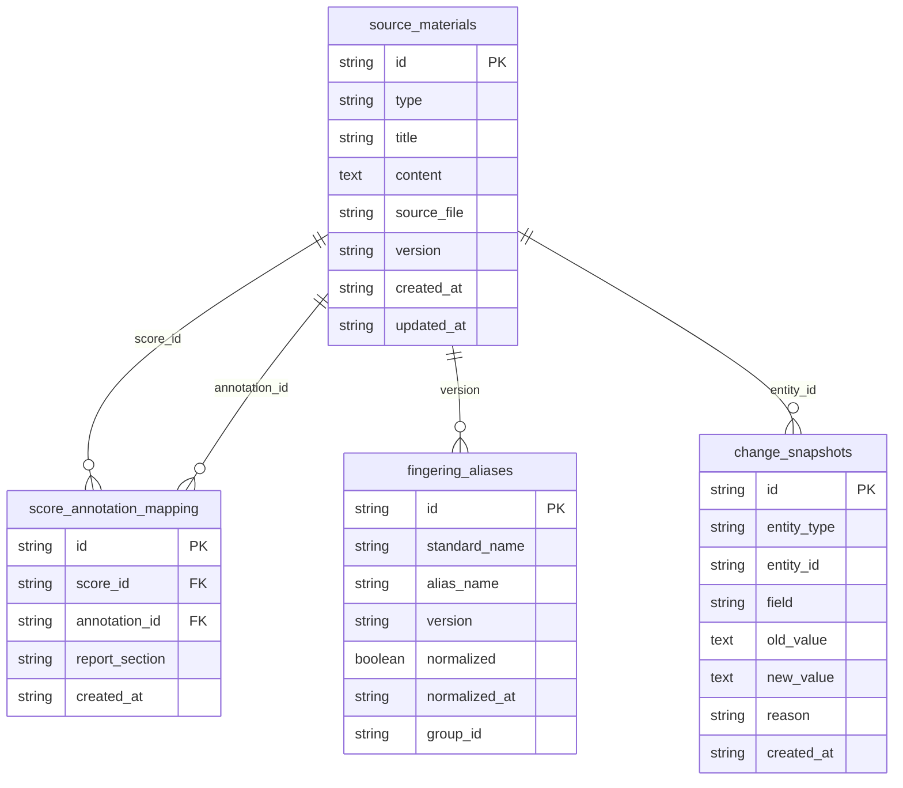

## 1. 架构设计

```mermaid
flowchart TD
    subgraph "前端层"
        "React 18 + Tailwind"
        "Zustand 状态管理"
        "React Router"
    end
    subgraph "后端层"
        "Express 4 + TypeScript"
        "指法归一服务"
        "版本对比服务"
        "片段检索服务"
        "证据导出服务"
    end
    subgraph "数据层"
        "SQLite 数据库"
        "变更快照表"
        "指法映射表"
    end
    "React 18 + Tailwind" --> "Express 4 + TypeScript"
    "Express 4 + TypeScript" --> "SQLite 数据库"
    "Zustand 状态管理" --> "React 18 + Tailwind"
    "指法归一服务" --> "指法映射表"
    "版本对比服务" --> "变更快照表"
    "证据导出服务" --> "变更快照表"
```

## 2. 技术说明

- 前端：React@18 + tailwindcss@3 + vite
- 初始化工具：vite-init
- 后端：Express@4 + TypeScript（ESM 模式）
- 数据库：SQLite（better-sqlite3），本地文件存储，无需外部服务
- 状态管理：Zustand
- 模板选择：react-express-ts

## 3. 路由定义

| 路由 | 用途 |
|------|------|
| / | 材料总览页，展示所有导入材料与溯源 |
| /normalization | 指法归一页，异名映射与变更历史 |
| /comparison | 版本对比页，双栏对比与差异标注 |
| /search | 片段检索页，跨版本检索与结果溯源 |
| /export | 证据导出页，报告生成与对应关系 |

## 4. API 定义

### 4.1 材料管理

```typescript
interface SourceMaterial {
  id: string;
  type: "score" | "annotation" | "note";
  title: string;
  content: string;
  sourceFile: string;
  version: string;
  createdAt: string;
  updatedAt: string;
}

interface ImportRequest {
  materials: SourceMaterial[];
}

interface ImportResponse {
  imported: number;
  ids: string[];
}
```

### 4.2 指法归一

```typescript
interface FingeringAlias {
  id: string;
  standardName: string;
  aliases: string[];
  version: string;
  normalized: boolean;
  normalizedAt: string | null;
}

interface NormalizeRequest {
  aliasGroupId: string;
  targetName: string;
  reason: string;
}

interface NormalizeResponse {
  success: boolean;
  affectedCount: number;
  snapshotId: string;
}
```

### 4.3 版本对比

```typescript
interface ComparisonResult {
  leftVersion: string;
  rightVersion: string;
  diffs: DiffItem[];
}

interface DiffItem {
  type: "alias" | "misalign" | "mixed";
  leftContent: string;
  rightContent: string;
  leftPosition: number;
  rightPosition: number;
  description: string;
}
```

### 4.4 片段检索

```typescript
interface SearchRequest {
  query: string;
  filters?: {
    versions?: string[];
    types?: ("score" | "annotation" | "note")[];
  };
}

interface SearchResult {
  items: SearchHit[];
  total: number;
}

interface SearchHit {
  materialId: string;
  type: "score" | "annotation" | "note";
  version: string;
  snippet: string;
  position: number;
  highlights: string[];
}
```

### 4.5 证据导出

```typescript
interface ExportRequest {
  comparisonId?: string;
  normalizationId?: string;
  includeMapping: boolean;
  includeDiff: boolean;
}

interface ExportResponse {
  report: string;
  mapping: MappingEntry[];
  diffSnapshot: DiffSnapshot | null;
}

interface MappingEntry {
  scoreId: string;
  annotationId: string;
  reportSection: string;
}

interface DiffSnapshot {
  beforeId: string;
  afterId: string;
  beforeContent: string;
  afterContent: string;
  changes: ChangeItem[];
}

interface ChangeItem {
  field: string;
  oldValue: string;
  newValue: string;
  timestamp: string;
}
```

## 5. 服务端架构图

```mermaid
flowchart TD
    "Controller 层" --> "Service 层"
    "Service 层" --> "Repository 层"
    "Repository 层" --> "SQLite"
```

## 6. 数据模型

### 6.1 数据模型定义



### 6.2 数据定义语言

```sql
CREATE TABLE source_materials (
  id TEXT PRIMARY KEY,
  type TEXT NOT NULL CHECK(type IN ('score', 'annotation', 'note')),
  title TEXT NOT NULL,
  content TEXT NOT NULL,
  source_file TEXT NOT NULL,
  version TEXT NOT NULL,
  created_at TEXT NOT NULL DEFAULT (datetime('now')),
  updated_at TEXT NOT NULL DEFAULT (datetime('now'))
);

CREATE TABLE fingering_aliases (
  id TEXT PRIMARY KEY,
  standard_name TEXT NOT NULL,
  alias_name TEXT NOT NULL,
  version TEXT NOT NULL,
  normalized INTEGER NOT NULL DEFAULT 0,
  normalized_at TEXT,
  group_id TEXT NOT NULL
);

CREATE TABLE change_snapshots (
  id TEXT PRIMARY KEY,
  entity_type TEXT NOT NULL,
  entity_id TEXT NOT NULL,
  field TEXT NOT NULL,
  old_value TEXT NOT NULL,
  new_value TEXT NOT NULL,
  reason TEXT,
  created_at TEXT NOT NULL DEFAULT (datetime('now'))
);

CREATE TABLE score_annotation_mapping (
  id TEXT PRIMARY KEY,
  score_id TEXT NOT NULL REFERENCES source_materials(id),
  annotation_id TEXT NOT NULL REFERENCES source_materials(id),
  report_section TEXT,
  created_at TEXT NOT NULL DEFAULT (datetime('now'))
);

CREATE INDEX idx_materials_type ON source_materials(type);
CREATE INDEX idx_materials_version ON source_materials(version);
CREATE INDEX idx_aliases_group ON fingering_aliases(group_id);
CREATE INDEX idx_aliases_standard ON fingering_aliases(standard_name);
CREATE INDEX idx_snapshots_entity ON change_snapshots(entity_type, entity_id);
CREATE INDEX idx_mapping_score ON score_annotation_mapping(score_id);
CREATE INDEX idx_mapping_annotation ON score_annotation_mapping(annotation_id);
```
