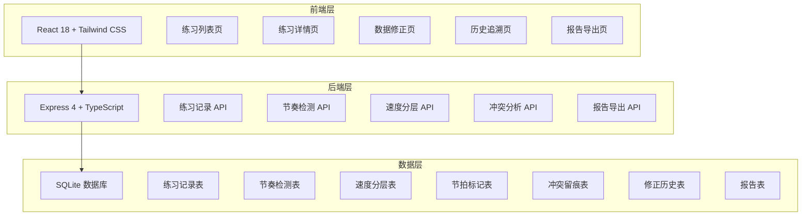
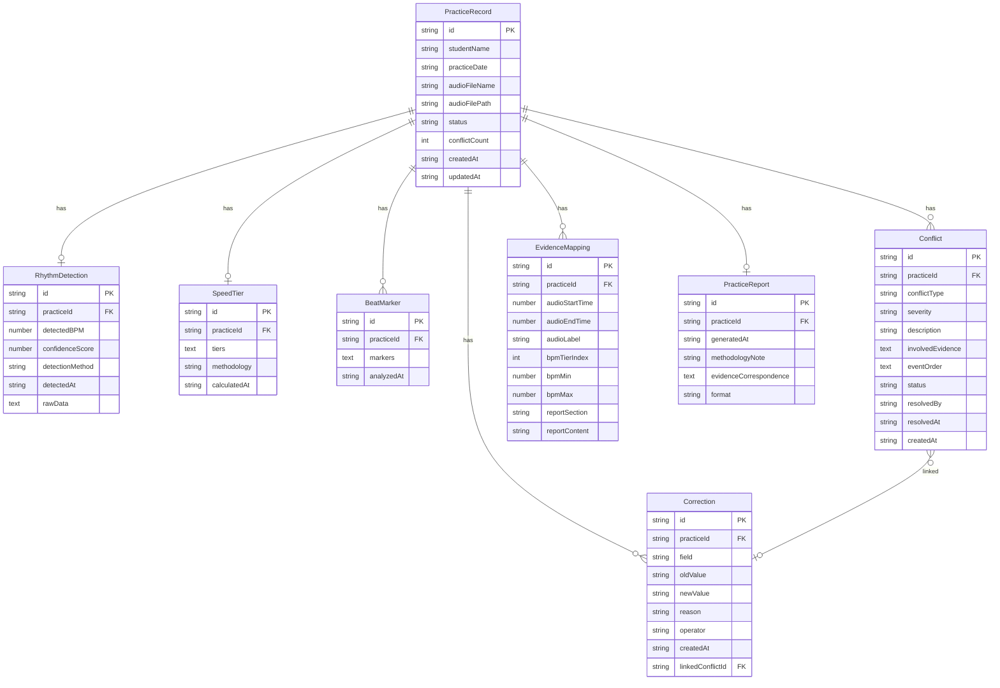

## 1. 架构设计



## 2. 技术说明

- 前端：React@18 + Tailwind CSS@3 + Vite + Zustand
- 初始化工具：vite-init
- 后端：Express@4 + TypeScript (ESM)
- 数据库：SQLite（本地文件数据库，无需额外安装）
- 图表：Recharts（BPM阶梯图、时间线可视化）
- PDF导出：jsPDF

## 3. 路由定义

| 路由 | 用途 |
|------|------|
| / | 重定向到 /practices |
| /practices | 练习列表页，按筛选条件展示所有练习记录 |
| /practices/:id | 练习详情页，展示三证据源和冲突留痕 |
| /practices/:id/edit | 数据修正页，修正冲突数据并自动留痕 |
| /practices/:id/history | 历史追溯页，查看完整变更链路 |
| /practices/:id/report | 报告导出页，预览和下载练习报告 |

## 4. API 定义

### 4.1 练习记录 API

```typescript
interface PracticeRecord {
  id: string;
  studentName: string;
  practiceDate: string;
  audioFileName: string;
  audioFilePath: string;
  status: "normal" | "conflict" | "corrected";
  conflictCount: number;
  createdAt: string;
  updatedAt: string;
}

// GET /api/practices - 获取练习列表
interface ListPracticesRequest {
  studentName?: string;
  dateFrom?: string;
  dateTo?: string;
  status?: PracticeRecord["status"];
  page?: number;
  pageSize?: number;
}

interface ListPracticesResponse {
  data: PracticeRecord[];
  total: number;
  page: number;
  pageSize: number;
}

// GET /api/practices/:id - 获取练习详情
interface PracticeDetailResponse {
  record: PracticeRecord;
  rhythmDetection: RhythmDetection;
  speedTier: SpeedTier;
  beatMarkers: BeatMarker[];
  conflicts: Conflict[];
  corrections: Correction[];
  evidenceMapping: EvidenceMapping[];
}
```

### 4.2 节奏检测 API

```typescript
interface RhythmDetection {
  id: string;
  practiceId: string;
  detectedBPM: number;
  confidenceScore: number;
  detectionMethod: string;
  detectedAt: string;
  rawData: {
    onsetTimes: number[];
    interOnsetIntervals: number[];
  };
}

// GET /api/practices/:id/rhythm - 获取节奏检测结果
// PUT /api/practices/:id/rhythm - 修正节奏检测结果（自动留痕）
```

### 4.3 速度分层 API

```typescript
interface SpeedTier {
  id: string;
  practiceId: string;
  tiers: SpeedTierLevel[];
  methodology: string;
  calculatedAt: string;
}

interface SpeedTierLevel {
  tierIndex: number;
  bpmRange: [number, number];
  startTime: number;
  endTime: number;
  label: string;
}

// GET /api/practices/:id/speed-tier - 获取速度分层结果
// PUT /api/practices/:id/speed-tier - 修正速度分层（自动留痕）
```

### 4.4 节拍标记 API

```typescript
interface BeatMarker {
  id: string;
  practiceId: string;
  markers: BeatEvent[];
  analyzedAt: string;
}

interface BeatEvent {
  timeOffset: number;
  type: "normal" | "rush" | "miss";
  expectedTime: number;
  actualTime: number;
  deviation: number;
}

// GET /api/practices/:id/beat-markers - 获取节拍标记
// PUT /api/practices/:id/beat-markers - 修正节拍标记（自动留痕）
```

### 4.5 冲突分析 API

```typescript
interface Conflict {
  id: string;
  practiceId: string;
  conflictType: "audio_bpm_mismatch" | "beat_bpm_jump" | "rush_miss_simultaneous" | "bpm_jump_late";
  severity: "low" | "medium" | "high";
  description: string;
  involvedEvidence: {
    source: "audio" | "bpm" | "beat_marker";
    detail: string;
  }[];
  eventOrder?: {
    event: string;
    timestamp: number;
    label: string;
  }[];
  status: "pending" | "flagged" | "resolved";
  resolvedBy?: string;
  resolvedAt?: string;
  createdAt: string;
}

// GET /api/practices/:id/conflicts - 获取冲突列表
// POST /api/practices/:id/conflicts/:conflictId/flag - 先留痕
// POST /api/practices/:id/conflicts/:conflictId/resolve - 解决冲突
```

### 4.6 修正历史 API

```typescript
interface Correction {
  id: string;
  practiceId: string;
  field: string;
  oldValue: string;
  newValue: string;
  reason: string;
  operator: string;
  createdAt: string;
  linkedConflictId?: string;
}

// GET /api/practices/:id/corrections - 获取修正历史
// POST /api/practices/:id/corrections - 创建修正记录
```

### 4.7 报告导出 API

```typescript
interface PracticeReport {
  id: string;
  practiceId: string;
  generatedAt: string;
  methodologyNote: string;
  evidenceCorrespondence: {
    audioSegment: string;
    bpmRange: string;
    reportEntry: string;
  }[];
  corrections: Correction[];
  conflicts: Conflict[];
}

// GET /api/practices/:id/report - 获取报告数据
// GET /api/practices/:id/report/pdf - 下载PDF报告
// GET /api/practices/:id/report/json - 下载JSON报告
```

### 4.8 证据对应关系

```typescript
interface EvidenceMapping {
  id: string;
  practiceId: string;
  audioSegment: {
    startTime: number;
    endTime: number;
    label: string;
  };
  bpmTier: {
    tierIndex: number;
    bpmRange: [number, number];
  };
  reportEntry: {
    section: string;
    content: string;
  };
}

// GET /api/practices/:id/evidence-mapping - 获取证据对应关系
```

## 5. 服务器架构图

```mermaid
graph LR
    "Controller" --> "Service"
    "Service" --> "Repository"
    "Repository" --> "SQLite"
```

- **Controller**：处理HTTP请求，参数校验，调用Service
- **Service**：业务逻辑，冲突检测，留痕记录，报告生成
- **Repository**：数据库操作，CRUD封装
- **SQLite**：本地文件数据库，存储所有练习数据

## 6. 数据模型

### 6.1 数据模型定义



### 6.2 数据定义语言

```sql
CREATE TABLE practice_records (
  id TEXT PRIMARY KEY,
  student_name TEXT NOT NULL,
  practice_date TEXT NOT NULL,
  audio_file_name TEXT NOT NULL,
  audio_file_path TEXT NOT NULL,
  status TEXT NOT NULL DEFAULT 'normal' CHECK(status IN ('normal', 'conflict', 'corrected')),
  conflict_count INTEGER NOT NULL DEFAULT 0,
  created_at TEXT NOT NULL DEFAULT (datetime('now')),
  updated_at TEXT NOT NULL DEFAULT (datetime('now'))
);

CREATE TABLE rhythm_detections (
  id TEXT PRIMARY KEY,
  practice_id TEXT NOT NULL REFERENCES practice_records(id) ON DELETE CASCADE,
  detected_bpm REAL NOT NULL,
  confidence_score REAL NOT NULL,
  detection_method TEXT NOT NULL,
  detected_at TEXT NOT NULL DEFAULT (datetime('now')),
  raw_data TEXT NOT NULL
);

CREATE TABLE speed_tiers (
  id TEXT PRIMARY KEY,
  practice_id TEXT NOT NULL REFERENCES practice_records(id) ON DELETE CASCADE,
  tiers TEXT NOT NULL,
  methodology TEXT NOT NULL,
  calculated_at TEXT NOT NULL DEFAULT (datetime('now'))
);

CREATE TABLE beat_markers (
  id TEXT PRIMARY KEY,
  practice_id TEXT NOT NULL REFERENCES practice_records(id) ON DELETE CASCADE,
  markers TEXT NOT NULL,
  analyzed_at TEXT NOT NULL DEFAULT (datetime('now'))
);

CREATE TABLE conflicts (
  id TEXT PRIMARY KEY,
  practice_id TEXT NOT NULL REFERENCES practice_records(id) ON DELETE CASCADE,
  conflict_type TEXT NOT NULL CHECK(conflict_type IN ('audio_bpm_mismatch', 'beat_bpm_jump', 'rush_miss_simultaneous', 'bpm_jump_late')),
  severity TEXT NOT NULL CHECK(severity IN ('low', 'medium', 'high')),
  description TEXT NOT NULL,
  involved_evidence TEXT NOT NULL,
  event_order TEXT,
  status TEXT NOT NULL DEFAULT 'pending' CHECK(status IN ('pending', 'flagged', 'resolved')),
  resolved_by TEXT,
  resolved_at TEXT,
  created_at TEXT NOT NULL DEFAULT (datetime('now'))
);

CREATE TABLE corrections (
  id TEXT PRIMARY KEY,
  practice_id TEXT NOT NULL REFERENCES practice_records(id) ON DELETE CASCADE,
  field TEXT NOT NULL,
  old_value TEXT NOT NULL,
  new_value TEXT NOT NULL,
  reason TEXT NOT NULL,
  operator TEXT NOT NULL,
  created_at TEXT NOT NULL DEFAULT (datetime('now')),
  linked_conflict_id TEXT REFERENCES conflicts(id) ON DELETE SET NULL
);

CREATE TABLE evidence_mappings (
  id TEXT PRIMARY KEY,
  practice_id TEXT NOT NULL REFERENCES practice_records(id) ON DELETE CASCADE,
  audio_start_time REAL NOT NULL,
  audio_end_time REAL NOT NULL,
  audio_label TEXT NOT NULL,
  bpm_tier_index INTEGER NOT NULL,
  bpm_min REAL NOT NULL,
  bpm_max REAL NOT NULL,
  report_section TEXT NOT NULL,
  report_content TEXT NOT NULL
);

CREATE TABLE practice_reports (
  id TEXT PRIMARY KEY,
  practice_id TEXT NOT NULL REFERENCES practice_records(id) ON DELETE CASCADE,
  generated_at TEXT NOT NULL DEFAULT (datetime('now')),
  methodology_note TEXT NOT NULL,
  evidence_correspondence TEXT NOT NULL,
  format TEXT NOT NULL DEFAULT 'pdf'
);

CREATE INDEX idx_practice_records_status ON practice_records(status);
CREATE INDEX idx_practice_records_student ON practice_records(student_name);
CREATE INDEX idx_practice_records_date ON practice_records(practice_date);
CREATE INDEX idx_conflicts_practice ON conflicts(practice_id);
CREATE INDEX idx_conflicts_status ON conflicts(status);
CREATE INDEX idx_corrections_practice ON corrections(practice_id);
CREATE INDEX idx_evidence_mappings_practice ON evidence_mappings(practice_id);
```
