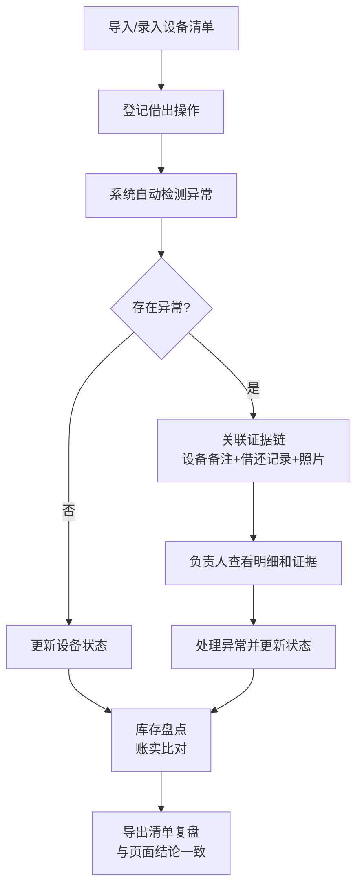

## 1. 产品概述

音乐社团设备借还管理系统，解决社团负责人在设备清单更新、排练日程版本迭代过程中，借还口径混乱、证据缺失的问题。系统以借还状态为主线，提供导入样例、图片查看、明细追溯、异常检测、证据链保留、导出复盘等功能，确保借还记录可追溯、异常可发现、结论可验证。

## 2. 核心功能

### 2.1 用户角色

| 角色 | 注册方式 | 核心权限 |
|------|----------|----------|
| 社团负责人 | 无需登录（本地应用） | 全部功能：导入数据、查看明细、管理借还、导出清单、异常处理 |

### 2.2 功能模块

1. **首页仪表盘**：借还状态总览、异常提醒、库存统计、快捷操作
2. **设备清单管理**：设备列表、图片查看、备注历史、导入导出
3. **借还记录管理**：借出登记、归还确认、状态流转、版本追溯
4. **异常检测中心**：重复借出检测、损坏未记检测、归还超时检测、证据链查看
5. **库存盘点**：账实比对、差异分析、盘点报告导出

### 2.3 页面详情

| 页面名称 | 模块名称 | 功能描述 |
|----------|----------|----------|
| 首页仪表盘 | 状态概览卡片 | 展示在库/借出/异常/损坏四类设备数量统计 |
| 首页仪表盘 | 异常提醒区 | 高亮展示重复借出、损坏未记、归还超时三类异常，点击跳转详情 |
| 首页仪表盘 | 快捷操作区 | 导入样例数据、新增借出、导出清单快捷入口 |
| 设备清单 | 设备列表 | 表格展示设备ID、名称、分类、状态、当前借用人、备注 |
| 设备清单 | 图片查看器 | 点击设备图片放大查看，支持左右切换 |
| 设备清单 | 备注历史面板 | 查看设备所有版本的备注修改记录，保留时间戳和修改人 |
| 借还记录 | 记录列表 | 按时间倒序展示所有借还记录，包含借出/归还时间、借用人、设备状态 |
| 借还记录 | 借还表单 | 新增借出/归还登记，支持上传损坏照片、填写备注 |
| 借还记录 | 版本追溯 | 同一条记录的多个版本对比，标记被覆盖的超时记录 |
| 异常检测 | 异常列表 | 分类展示检测出的异常项，标注异常类型和风险等级 |
| 异常检测 | 证据链面板 | 展示异常相关的所有证据：设备清单快照、借还记录、损坏备注、时间戳 |
| 异常检测 | 异常处理 | 标记异常已处理、添加处理说明、更新设备状态 |
| 库存盘点 | 盘点列表 | 展示账实比对结果，标记盘盈盘亏 |
| 库存盘点 | 差异详情 | 查看差异项的详细证据链，支持导出差异报告 |

## 3. 核心流程

用户导入样例数据或手动录入设备清单 → 登记借出/归还操作 → 系统自动检测异常（重复借出、损坏未记、归还超时）→ 异常产生时关联证据链（设备清单备注、借还记录、照片）→ 负责人查看明细和证据 → 处理异常并更新状态 → 导出清单用于复盘，导出文件结论与页面保持一致。

## 4. 用户界面设计

### 4.1 设计风格

- **主色调**：深靛蓝（#1e3a5f）- 专业、稳重
- **辅助色**：琥珀橙（#f59e0b）- 异常提醒、警示
- **成功色**： emerald 绿（#10b981）- 正常、已归还
- **危险色**：玫瑰红（#ef4444）- 异常、损坏
- **中性色**：石板灰系列 - 文字、背景、边框
- **按钮风格**：圆角 8px，带微妙悬停动效，主按钮深靛蓝填充
- **字体**：标题使用 "Noto Serif SC"（中文衬线，典雅有质感），正文使用 "Noto Sans SC"（中文无衬线，清晰易读）
- **布局风格**：左侧导航 + 右侧内容区，卡片式模块，信息密度适中
- **图标风格**：使用 lucide-react 线性图标，与整体稳重风格协调

### 4.2 页面设计概述

| 页面名称 | 模块名称 | UI 元素 |
|----------|----------|---------|
| 首页仪表盘 | 状态概览卡片 | 4张统计卡片横向排列，每张卡片包含图标、数值、环比趋势、渐变背景 |
| 首页仪表盘 | 异常提醒区 | 异常卡片堆叠展示，红色/橙色背景区分风险等级，悬停上浮动效 |
| 设备清单 | 设备列表 | 表格带斑马纹，设备名称可点击展开详情，图片列显示缩略图 |
| 设备清单 | 图片查看器 | 模态框展示，半透明背景，图片居中，左右箭头切换 |
| 借还记录 | 时间线 | 左侧时间线，右侧记录卡片，不同状态用不同颜色标记 |
| 异常检测 | 证据链面板 | 时间轴式展示证据节点，节点可展开查看详情，高亮关键证据 |
| 库存盘点 | 对比表格 | 账面/实存两列对比，差异项红色背景标记 |

### 4.3 响应性

- 桌面端优先设计（1440px 基准）
- 断点 1024px：左侧导航收起为图标模式
- 断点 768px：顶部导航，内容区单列布局
- 移动端：优化表格横向滚动，按钮最小尺寸 44x44px

### 4.4 动效设计

- 页面加载：内容模块从下往上渐入，错开 100ms 延迟
- 异常提醒：首次出现时轻微脉冲动画（opacity 0.8 → 1 → 0.8）
- 卡片悬停：上移 2px + 阴影加深
- 证据链展开：高度平滑过渡，箭头旋转 90 度
- 状态变更：数字滚动动画，颜色渐变过渡
