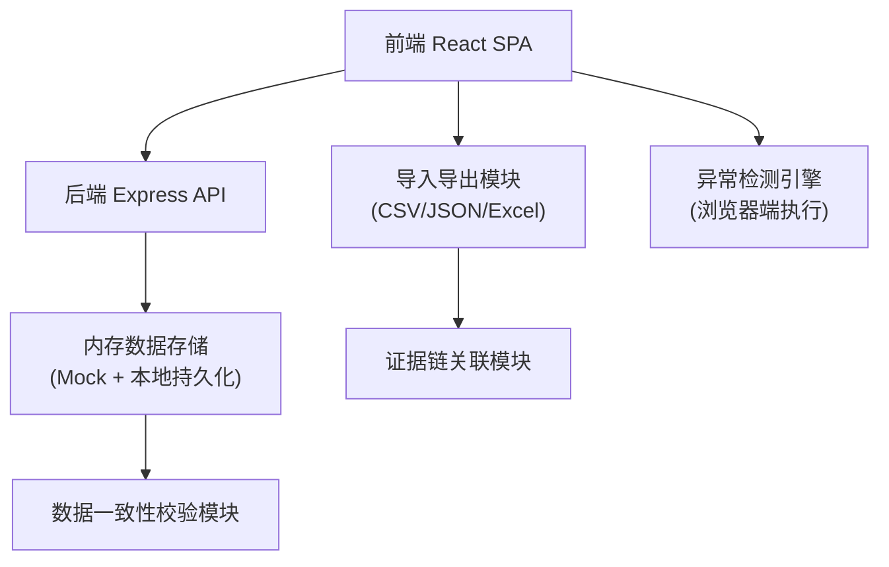
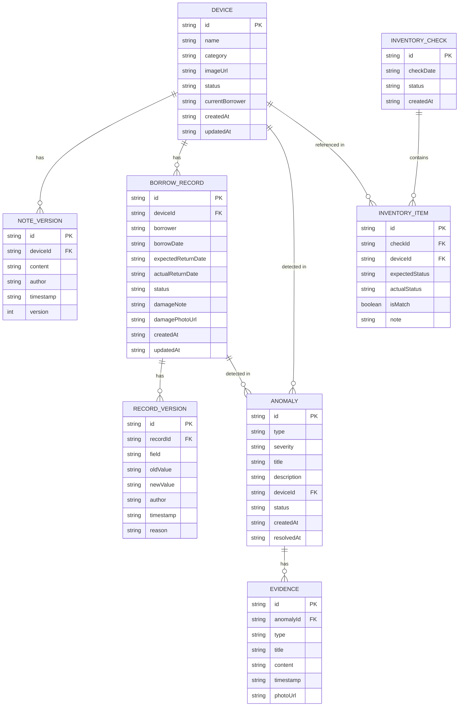

## 1. 架构设计



## 2. 技术描述

- **前端**：React@18 + TypeScript + Vite + TailwindCSS@3 + Zustand + React Router DOM@6 + lucide-react
- **初始化工具**：vite-init
- **后端**：Express@4 + TypeScript
- **数据存储**：内存存储 + localStorage 持久化（无需数据库，便于单机使用）
- **文件处理**：xlsx（Excel 导入导出）、papaparse（CSV 解析）
- **图标**：lucide-react

## 3. 路由定义

| 路由 | 页面名称 | 用途 |
|------|----------|------|
| / | 首页仪表盘 | 状态总览、异常提醒、快捷操作 |
| /devices | 设备清单 | 设备列表、图片查看、备注历史 |
| /records | 借还记录 | 借出/归还登记、记录列表、版本追溯 |
| /anomalies | 异常检测 | 异常列表、证据链、异常处理 |
| /inventory | 库存盘点 | 账实比对、差异分析、盘点报告 |

## 4. API 定义

### 4.1 类型定义

```typescript
// 设备状态
type DeviceStatus = 'in_stock' | 'borrowed' | 'damaged' | 'anomaly';

// 异常类型
type AnomalyType = 'duplicate_borrow' | 'damage_unrecorded' | 'overdue_return' | 'inventory_mismatch';

// 证据类型
type EvidenceType = 'device_note' | 'borrow_record' | 'return_record' | 'damage_photo' | 'inventory_snapshot';

// 设备
interface Device {
  id: string;
  name: string;
  category: string;
  imageUrl: string;
  status: DeviceStatus;
  currentBorrower: string | null;
  notes: NoteVersion[];
  createdAt: string;
  updatedAt: string;
}

// 备注版本
interface NoteVersion {
  id: string;
  content: string;
  author: string;
  timestamp: string;
  version: number;
}

// 借还记录
interface BorrowRecord {
  id: string;
  deviceId: string;
  deviceName: string;
  borrower: string;
  borrowDate: string;
  expectedReturnDate: string;
  actualReturnDate: string | null;
  status: 'borrowed' | 'returned' | 'overdue';
  damageNote: string | null;
  damagePhotoUrl: string | null;
  versions: RecordVersion[];
  createdAt: string;
  updatedAt: string;
}

// 记录版本
interface RecordVersion {
  id: string;
  field: string;
  oldValue: string;
  newValue: string;
  author: string;
  timestamp: string;
  reason: string;
}

// 异常
interface Anomaly {
  id: string;
  type: AnomalyType;
  severity: 'high' | 'medium' | 'low';
  title: string;
  description: string;
  deviceId: string;
  recordIds: string[];
  evidenceChain: Evidence[];
  status: 'open' | 'resolved';
  resolvedAt: string | null;
  resolutionNote: string | null;
  createdAt: string;
}

// 证据
interface Evidence {
  id: string;
  type: EvidenceType;
  title: string;
  content: string;
  timestamp: string;
  photoUrl: string | null;
}

// 盘点记录
interface InventoryCheck {
  id: string;
  checkDate: string;
  items: InventoryItem[];
  status: 'draft' | 'completed';
  createdAt: string;
}

interface InventoryItem {
  deviceId: string;
  deviceName: string;
  expectedStatus: DeviceStatus;
  actualStatus: DeviceStatus;
  isMatch: boolean;
  note: string;
}

// 导出数据
interface ExportData {
  exportDate: string;
  summary: {
    totalDevices: number;
    inStock: number;
    borrowed: number;
    damaged: number;
    anomalies: number;
    overdue: number;
  };
  devices: Device[];
  records: BorrowRecord[];
  anomalies: Anomaly[];
  conclusions: string[];
}
```

### 4.2 API 接口

| 方法 | 路径 | 描述 |
|------|------|------|
| GET | /api/devices | 获取设备列表 |
| GET | /api/devices/:id | 获取设备详情 |
| POST | /api/devices | 新增设备 |
| PUT | /api/devices/:id | 更新设备 |
| POST | /api/devices/:id/notes | 添加设备备注 |
| GET | /api/records | 获取借还记录列表 |
| GET | /api/records/:id | 获取借还记录详情 |
| POST | /api/records/borrow | 登记借出 |
| POST | /api/records/:id/return | 登记归还 |
| GET | /api/anomalies | 获取异常列表 |
| POST | /api/anomalies/:id/resolve | 处理异常 |
| POST | /api/anomalies/detect | 触发异常检测 |
| GET | /api/inventory | 获取盘点列表 |
| POST | /api/inventory | 创建盘点 |
| POST | /api/inventory/:id/complete | 完成盘点 |
| POST | /api/import | 导入数据 |
| GET | /api/export | 导出数据 |
| GET | /api/sample | 获取样例数据 |

## 5. 数据一致性保障机制

### 5.1 单一数据源原则
- 所有模块（仪表盘、设备清单、借还记录、异常检测、库存盘点）共享同一数据源
- 状态变更通过统一的 store action 分发，确保数据一致性

### 5.2 导出结论一致性
- 导出文件包含 `summary` 和 `conclusions` 字段
- 导出前执行与页面显示相同的计算逻辑
- 导出结论与页面终端摘要通过同一函数生成，确保完全一致

### 5.3 版本不可篡改
- 所有修改操作保留历史版本，新版本不覆盖旧版本
- 被覆盖的超时记录标记为 `overridden` 但不删除
- 备注历史完整保留，支持版本对比

## 6. 数据模型 ER 图


