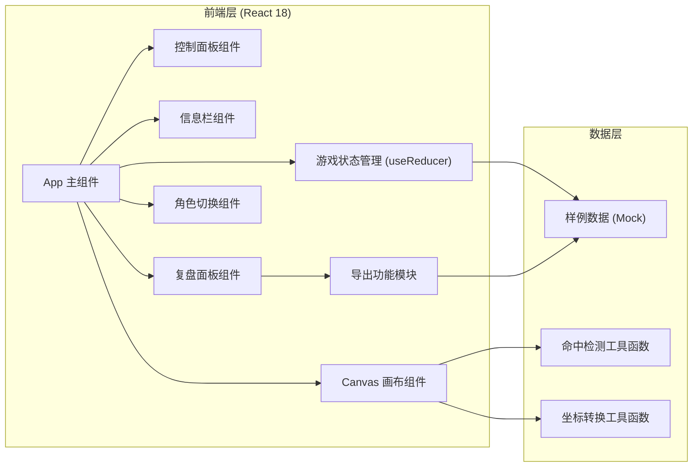
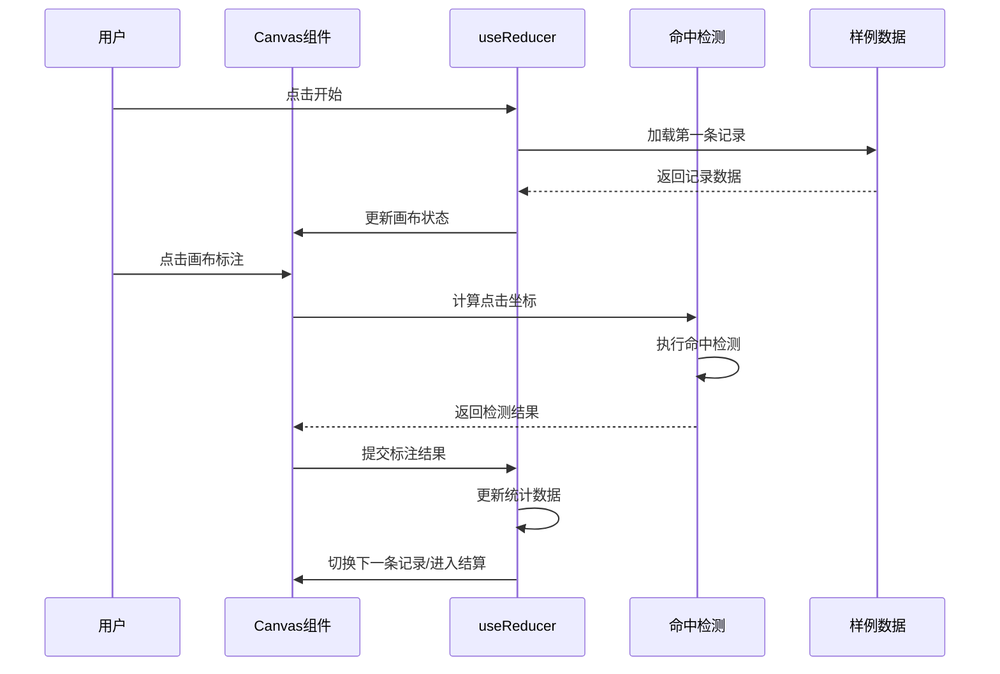

## 1. 架构设计



## 2. 技术描述

- **前端框架**：React 18 + TypeScript + Vite 5
- **样式方案**：TailwindCSS 3.4
- **画布渲染**：原生 Canvas 2D API（无额外依赖，轻量高效）
- **状态管理**：React useReducer（游戏状态集中管理）+ Context（角色全局状态）
- **数据方案**：本地 Mock 数据（JSON格式），无后端依赖，便于教学部署
- **图标方案**：Lucide React（轻量SVG图标库）

## 3. 目录结构

```
/
├── src/
│   ├── components/
│   │   ├── Canvas.tsx          # 主画布组件，处理绘制与交互
│   │   ├── ControlBar.tsx      # 顶部控制栏（开始/暂停/重开/结算）
│   │   ├── InfoPanel.tsx       # 左侧信息栏（当前记录详情）
│   │   ├── StatsPanel.tsx      # 右侧统计栏（实时命中统计）
│   │   ├── ReviewPanel.tsx     # 复盘面板（结算后展示）
│   │   ├── RoleSwitch.tsx      # 角色切换组件
│   │   └── RippleEffect.tsx    # 点击波纹动效组件
│   ├── data/
│   │   └── samples.ts          # 样例数据（顺利/待确认/坏数据）
│   ├── hooks/
│   │   ├── useGameState.ts     # 游戏状态管理Hook
│   │   └── useCanvas.ts        # Canvas操作Hook
│   ├── utils/
│   │   ├── hitDetection.ts     # 命中检测算法
│   │   ├── coordinate.ts       # 坐标转换与翻转检测
│   │   └── export.ts           # 导出复盘报告
│   ├── types/
│   │   └── index.ts            # TypeScript类型定义
│   ├── context/
│   │   └── RoleContext.tsx     # 角色上下文
│   ├── App.tsx                 # 主应用组件
│   ├── main.tsx                # 入口文件
│   └── index.css               # 全局样式（Tailwind + 自定义）
├── public/
│   └── samples/                # 样例底图占位（可使用生成的图片）
├── package.json
├── vite.config.ts
├── tailwind.config.js
└── tsconfig.json
```

## 4. 核心类型定义

```typescript
// 巡检记录状态
type RecordStatus = 'success' | 'pending' | 'error' | 'flipped';

// 坐标点
interface Point {
  x: number;
  y: number;
}

// 巡检记录
interface InspectionRecord {
  id: string;
  name: string;
  status: RecordStatus;
  actualCoords: Point;       // 真实坐标（用于命中检测）
  displayedCoords: Point;    // 显示给用户的坐标（可能翻转）
  isFlipped: boolean;        // 是否坐标翻转
  trajectory: Point[];       // 轨迹点数组
  sourceMeta: {              // 数据溯源信息
    originalRow: number;     // 原始行号
    imageName: string;       // 图片名
    remark: string;          // 来源备注
    dataSource: string;      // 数据表来源
  };
  hint: string;              // 操作提示
}

// 用户标注结果
interface AnnotationResult {
  recordId: string;
  userClick: Point;          // 用户点击坐标
  distance: number;          // 与真实坐标的距离（像素）
  isHit: boolean;            // 是否命中
  hitThreshold: number;      // 命中阈值
  timestamp: number;         // 标注时间
}

// 游戏状态
type GamePhase = 'idle' | 'playing' | 'paused' | 'finished';

interface GameState {
  phase: GamePhase;
  currentRecordIndex: number;
  records: InspectionRecord[];
  results: AnnotationResult[];
  startTime: number | null;
  elapsedTime: number;
  isPaused: boolean;
}

// 角色类型
type UserRole = 'teacher' | 'student';
```

## 5. 核心算法

### 5.1 命中检测算法
- 计算用户点击点与真实坐标点的欧氏距离
- 命中阈值：30像素（可配置）
- 距离 ≤ 阈值 → 命中（绿色标记）
- 距离 > 阈值 → 未命中，显示偏差方向与距离

### 5.2 坐标翻转检测
- 检查 displayedCoords 与 actualCoords 的关系
- 若 (x,y) 与实际 (y,x) 或 (-x,-y) 等模式匹配 → 标记为翻转
- 翻转记录在教研视图中高亮显示，便于教学讲解

### 5.3 得分计算
- 每条记录满分100分
- 命中：100 - (距离/阈值 * 50)，最低50分
- 未命中：0分
- 翻转记录识别正确额外加20分

## 6. 路由定义

| 路由 | 用途 |
|------|------|
| / | 主游戏页面（唯一页面，单页应用） |

本项目为单页应用，所有功能在同一页面内通过状态切换实现，无需多路由。

## 7. 数据流



## 8. 样例数据说明

预置3条样例记录，覆盖三种典型场景：

1. **顺利记录 (success)**
   - 坐标正常，轨迹清晰
   - 命中难度：低
   - 教学用途：展示标准合格的巡检数据

2. **待确认记录 (pending)**
   - 坐标存在轻微偏差，轨迹有断点
   - 命中难度：中
   - 教学用途：讲解需要人工复核的边界情况

3. **坏数据/坐标翻转 (error/flipped)**
   - 显示坐标与真实坐标存在X/Y翻转
   - 轨迹混乱
   - 命中难度：高
   - 教学用途：重点讲解坐标翻转问题的识别与处理
