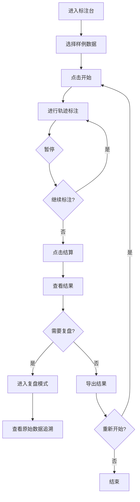

## 1. 产品概述

河道巡检二维标注台是一款面向水利巡检教学场景的浏览器端交互应用，帮助学生通过画布标注练习，教研老师进行教学质量把控。

- 核心目标：让学生在浏览器中完成河道巡检轨迹的标注练习，理解坐标翻转等概念，同时支持教研老师复核标注结果

---

## 2. 核心功能

### 2.1 用户角色

| 角色 | 使用方式 | 核心权限 |
|------|----------|----------|
| 学生 | 浏览器访问 | 进行标注练习、查看结算结果、导出复盘数据 |
| 教研老师 | 浏览器访问 | 查看学生标注结果、复核待确认记录、追溯原始数据来源 |

### 2.2 功能模块

1. **标注主界面**：画布区域、控制面板、状态显示
2. **游戏流程控制**：开始、暂停、重开、结算、复盘
3. **样例数据管理**：三条样例记录（顺利、待确认、坏数据）
4. **结果导出**：JSON格式导出，包含原始行号和来源追溯

### 2.3 页面详情

| 页面名称 | 模块名称 | 功能描述 |
|-----------|----------|----------|
| 标注主界面 | 画布区域 | 显示河道底图、轨迹绘制、命中点标注 |
| 标注主界面 | 控制面板 | 开始/暂停/重开/结算/复盘按钮 |
| 标注主界面 | 状态面板 | 当前进度、命中数、错误数实时显示 |
| 结算页面 | 结果统计 | 正确率统计、正确率展示 |
| 复盘面板 | 数据追溯 | 显示每条记录的原始行号、图片名、来源备注 |

---

## 3. 核心流程

---

## 4. 用户界面设计

### 4.1 设计风格

- **主色调**：深蓝 #1e3a5f（专业、稳重），代表水利行业特色
- **辅助色**：青色 #0ea5e9（成功）、琥珀色 #f59e0b（待确认）、红色 #ef4444（错误）
- **按钮风格**：圆角 8px，hover 状态有微妙阴影变化
- **字体**：使用 Space Grotesk 标题 + JetBrains Mono 等宽字体显示坐标数据
- **布局风格**：左右分栏布局，左侧画布为主区域，右侧控制面板和状态面板

### 4.2 页面设计概览

| 页面名称 | 模块名称 | UI 元素 |
|-----------|----------|----------|
| 标注主界面 | 画布区域 | 网格背景、河道轮廓、可拖动标注点 |
| 标注主界面 | 控制面板 | 5个功能按钮垂直排列，有状态指示 |
| 标注主界面 | 状态面板 | 数字卡片式统计、进度条 |
| 结算弹窗 | 结果面板 | 分级结果展示、导出按钮 |

### 4.3 响应式设计

- Desktop-first 设计，主画布区域自适应缩放
- 控制面板在小屏幕转为底部横向排列
- 触摸设备支持标注点拖动

### 4.4 交互与动画

- 标注点拖动时有实时坐标显示
- 命中检测成功时有轻微弹跳动画
- 状态切换时有平滑过渡效果
- 结算时结果数字有计数动画
