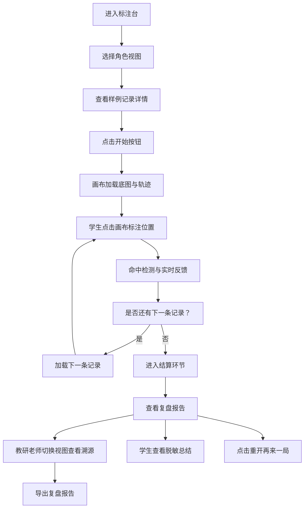

## 1. 产品概述

河道巡检二维标注台是一款面向水文与环境专业教学场景的交互式Web应用。教研老师可导入底图坐标与轨迹记录，学生通过在画布上标注巡检点完成练习，系统自动检测命中精度并生成复盘报告，解决坐标翻转等异常数据的教学讲解难题。

本产品核心价值在于将抽象的坐标数据转化为可交互的标注游戏，通过"一局式"体验让学生快速理解巡检数据质量控制的要点，同时保留完整的数据溯源能力便于教研复核。

## 2. 核心特性

### 2.1 用户角色

| 角色 | 使用方式 | 核心权限 |
|------|----------|----------|
| 教研老师 | 直接访问，切换角色视图 | 查看原始数据溯源、导出完整复盘报告、标记数据状态（可直接用/待复核） |
| 学生 | 直接访问，默认学生视图 | 进行标注练习、查看命中结果、查看已脱敏的复盘总结 |

### 2.2 功能模块

1. **主游戏页面**：画布展示、轨迹绘制、标注交互、游戏控制
2. **复盘面板**：命中统计、误差分析、数据溯源、导出功能
3. **角色切换**：教研老师/学生视图一键切换，数据展示粒度分级

### 2.3 页面详情

| 页面名称 | 模块名称 | 功能描述 |
|---------|----------|----------|
| 主游戏页 | 顶部控制栏 | 开始、暂停、重开、结算按钮，计时器，当前样本进度，角色切换 |
| 主游戏页 | 二维画布区 | 底图渲染、轨迹线绘制、目标点标记、用户点击标注、命中判定反馈 |
| 主游戏页 | 侧边信息栏 | 当前记录详情（坐标、来源、状态）、操作提示、实时命中统计 |
| 复盘面板 | 结果总览 | 本轮得分、命中率、平均误差、各样本判定结果列表 |
| 复盘面板 | 数据溯源 | 每条记录的原始行号、图片名、来源备注、翻转标记等元数据 |
| 复盘面板 | 导出功能 | 导出JSON格式复盘报告，包含完整溯源信息与判定结果 |

## 3. 核心流程

学生进入标注台后，点击开始按钮启动练习。系统依次展示三条样例记录（顺利/待确认/坏数据），学生在画布上点击标注巡检点位置，系统实时计算与真实坐标的偏差并给出视觉反馈。全部标注完成后进入结算环节，可查看详细复盘报告，支持导出。教研老师可切换角色视图查看完整数据溯源信息。

## 4. 用户界面设计

### 4.1 设计风格
- **主色调**：深蓝 #0F3460（专业、沉稳）+ 青蓝 #1A5276（辅助）
- **强调色**：绿色 #27AE60（命中）、橙色 #F39C12（待确认）、红色 #E74C3C（异常/坏数据）
- **中性色**：深灰 #2C3E50（正文）、浅灰 #ECF0F1（背景）
- **按钮风格**：微圆角（4px）、实心填充、悬停有浮起阴影
- **字体**：标题使用 Noto Serif SC（衬线，学术感），正文使用 Noto Sans SC（无衬线，清晰易读）
- **布局风格**：三栏式布局，左侧信息栏、中央画布区、右侧控制与统计
- **视觉元素**：画布使用网格背景增强专业感，命中点使用脉冲动画，轨迹使用虚线渐变

### 4.2 页面设计概览

| 页面名称 | 模块名称 | UI元素 |
|---------|----------|--------|
| 主游戏页 | 顶部控制栏 | 深色背景条，左侧角色切换下拉，中间控制按钮组（开始/暂停/重开/结算），右侧计时器与进度指示器 |
| 主游戏页 | 中央画布区 | 带网格的Canvas画布，渐变轨迹线，闪烁的目标区域，点击标注时有波纹动效，命中/未命中有不同颜色标记 |
| 主游戏页 | 左侧信息栏 | 卡片式布局，显示当前记录的ID、坐标值、来源信息，状态标签使用不同颜色区分 |
| 主游戏页 | 右侧统计栏 | 实时命中数、待确认数、异常数统计，使用大号数字+图标展示 |
| 复盘面板 | 结果卡片 | 居中弹窗，半透明遮罩，得分使用大号字体突出显示，各记录结果列表支持展开查看详情 |
| 复盘面板 | 溯源表格 | 教研老师视图专属，表格展示原始行号、图片名、备注、翻转标记等，可直接复制 |

### 4.3 响应式
- 桌面端优先设计（最小支持1280px宽度）
- 画布区域自适应，保持固定宽高比
- 窄屏下侧边栏自动折叠为抽屉式
- 触摸设备优化点击区域（按钮最小44x44px）

### 4.4 动效设计
- 页面加载：元素从底部渐入，错落延迟
- 点击标注：波纹扩散动画，命中时绿色光晕扩散
- 记录切换：画布内容左滑淡出，新内容右滑淡入
- 结算弹窗：从下方滑入，带弹性缓动
- 按钮交互：悬停时上浮+阴影加深，点击时轻微收缩
