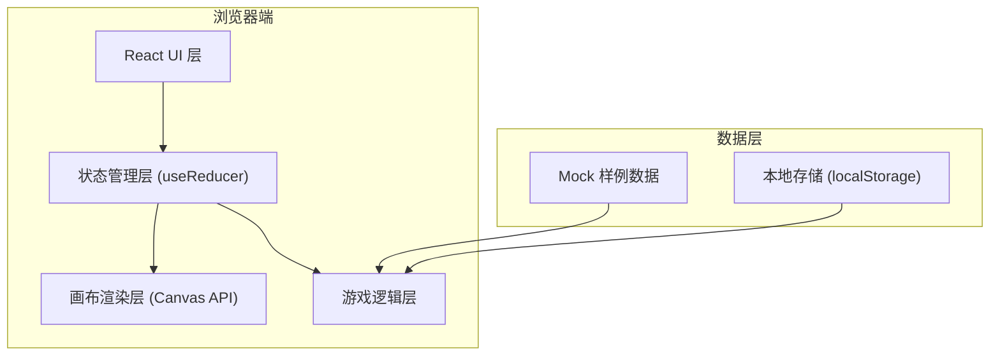

## 1. 架构设计



---

## 2. 技术选型说明

- **前端框架**: React@18 + TypeScript
- **构建工具**: Vite@5
- **样式方案**: Tailwind CSS@3
- **画布渲染**: 原生 Canvas API
- **状态管理**: React useReducer (轻量级全局状态)
- **数据存储**: 本地 Mock 数据 + localStorage 持久化
- **无后端依赖**: 纯前端应用，所有数据处理在浏览器完成

---

## 3. 模块结构

```
src/
├── components/
│   ├── Canvas/           # 画布组件
│   ├── ControlPanel/     # 控制面板
│   ├── StatusPanel/      # 状态面板
│   ├── ResultModal/      # 结算弹窗
│   └── ReviewPanel/      # 复盘面板
├── hooks/
│   ├── useGameState.ts   # 游戏状态管理
│   └── useCanvas.ts      # Canvas 操作 Hook
├── utils/
│   ├── hitDetection.ts   # 命中检测算法
│   ├── coordinate.ts     # 坐标转换工具
│   └── export.ts         # 导出工具
├── data/
│   └── samples.ts        # 样例数据
├── types/
│   └── index.ts          # TypeScript 类型定义
└── App.tsx               # 主应用组件
```

---

## 4. 核心数据模型

### 4.1 数据定义

```typescript
// 巡检点状态
type PointStatus = 'success' | 'pending' | 'error';

// 巡检点
interface InspectionPoint {
  id: string;
  x: number;
  y: number;
  originalX: number;      // 原始X坐标（用于追溯）
  originalY: number;      // 原始Y坐标（用于追溯）
  status: PointStatus;
  sourceRow: number;      // 原始行号
  sourceImage: string;    // 来源图片名
  sourceNote: string;     // 来源备注
  isFlipped: boolean;     // 是否坐标翻转
}

// 样例数据集
interface SampleData {
  id: string;
  name: string;
  description: string;
  type: 'smooth' | 'pending' | 'bad'; // 顺利/待确认/坏数据
  points: InspectionPoint[];
  riverPath: { x: number; y: number }[]; // 河道轮廓
}

// 游戏状态
interface GameState {
  status: 'idle' | 'playing' | 'paused' | 'finished';
  currentSample: SampleData | null;
  markedPoints: MarkedPoint[];
  startTime: number | null;
  endTime: number | null;
  hitCount: number;
  missCount: number;
}

// 标注结果
interface MarkedPoint {
  id: string;
  x: number;
  y: number;
  matchedPoint: InspectionPoint | null;
  accuracy: number; // 匹配精度 0-100
}
```

---

## 5. 核心算法

### 5.1 命中检测算法

```typescript
// 基于欧几里得距离的命中检测
function detectHit(
  markedPoint: { x: number; y: number },
  targetPoints: InspectionPoint[],
  threshold: number = 20 // 像素阈值
): { 
  matched: InspectionPoint | null; 
  accuracy: number 
} {
  // 计算与所有目标点的距离，返回最近且在阈值内的点
  // accuracy = 100 - (distance / threshold * 100)
}
```

### 5.2 坐标翻转处理

```typescript
// 坐标翻转追溯
function flipCoordinate(
  y: number, 
  canvasHeight: number,
  originalSource: { row: number; image: string; note: string }
): {
  flippedY: number;
  sourceInfo: { row: number; image: string; note: string };
} {
  // 保留原始来源信息用于追溯
}
```

---

## 6. 状态管理 Action 类型

```typescript
type GameAction =
  | { type: 'START_GAME'; payload: { sampleId: string } }
  | { type: 'PAUSE_GAME' }
  | { type: 'RESUME_GAME' }
  | { type: 'RESET_GAME' }
  | { type: 'MARK_POINT'; payload: { x: number; y: number } }
  | { type: 'FINISH_GAME' }
  | { type: 'EXPORT_RESULT' };
```
