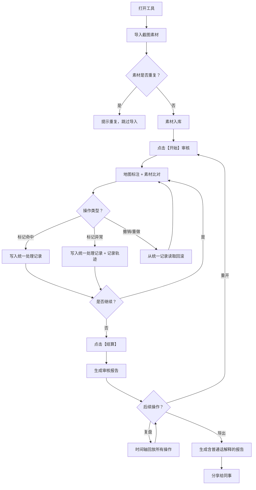

## 1. 产品概述

校园逃生路线板是一款面向文保讲解员的浏览器端互动审核工具，解决逃生路线复核时依赖截图、手写备注反复比对的低效问题。通过游戏化的审核流程，让文保讲解员能在浏览器内完成一局完整的路线审核，支持开始、暂停、重开、结算和复盘全流程操作。

- 核心价值：统一处理记录、消除重复结论、提供易懂的审核报告
- 目标用户：文保讲解员、安全复核人员
- 产品定位：轻量、专业、可追溯的逃生路线审核工具

## 2. 核心 Features

### 2.1 用户角色

| 角色 | 注册方式 | 核心权限 |
|------|----------|----------|
| 文保讲解员 | 无需注册，直接使用 | 导入素材、进行路线审核、导出报告、查看复盘 |

### 2.2 Feature Module

1. **审核主界面**：路线地图画布、控制面板、审核进度显示
2. **素材导入系统**：截图批量导入、去重校验、素材哈希比对
3. **游戏化审核流程**：开始/暂停/重开/结算/复盘操作
4. **统一记录系统**：命中检测、撤销/重做共用同一批处理记录
5. **异常追溯系统**：颜色越界等异常可追溯轨迹和处理意见
6. **报告导出系统**：生成含普通话解释的友好报告，支持导出分享

### 2.3 页面详情

| 页面名称 | 模块名称 | 功能描述 |
|---------|----------|----------|
| 审核主页面 | 顶部控制栏 | 开始、暂停、重开、结算、复盘按钮，当前局数显示 |
| 审核主页面 | 中央画布区 | 显示校园地图、逃生路线、审核标记点，支持点击标注 |
| 审核主页面 | 右侧素材面板 | 导入的截图素材列表，点击可查看大图，标记命中/异常 |
| 审核主页面 | 左侧记录面板 | 处理记录列表，支持撤销/重做，点击可定位到对应位置 |
| 审核主页面 | 底部报告区 | 实时显示当前审核结论，异常条目可追溯 |
| 复盘弹窗 | 时间轴复盘 | 按时间顺序展示所有操作记录，支持逐帧回放 |
| 导出报告 | 报告预览 | 展示完整审核报告，含普通话解释段，可复制可下载 |

## 3. 核心 Process

文保讲解员打开工具 → 导入截图素材（自动去重）→ 点击开始进入审核 → 在地图上点击标注逃生路线关键点 → 对照右侧素材标记命中或异常 → 可随时撤销/重做操作 → 点击结算生成本局报告 → 可复盘查看完整轨迹 → 导出含普通话解释的报告给同事。

## 4. 用户 Interface 设计

### 4.1 设计 Style

采用 **专业工具感 + 游戏化交互** 的设计方向：
- 主色调：深海军蓝 `#0F2C4A`（专业、安全），警示橙 `#FF6B35`（异常、逃生），成功绿 `#2ECC71`（命中、安全）
- 辅助色：浅灰蓝 `#E8F1F8`（背景），深灰 `#2C3E50`（文字）
- 按钮风格：微立体圆角按钮，悬停有轻微上浮动效，危险操作（如重开）用警示色边框
- 字体：标题用 `Noto Sans SC Bold` 有力量感，正文用 `Noto Sans SC Regular` 清晰易读
- 布局：三栏结构（左侧记录 + 中央画布 + 右侧素材），顶部控制栏，底部报告预览
- 图标：采用线性图标配合 emoji 增强识别度，异常用 ⚠️，命中考用 ✅，撤销用 ↩️
- 动效：标注点出现时有脉冲扩散动画，撤销/重做时有平滑过渡，结算时有庆祝动效

### 4.2 页面设计 Overview

| 页面名称 | 模块名称 | UI Elements |
|---------|----------|-------------|
| 审核主页面 | 顶部控制栏 | 深色背景，白色文字，按钮带图标，操作状态实时变化文字 |
| 审核主页面 | 中央画布区 | 浅灰蓝背景，校园平面图居中，路线用橙色虚线，标注点带编号，hover 放大 |
| 审核主页面 | 右侧素材面板 | 卡片式布局，缩略图 + 标题 + 状态标签，点击展开大图 |
| 审核主页面 | 左侧记录面板 | 时间线布局，每条记录带操作类型图标，可点击撤销/重做 |
| 审核主页面 | 底部报告区 | 半透明深色背景，异常条目高亮橙红色，点击展开详情 |
| 复盘弹窗 | 时间轴复盘 | 底部横向时间轴，带播放/暂停/上一帧/下一帧控制，中央同步显示画面 |
| 导出报告 | 报告预览 | 卡片式布局，顶部标题，中间普通话解释段（带复制按钮），底部明细表格 |

### 4.3 响应式设计

- Desktop-first 设计，主布局针对 1280px+ 屏幕优化
- 平板端：右侧素材面板可折叠收起，左侧记录面板改为底部抽屉
- 移动端：简化为单栏布局，画布为主，素材和记录通过底部 tab 切换
- 触摸优化：按钮最小尺寸 44x44px，支持双指缩放地图

## 5. 核心业务规则

1. **统一处理记录规则**：命中检测、撤销、重做必须读写同一份 `actionLog` 数组，界面展示和报告生成都从该数组读取，确保数据一致性。
2. **素材去重规则**：导入时计算图片 MD5 哈希，与已导入素材哈希比对，重复则提示并跳过，同一批素材多次导入只保留一份结论。
3. **异常追溯规则**：标记颜色越界等异常时，自动关联当前操作前后各 3 条轨迹记录和处理意见，形成完整证据链。
4. **报告生成规则**：必须包含一段 100-200 字的普通话总结，所有异常描述避免使用字段名和缩写，改用自然语言解释。
5. **游戏状态规则**：状态机严格管理：`idle` → `playing` ↔ `paused` → `finished`，只有 `playing` 状态可标注，`finished` 后可复盘或重开。
