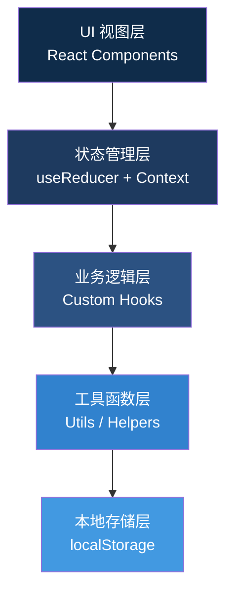

## 1. 架构设计

本项目采用纯前端单页应用架构，无需后端服务，所有数据存储在浏览器本地。采用分层架构确保关注点分离，便于维护和扩展。



**架构说明：**
- **UI 视图层**：React 组件负责页面渲染和用户交互，采用原子化组件设计
- **状态管理层**：使用 `useReducer` + `Context` 管理全局状态，确保状态变更可追踪
- **业务逻辑层**：自定义 Hooks 封装审核流程、记录管理、素材处理等核心逻辑
- **工具函数层**：提供哈希计算、报告生成、时间格式化等通用工具
- **本地存储层**：使用 `localStorage` 持久化存储素材和审核记录

## 2. 技术选型说明

| 技术 | 版本 | 用途说明 |
|------|------|----------|
| React | 18.x | UI 框架，使用 Hooks API |
| TypeScript | 5.x | 类型安全，提升代码可维护性 |
| Vite | 5.x | 构建工具，开发体验佳，打包速度快 |
| TailwindCSS | 3.x | 原子化 CSS 框架，快速构建 UI |
| blueimp-md5 | 2.19.x | 图片 MD5 哈希计算，用于去重 |
| html2canvas | 1.4.x | 报告导出为图片功能 |
| Lucide React | 0.344.x | 图标库，提供统一的图标风格 |

**初始化方式**：使用 `npm create vite@latest` 初始化 React + TypeScript 项目，手动安装 TailwindCSS 和其他依赖。

## 3. 状态管理设计

### 3.1 全局状态结构

```typescript
// 游戏状态枚举
type GameStatus = 'idle' | 'playing' | 'paused' | 'finished';

// 操作类型枚举
type ActionType = 'mark_hit' | 'mark_anomaly' | 'update_route' | 'import_material';

// 异常类型枚举
type AnomalyType = 'color_out_of_bounds' | 'route_deviation' | 'missing_marker';

// 坐标点
interface Point {
  x: number;
  y: number;
  timestamp: number;
}

// 处理记录（统一记录，命中检测和撤销重做共用）
interface ActionLog {
  id: string;
  type: ActionType;
  point?: Point;
  materialId?: string;
  anomalyType?: AnomalyType;
  description: string;
  timestamp: number;
  operator: string;
  tracePoints: Point[]; // 轨迹记录，用于异常追溯
  opinion?: string; // 处理意见
}

// 素材信息
interface Material {
  id: string;
  name: string;
  hash: string; // MD5 哈希，用于去重
  dataUrl: string;
  importedAt: number;
  status: 'pending' | 'hit' | 'anomaly' | 'skipped';
  relatedLogId?: string;
}

// 审核报告
interface AuditReport {
  id: string;
  gameSessionId: string;
  startTime: number;
  endTime: number;
  totalMarks: number;
  hitCount: number;
  anomalyCount: number;
  actionLogs: ActionLog[];
  materials: Material[];
  plainTextSummary: string; // 普通话解释
  anomalies: AnomalyDetail[];
}

// 异常详情（用于追溯）
interface AnomalyDetail {
  logId: string;
  type: AnomalyType;
  description: string;
  tracePoints: Point[];
  opinion: string;
  relatedLogs: string[]; // 关联的前后操作记录 ID
}

// 全局状态
interface AppState {
  gameStatus: GameStatus;
  gameSessionId: string;
  currentRound: number;
  startTime: number | null;
  pauseTime: number;
  totalPausedDuration: number;
  routePoints: Point[];
  actionLogs: ActionLog[]; // 统一处理记录
  redoStack: ActionLog[]; // 重做栈
  materials: Material[];
  currentReport: AuditReport | null;
  selectedMaterialId: string | null;
  isReplaying: boolean;
  replayIndex: number;
}
```

### 3.2 状态变更 Action 类型

```typescript
type AppAction =
  | { type: 'START_GAME' }
  | { type: 'PAUSE_GAME' }
  | { type: 'RESUME_GAME' }
  | { type: 'RESET_GAME' }
  | { type: 'FINISH_GAME'; payload: { plainTextSummary: string } }
  | { type: 'ADD_POINT'; payload: Point }
  | { type: 'MARK_HIT'; payload: { materialId: string; point: Point; description: string } }
  | { type: 'MARK_ANOMALY'; payload: { materialId: string; point: Point; anomalyType: AnomalyType; description: string; opinion: string } }
  | { type: 'UNDO' }
  | { type: 'REDO' }
  | { type: 'IMPORT_MATERIALS'; payload: Material[] }
  | { type: 'SELECT_MATERIAL'; payload: string | null }
  | { type: 'START_REPLAY' }
  | { type: 'STOP_REPLAY' }
  | { type: 'SET_REPLAY_INDEX'; payload: number }
  | { type: 'CLEAR_REPORT' };
```

**关键设计原则**：
- `actionLogs` 是唯一数据源，界面渲染、报告生成、撤销重做都基于此数组
- 撤销操作将记录从 `actionLogs` 弹出并推入 `redoStack`
- 重做操作从 `redoStack` 弹出并推回 `actionLogs`
- 新操作会清空 `redoStack`，确保状态一致性

## 4. 路由定义

单页应用，使用 HashRouter 管理路由：

| 路由 | 页面组件 | 用途 |
|------|----------|------|
| `/` | `AuditGame` | 审核主界面，包含所有核心功能 |
| `/report/:id` | `ReportViewer` | 报告查看页面，支持分享链接访问 |

## 5. 核心模块设计

### 5.1 游戏流程 Hook - `useGameFlow`

```typescript
// 管理游戏状态流转
interface UseGameFlowReturn {
  status: GameStatus;
  start: () => void;
  pause: () => void;
  resume: () => void;
  reset: () => void;
  finish: (summary: string) => AuditReport;
  getElapsedTime: () => number;
}
```

**状态机流转规则**：
```
idle → playing → paused → playing → ... → paused → finished
  ↑                          ↓
  └──────────────────────────┘ (reset)
```

### 5.2 统一记录管理 Hook - `useActionLog`

```typescript
// 管理统一处理记录，命中检测和撤销重做共用
interface UseActionLogReturn {
  logs: ActionLog[];
  redoStack: ActionLog[];
  addLog: (log: Omit<ActionLog, 'id' | 'timestamp' | 'tracePoints'>) => void;
  undo: () => ActionLog | undefined;
  redo: () => ActionLog | undefined;
  canUndo: boolean;
  canRedo: boolean;
  getLogsByType: (type: ActionType) => ActionLog[];
  getAnomalyTrace: (logId: string) => { log: ActionLog; before: ActionLog[]; after: ActionLog[] };
}
```

### 5.3 素材管理 Hook - `useMaterials`

```typescript
// 管理素材导入和去重
interface UseMaterialsReturn {
  materials: Material[];
  importMaterials: (files: File[]) => Promise<{ imported: Material[]; duplicates: Material[] }>;
  updateMaterialStatus: (id: string, status: Material['status'], logId?: string) => void;
  getMaterialByHash: (hash: string) => Material | undefined;
  removeMaterial: (id: string) => void;
}
```

**去重算法**：
1. 读取文件为 ArrayBuffer
2. 计算 MD5 哈希值
3. 与已有素材哈希比对
4. 重复则返回提示，不重复则入库

### 5.4 报告生成 Hook - `useReport`

```typescript
// 生成审核报告
interface UseReportReturn {
  generatePlainTextSummary: (logs: ActionLog[], materials: Material[]) => string;
  generateReport: (session: GameSession, logs: ActionLog[], materials: Material[]) => AuditReport;
  exportReportAsJson: (report: AuditReport) => string;
  exportReportAsImage: (element: HTMLElement) => Promise<string>;
  getAnomalyExplanation: (type: AnomalyType) => string;
}
```

**普通话解释生成规则**：
- 开头说明审核时间、地点、审核人
- 中间说明总标记数、命中数、异常数
- 针对每个异常，用自然语言描述位置和问题
- 结尾给出处理建议
- 字数控制在 100-200 字

**异常解释映射（避免字段名）**：
```typescript
const anomalyExplanations: Record<AnomalyType, string> = {
  color_out_of_bounds: '该区域颜色超出规定的安全色范围，可能导致标识不清晰',
  route_deviation: '实际逃生路线与预设路线存在偏差，需要核对路径是否正确',
  missing_marker: '该位置缺少必要的逃生指示标识，存在安全隐患',
};
```

## 6. 组件结构

```
src/
├── components/
│   ├── layout/
│   │   ├── TopBar.tsx          # 顶部控制栏
│   │   ├── LeftPanel.tsx       # 左侧记录面板
│   │   ├── RightPanel.tsx      # 右侧素材面板
│   │   └── BottomBar.tsx       # 底部报告预览
│   ├── canvas/
│   │   ├── MapCanvas.tsx       # 地图画布
│   │   ├── RouteLayer.tsx      # 路线图层
│   │   └── MarkerLayer.tsx     # 标记点图层
│   ├── material/
│   │   ├── MaterialUploader.tsx # 素材上传组件
│   │   ├── MaterialCard.tsx    # 素材卡片
│   │   └── MaterialViewer.tsx  # 素材大图查看器
│   ├── record/
│   │   ├── RecordTimeline.tsx  # 记录时间线
│   │   └── RecordItem.tsx      # 单条记录项
│   ├── replay/
│   │   ├── ReplayModal.tsx     # 复盘弹窗
│   │   └── ReplayTimeline.tsx  # 复盘时间轴
│   ├── report/
│   │   ├── ReportModal.tsx     # 报告预览弹窗
│   │   ├── ReportSummary.tsx   # 普通话解释段
│   │   └── AnomalyDetail.tsx   # 异常详情（可追溯）
│   └── common/
│       ├── Button.tsx          # 通用按钮
│       ├── Modal.tsx           # 通用弹窗
│       └── StatusBadge.tsx     # 状态标签
├── hooks/
│   ├── useGameFlow.ts          # 游戏流程
│   ├── useActionLog.ts         # 统一记录管理
│   ├── useMaterials.ts         # 素材管理
│   ├── useReport.ts            # 报告生成
│   └── useLocalStorage.ts      # 本地存储
├── store/
│   ├── AppContext.tsx          # 全局 Context
│   ├── appReducer.ts           # Reducer 逻辑
│   └── initialState.ts         # 初始状态
├── types/
│   └── index.ts                # 类型定义
├── utils/
│   ├── hash.ts                 # 哈希计算
│   ├── report.ts               # 报告工具
│   └── time.ts                 # 时间工具
├── data/
│   └── mockMap.ts              # 模拟校园地图数据
├── App.tsx
├── main.tsx
└── index.css
```

## 7. 核心算法说明

### 7.1 命中检测算法

```typescript
// 判断标记点是否在预设路线附近（阈值 30px）
function checkHit(point: Point, routePoints: Point[], threshold = 30): boolean {
  return routePoints.some(routePoint => {
    const distance = Math.sqrt(
      Math.pow(point.x - routePoint.x, 2) + 
      Math.pow(point.y - routePoint.y, 2)
    );
    return distance <= threshold;
  });
}
```

### 7.2 颜色越界检测

```typescript
// 判断颜色是否在允许的安全色范围内
function checkColorOutOfBounds(
  pixelColor: { r: number; g: number; b: number },
  allowedColors: Array<{ r: number; g: number; b: number; tolerance: number }>
): boolean {
  return !allowedColors.some(allowed => {
    return (
      Math.abs(pixelColor.r - allowed.r) <= allowed.tolerance &&
      Math.abs(pixelColor.g - allowed.g) <= allowed.tolerance &&
      Math.abs(pixelColor.b - allowed.b) <= allowed.tolerance
    );
  });
}
```

### 7.3 撤销重做实现

```typescript
// Reducer 中的撤销逻辑
case 'UNDO':
  if (state.actionLogs.length === 0) return state;
  const lastLog = state.actionLogs[state.actionLogs.length - 1];
  return {
    ...state,
    actionLogs: state.actionLogs.slice(0, -1),
    redoStack: [...state.redoStack, lastLog],
    // 同步回滚 routePoints
    routePoints: state.routePoints.filter(p => p.timestamp !== lastLog.point?.timestamp),
  };

case 'REDO':
  if (state.redoStack.length === 0) return state;
  const redoLog = state.redoStack[state.redoStack.length - 1];
  return {
    ...state,
    actionLogs: [...state.actionLogs, redoLog],
    redoStack: state.redoStack.slice(0, -1),
    routePoints: redoLog.point 
      ? [...state.routePoints, redoLog.point] 
      : state.routePoints,
  };
```

## 8. 数据持久化

使用 `localStorage` 存储以下数据：
- `materials`：素材库（包含哈希值，用于去重）
- `reports`：历史审核报告列表
- `preferences`：用户偏好设置

**存储策略**：
- 素材仅存储元数据和 DataURL，不保存原始文件
- 报告保存完整数据，支持复盘和导出
- 定期清理超过 30 天的历史数据
