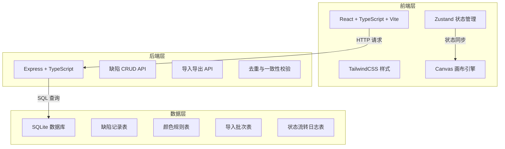
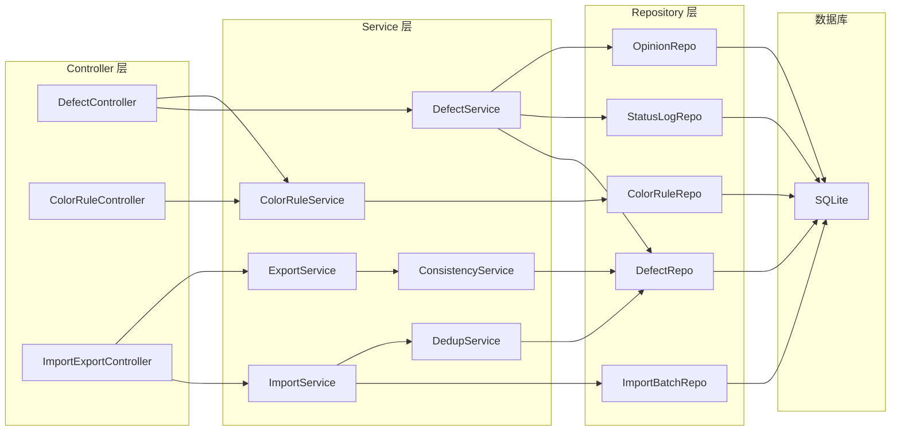
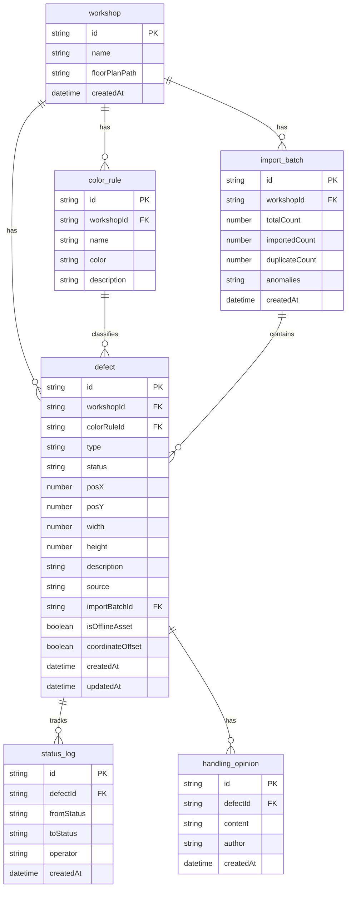

## 1. 架构设计



## 2. 技术说明

- **前端**：React@18 + TypeScript + Vite + TailwindCSS@3 + Zustand
- **初始化工具**：vite-init（react-express-ts 模板）
- **后端**：Express@4 + TypeScript（ESM 模式）
- **数据库**：SQLite（better-sqlite3），轻量无需额外部署
- **画布引擎**：基于 HTML Canvas API 实现圈选与底图叠加
- **文件处理**：PapaParse 解析 CSV，前端文件读取 + 后端入库

## 3. 路由定义

| 路由 | 用途 |
|------|------|
| `/` | 图层管理页，车间列表与状态总览 |
| `/canvas/:workshopId` | 画布编辑页，缺陷圈选与颜色规则 |
| `/defects/:workshopId` | 缺陷列表页，筛选与批量操作 |
| `/defects/:workshopId/:defectId` | 缺陷详情页，来源与处理意见 |
| `/student/:workshopId` | 学生视图，只读结论展示 |

## 4. API 定义

### 4.1 缺陷记录 API

```typescript
interface Defect {
  id: string
  workshopId: string
  type: string
  colorRuleId: string
  status: "pending" | "approved" | "rejected" | "resolved"
  position: { x: number; y: number; width: number; height: number }
  description: string
  source: "manual" | "import"
  importBatchId: string | null
  isOfflineAsset: boolean
  coordinateOffset: boolean
  createdAt: string
  updatedAt: string
}

interface CreateDefectRequest {
  workshopId: string
  type: string
  colorRuleId: string
  position: { x: number; y: number; width: number; height: number }
  description: string
}

interface UpdateDefectRequest {
  status?: Defect["status"]
  description?: string
}
```

### 4.2 颜色规则 API

```typescript
interface ColorRule {
  id: string
  workshopId: string
  name: string
  color: string
  description: string
  defectCount: number
}

interface UpsertColorRuleRequest {
  name: string
  color: string
  description: string
}
```

### 4.3 导入 API

```typescript
interface ImportRequest {
  workshopId: string
  data: DefectImportRow[]
}

interface DefectImportRow {
  type: string
  colorRuleName: string
  position: { x: number; y: number; width: number; height: number }
  description: string
  isOfflineAsset: boolean
}

interface ImportResult {
  total: number
  imported: number
  duplicates: number
  anomalies: AnomalyItem[]
}

interface AnomalyItem {
  row: number
  reason: "offline_asset_missing" | "color_rule_mismatch" | "coordinate_offset" | "duplicate"
  detail: string
}
```

### 4.4 导出 API

```typescript
interface ExportRequest {
  workshopId: string
  status?: Defect["status"][]
  includeDetails: boolean
}

interface ExportConsistencyCheck {
  isConsistent: boolean
  mismatches: MismatchItem[]
}

interface MismatchItem {
  defectId: string
  uiStatus: string
  dataStatus: string
}
```

### 4.5 处理意见 API

```typescript
interface HandlingOpinion {
  id: string
  defectId: string
  content: string
  author: string
  createdAt: string
}

interface AddOpinionRequest {
  content: string
  author: string
}
```

### 4.6 状态流转 API

```typescript
interface StatusTransition {
  id: string
  defectId: string
  fromStatus: Defect["status"]
  toStatus: Defect["status"]
  operator: string
  createdAt: string
}

interface TransitionRequest {
  toStatus: Defect["status"]
  operator: string
}
```

## 5. 后端架构图



## 6. 数据模型

### 6.1 数据模型定义



### 6.2 数据定义语言

```sql
CREATE TABLE IF NOT EXISTS workshop (
  id TEXT PRIMARY KEY,
  name TEXT NOT NULL,
  floorPlanPath TEXT,
  createdAt TEXT NOT NULL DEFAULT (datetime('now'))
);

CREATE TABLE IF NOT EXISTS color_rule (
  id TEXT PRIMARY KEY,
  workshopId TEXT NOT NULL REFERENCES workshop(id),
  name TEXT NOT NULL,
  color TEXT NOT NULL,
  description TEXT NOT NULL DEFAULT '',
  UNIQUE(workshopId, name)
);

CREATE TABLE IF NOT EXISTS import_batch (
  id TEXT PRIMARY KEY,
  workshopId TEXT NOT NULL REFERENCES workshop(id),
  totalCount INTEGER NOT NULL DEFAULT 0,
  importedCount INTEGER NOT NULL DEFAULT 0,
  duplicateCount INTEGER NOT NULL DEFAULT 0,
  anomalies TEXT NOT NULL DEFAULT '[]',
  createdAt TEXT NOT NULL DEFAULT (datetime('now'))
);

CREATE TABLE IF NOT EXISTS defect (
  id TEXT PRIMARY KEY,
  workshopId TEXT NOT NULL REFERENCES workshop(id),
  colorRuleId TEXT REFERENCES color_rule(id),
  type TEXT NOT NULL,
  status TEXT NOT NULL DEFAULT 'pending' CHECK (status IN ('pending','approved','rejected','resolved')),
  posX REAL NOT NULL,
  posY REAL NOT NULL,
  width REAL NOT NULL,
  height REAL NOT NULL,
  description TEXT NOT NULL DEFAULT '',
  source TEXT NOT NULL DEFAULT 'manual' CHECK (source IN ('manual','import')),
  importBatchId TEXT REFERENCES import_batch(id),
  isOfflineAsset INTEGER NOT NULL DEFAULT 0,
  coordinateOffset INTEGER NOT NULL DEFAULT 0,
  createdAt TEXT NOT NULL DEFAULT (datetime('now')),
  updatedAt TEXT NOT NULL DEFAULT (datetime('now'))
);

CREATE TABLE IF NOT EXISTS status_log (
  id TEXT PRIMARY KEY,
  defectId TEXT NOT NULL REFERENCES defect(id),
  fromStatus TEXT NOT NULL,
  toStatus TEXT NOT NULL,
  operator TEXT NOT NULL DEFAULT '',
  createdAt TEXT NOT NULL DEFAULT (datetime('now'))
);

CREATE TABLE IF NOT EXISTS handling_opinion (
  id TEXT PRIMARY KEY,
  defectId TEXT NOT NULL REFERENCES defect(id),
  content TEXT NOT NULL,
  author TEXT NOT NULL DEFAULT '',
  createdAt TEXT NOT NULL DEFAULT (datetime('now'))
);

CREATE INDEX IF NOT EXISTS idx_defect_workshop ON defect(workshopId);
CREATE INDEX IF NOT EXISTS idx_defect_status ON defect(status);
CREATE INDEX IF NOT EXISTS idx_defect_batch ON defect(importBatchId);
CREATE INDEX IF NOT EXISTS idx_defect_type ON defect(type);
CREATE INDEX IF NOT EXISTS idx_status_log_defect ON status_log(defectId);
CREATE INDEX IF NOT EXISTS idx_opinion_defect ON handling_opinion(defectId);
```

### 6.3 初始示例数据

首次启动时自动插入示例车间"演示车间-A"，包含：
- 3 条颜色规则（划伤/红色、变形/橙色、锈蚀/黄色）
- 5 条缺陷记录（覆盖不同状态：待确认2条、已通过1条、已驳回1条、已处理1条）
- 1 条导入批次记录
- 对应的状态流转日志和处理意见
