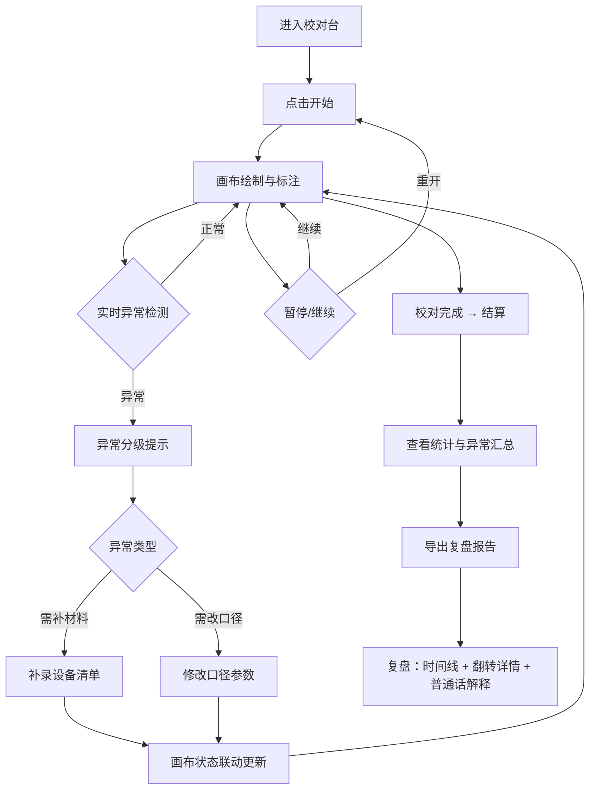

## 1. 产品概述

手绘地图比例尺校对工具——面向车间主管的浏览器端校对流程工具。将"比例尺校对"从纸质翻查变为可操作的一局式流程，解决撤销后状态不同步、异常分类模糊、复盘报告缺乏可读解释等现场痛点。目标用户为车间主管及评审老师。

## 2. 核心功能

### 2.1 用户角色

| 角色 | 使用方式 | 核心权限 |
|------|----------|----------|
| 车间主管 | 直接使用 | 操作校对流程、补录设备、导出报告、添加人工备注 |
| 评审老师 | 查看导出报告 | 仅阅读报告，无需登录即可理解异常原因与处理建议 |

### 2.2 功能模块

1. **校对台页面**：画布绘制区、比例尺标注、坐标网格、实时异常检测
2. **结算页面**：本轮校对统计、异常分级汇总、处理建议
3. **复盘页面**：操作回放时间线、坐标翻转记录详情、人工备注保留、普通话解释

### 2.3 页面详情

| 页面名称 | 模块名称 | 功能描述 |
|----------|----------|----------|
| 校对台 | 流程控制栏 | 开始、暂停、重开三个按钮，显示当前轮次与计时 |
| 校对台 | 画布绘制区 | 可绘制比例尺参考线、标注关键坐标点，支持撤销/重做且状态同步 |
| 校对台 | 坐标网格 | 显示当前坐标系方向，标识翻转区域 |
| 校对台 | 设备清单面板 | 可补录设备信息，补录后画布状态联动刷新 |
| 校对台 | 异常提示条 | 实时检测异常，按类型分级显示（补材料/改口径），不用单一红色数字 |
| 结算 | 统计卡片 | 本轮校对时长、检测点数、异常数、通过率 |
| 结算 | 异常分级表 | 按异常类型分组，标注"需补材料"或"需改口径" |
| 结算 | 导出按钮 | 导出复盘报告 |
| 复盘 | 操作时间线 | 按时间顺序回放每步操作 |
| 复盘 | 坐标翻转详情 | 翻转坐标记录，附普通话解释与人工备注原话 |
| 复盘 | 报告预览 | 可直接复制普通话解释段落，评审老师可独立阅读 |

## 3. 核心流程

车间主管打开工具后，点击"开始"进入校对流程。在画布上绘制比例尺参考线、标注坐标点，系统实时检测异常。若发现坐标翻转等异常，异常提示条按类型分级显示（而非全部红色数字），并明确建议下一步是"补材料"还是"改口径"。过程中可补录设备清单，补录后画布自动刷新状态。暂停后可继续，重开则清空本轮。校对完成后进入结算页，查看统计与异常汇总。点击导出生成复盘报告，报告中坐标翻转记录附带普通话解释，人工备注保留原话不改写。评审老师仅看报告也能理解拦截原因。

## 4. 用户界面设计

### 4.1 设计风格

- 主色调：工业灰蓝（#2D3748）+ 校对红橙警示（#E53E3E / #ED8936）+ 通过绿（#38A169）
- 按钮：圆角微凸（rounded-md + shadow-sm），主操作按钮略带立体感
- 字体：正文用 Noto Sans SC，数据/坐标用 JetBrains Mono
- 布局：左侧画布区为主，右侧设备清单与异常面板，顶部流程控制栏
- 图标：使用 lucide-react 线性图标，保持工具感
- 画布区域使用浅色网格底纹，坐标轴标注清晰

### 4.2 页面设计概览

| 页面名称 | 模块名称 | UI 元素 |
|----------|----------|---------|
| 校对台 | 流程控制栏 | 深灰底色横条，开始(绿)/暂停(黄)/重开(灰)按钮，轮次与计时数字 |
| 校对台 | 画布绘制区 | 白底网格画布，比例尺参考线蓝色，标注点红色圆点，翻转区域橙色虚线框 |
| 校对台 | 设备清单面板 | 右侧卡片，可折叠，补录输入框 + 添加按钮，补录后画布闪烁刷新 |
| 校对台 | 异常提示条 | 画布下方条状，补材料类用橙色标签，改口径类用红色标签，不合并为单一数字 |
| 结算 | 统计卡片 | 四宫格卡片，图标 + 数字 + 标签 |
| 结算 | 异常分级表 | 表格行按类型着色，最后一列为处理建议徽章 |
| 复盘 | 操作时间线 | 竖向时间线，每步操作一个节点，可点击展开详情 |
| 复盘 | 坐标翻转详情 | 卡片式，原坐标 → 翻转坐标，下方普通话解释段落（可复制），人工备注原话高亮保留 |
| 复盘 | 报告预览 | A4纸感预览区，可直接复制文本段落 |

### 4.3 响应式策略

- 桌面优先（1920×1080 为基准）
- 画布区最小宽度 800px，设备清单面板可折叠
- 平板适配：面板改为底部抽屉
- 移动端暂不作为主要目标

### 4.4 3D 场景

不适用
