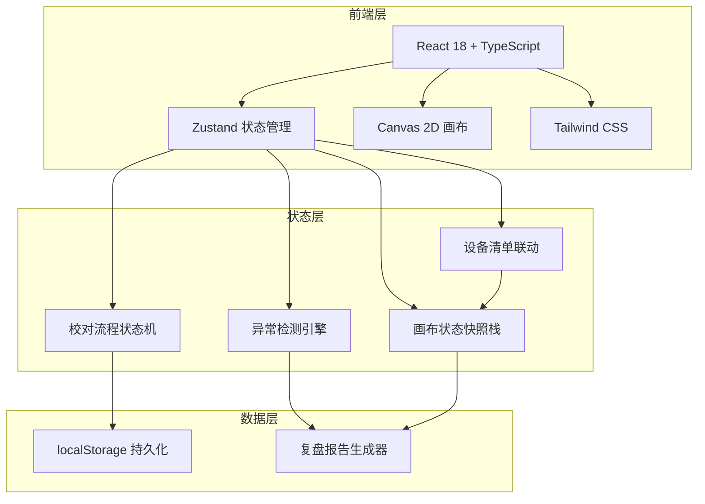
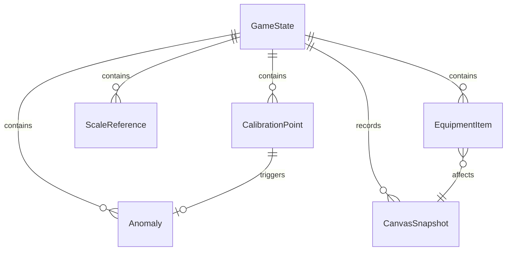

## 1. 架构设计



## 2. 技术说明

- 前端：React@18 + TypeScript + Tailwind CSS@3 + Vite
- 状态管理：Zustand（含 immer 中间件用于画布状态快照）
- 画布：Canvas 2D API（原生，不引入第三方画布库）
- 初始化工具：vite-init
- 后端：无（纯前端，数据存 localStorage）
- 数据库：无（localStorage + 内存）

## 3. 路由定义

| 路由 | 用途 |
|------|------|
| / | 校对台主页面（画布 + 控制栏 + 设备清单 + 异常提示） |
| /settlement | 结算页面（统计 + 异常分级表 + 导出按钮） |
| /replay | 复盘页面（时间线 + 坐标翻转详情 + 报告预览） |

## 4. API 定义

无后端 API。所有数据通过 Zustand store + localStorage 管理。

### 4.1 核心 TypeScript 类型

```typescript
type GamePhase = 'idle' | 'running' | 'paused' | 'settled'

interface CalibrationPoint {
  id: string
  x: number
  y: number
  label: string
  coordinateReversed: boolean
  manualNote: string | null
}

interface ScaleReference {
  id: string
  startX: number
  startY: number
  endX: number
  endY: number
  realDistance: number
  unit: string
}

interface Anomaly {
  id: string
  type: 'coordinate_flip' | 'scale_mismatch' | 'missing_equipment'
  severity: 'need_material' | 'need_caliber_change'
  pointId: string
  description: string
  plainExplanation: string
  manualNote: string | null
  timestamp: number
}

interface EquipmentItem {
  id: string
  name: string
  spec: string
  addedAt: number
}

interface CanvasSnapshot {
  points: CalibrationPoint[]
  scaleRefs: ScaleReference[]
  anomalies: Anomaly[]
  equipment: EquipmentItem[]
  timestamp: number
  action: string
}

interface GameState {
  phase: GamePhase
  round: number
  elapsedTime: number
  points: CalibrationPoint[]
  scaleRefs: ScaleReference[]
  anomalies: Anomaly[]
  equipment: EquipmentItem[]
  snapshots: CanvasSnapshot[]
  undoStack: CanvasSnapshot[]
  redoStack: CanvasSnapshot[]
}
```

## 5. 服务端架构

不适用

## 6. 数据模型

### 6.1 数据模型图



### 6.2 关键状态流转规则

- **撤销/重做状态同步**：每次画布操作前，将完整状态快照压入 undoStack；撤销时从 undoStack 弹出恢复，当前状态压入 redoStack；任何新操作清空 redoStack
- **设备补录联动**：补录设备后，重新运行异常检测引擎，更新 anomalies 列表，画布标记点颜色与数量随之变化
- **坐标翻转检测**：当标注点的 (x, y) 与相邻参考点方向相反时标记为翻转，生成 Anomaly 记录并附带普通话解释
- **人工备注保留**：Anomaly.manualNote 字段原样保留，导出报告时不做改写
