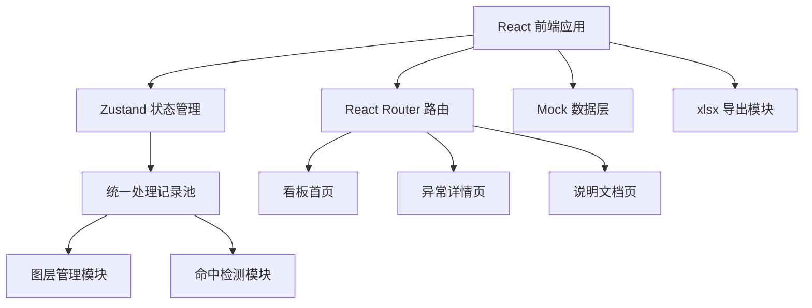
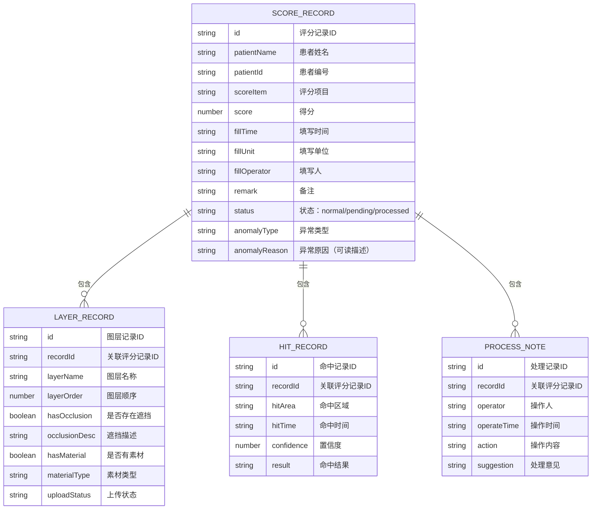

## 1. 架构设计



**核心设计原则**：图层管理与命中检测共用同一批处理记录，确保界面展示与导出报告数据完全一致，避免"各算各的"问题。

## 2. 技术描述

- 前端框架：React 18 + TypeScript
- 构建工具：Vite 5
- 样式方案：Tailwind CSS 3
- 状态管理：Zustand（单一数据源，确保图层和命中检测数据同源）
- 路由管理：React Router DOM 6
- 图标库：lucide-react
- 导出功能：xlsx（SheetJS）
- 数据来源：内置 Mock 数据，贴近真实场景

## 3. 路由定义

| 路由 | 页面 | 功能说明 |
|------|------|----------|
| `/` | 看板首页 | 异常概览、记录列表、筛选、导入、导出 |
| `/detail/:id` | 异常详情页 | 评分表信息、素材信息、图层信息、处理意见、追溯链路 |
| `/docs` | 说明文档页 | 启动、导入、查看异常、导出结果四步操作指南 |

## 4. 数据模型

### 4.1 数据关系图



### 4.2 TypeScript 类型定义

```typescript
// 处理记录状态
type RecordStatus = 'normal' | 'pending' | 'processed';

// 异常类型
type AnomalyType = 'none' | 'material_missing' | 'layer_occlusion' | 'incomplete_data' | 'old_format';

// 评分表记录
interface ScoreRecord {
  id: string;
  patientName: string;
  patientId: string;
  scoreItem: string;
  score: number;
  fillTime: string;
  fillUnit: string;
  fillOperator: string;
  remark: string;
  status: RecordStatus;
  anomalyType: AnomalyType;
  anomalyReason: string;
  isOldFormat: boolean;
  hasSupplementary: boolean;
}

// 图层记录（与命中检测共用 recordId）
interface LayerRecord {
  id: string;
  recordId: string;
  layerName: string;
  layerOrder: number;
  hasOcclusion: boolean;
  occlusionDesc: string;
  hasMaterial: boolean;
  materialType: 'screenshot' | 'video' | 'mark';
  uploadStatus: 'uploaded' | 'missing' | 'damaged';
}

// 命中检测记录（与图层管理共用 recordId）
interface HitRecord {
  id: string;
  recordId: string;
  hitArea: string;
  hitTime: string;
  confidence: number;
  result: string;
}

// 处理意见记录
interface ProcessNote {
  id: string;
  recordId: string;
  operator: string;
  operateTime: string;
  action: string;
  suggestion: string;
}

// 统一处理记录池状态
interface RecordPoolState {
  scoreRecords: ScoreRecord[];
  layerRecords: LayerRecord[];
  hitRecords: HitRecord[];
  processNotes: ProcessNote[];
  selectedRecordId: string | null;
  filterConditions: FilterConditions;
}
```

## 5. 核心模块设计

### 5.1 统一处理记录池（Zustand Store）

确保图层管理和命中检测从同一数据源读取，杜绝"界面、报告各算各的"问题：

```typescript
// src/store/recordPool.ts
import { create } from 'zustand';

export const useRecordPool = create<RecordPoolState & Actions>((set, get) => ({
  // 单一数据源，所有模块共用
  scoreRecords: [],
  layerRecords: [],
  hitRecords: [],
  processNotes: [],
  
  // 图层管理模块 - 从同一 pool 读取
  getLayersByRecordId: (recordId) => 
    get().layerRecords.filter(l => l.recordId === recordId),
  
  // 命中检测模块 - 从同一 pool 读取
  getHitsByRecordId: (recordId) => 
    get().hitRecords.filter(h => h.recordId === recordId),
  
  // 导入时统一更新所有数据
  importRecords: (data) => set({
    scoreRecords: data.scoreRecords,
    layerRecords: data.layerRecords,
    hitRecords: data.hitRecords,
    processNotes: data.processNotes,
  }),
}));
```

### 5.2 异常检测逻辑

```typescript
// src/utils/anomalyDetector.ts
export function detectAnomalies(record: ScoreRecord, layers: LayerRecord[]): AnomalyType[] {
  const anomalies: AnomalyType[] = [];
  
  // 离线素材缺失检测
  const missingMaterials = layers.filter(l => l.uploadStatus === 'missing');
  if (missingMaterials.length > 0) {
    anomalies.push('material_missing');
  }
  
  // 图层遮挡检测（依赖素材存在）
  const occlusionLayers = layers.filter(l => l.hasOcclusion && l.uploadStatus === 'uploaded');
  if (occlusionLayers.length > 0) {
    anomalies.push('layer_occlusion');
  }
  
  // 漏填单位检测
  if (!record.fillUnit || record.fillUnit.trim() === '') {
    anomalies.push('incomplete_data');
  }
  
  // 旧格式检测
  if (record.isOldFormat) {
    anomalies.push('old_format');
  }
  
  return anomalies;
}
```

### 5.3 导出模块

```typescript
// src/utils/exporter.ts
import * as XLSX from 'xlsx';

// 面向非技术人员的导出列名映射
const COLUMN_MAP: Record<string, string> = {
  patientName: '患者姓名',
  patientId: '患者编号',
  scoreItem: '评分项目',
  score: '得分',
  fillTime: '填写时间',
  fillUnit: '填写单位',
  fillOperator: '填写人',
  statusText: '处理状态',
  anomalyTypeText: '异常类型',
  anomalyReason: '异常说明',
  suggestion: '处理建议',
  materialStatus: '素材状态',
  layerCheckResult: '图层检测结果',
};

// 异常类型可读转换
const ANOMALY_TYPE_MAP: Record<AnomalyType, string> = {
  none: '无异常',
  material_missing: '离线素材缺失',
  layer_occlusion: '图层遮挡',
  incomplete_data: '数据不完整',
  old_format: '旧格式记录',
};
```

## 6. 项目结构

```
src/
├── components/          # 可复用组件
│   ├── StatCard.tsx     # 统计卡片
│   ├── FilterPanel.tsx  # 筛选面板
│   ├── RecordTable.tsx  # 记录表格
│   ├── TraceTimeline.tsx # 追溯时间线
│   └── LayerHitPanel.tsx # 图层与命中共用面板
├── pages/               # 页面组件
│   ├── Dashboard.tsx    # 看板首页
│   ├── Detail.tsx       # 异常详情页
│   └── Docs.tsx         # 说明文档页
├── store/               # 状态管理
│   └── recordPool.ts    # 统一处理记录池
├── utils/               # 工具函数
│   ├── anomalyDetector.ts # 异常检测
│   ├── exporter.ts      # 导出模块
│   └── mockData.ts      # Mock 数据生成
├── types/               # 类型定义
│   └── index.ts
├── App.tsx
├── main.tsx
└── index.css
```
