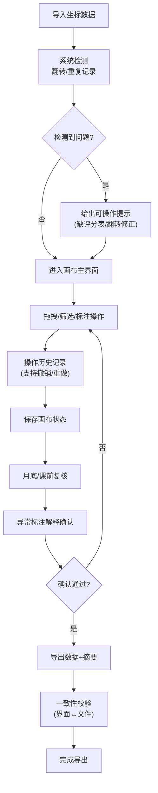

## 1. 产品概述

赛事战术白板回放是一款面向教研老师和训练员的战术分析工具，用于处理、标注和复核赛事轨迹坐标数据，解决底图坐标记录不规范、重复导入冲突等问题。

- 核心价值：将杂乱的底图坐标数据转化为可操作、可复核的战术分析素材
- 目标用户：教研老师（日常使用）、训练员（审核使用）

## 2. 核心功能

### 2.1 用户角色

| 角色 | 注册方式 | 核心权限 |
|------|----------|----------|
| 教研老师 | 内部账号 | 日常操作、导入数据、标注、导出 |
| 训练员 | 内部账号 | 审核数据、复核异常标注、最终确认 |

### 2.2 功能模块

1. **画布主界面**：底图展示、轨迹回放、实时操作
2. **数据导入模块**：坐标数据导入、去重处理、翻转修正
3. **标注系统**：异常标注、备注添加、状态标记
4. **操作工具栏**：拖拽、筛选、撤销、重做
5. **导出模块**：数据导出、摘要生成、一致性校验
6. **复核面板**：异常记录查看、重复导入校验、结论确认

### 2.3 页面详情

| 页面名称 | 模块名称 | 功能描述 |
|----------|----------|----------|
| 画布主界面 | 底图展示区 | 赛事场地底图、轨迹图层叠加、坐标翻转自动修正 |
| 画布主界面 | 轨迹操作区 | 拖拽移动、缩放、单条轨迹筛选、批量选择 |
| 画布主界面 | 标注工具栏 | 添加标注、编辑备注、标记状态（正常/异常/待确认） |
| 数据导入弹窗 | 文件上传 | 支持批量导入、格式校验、错误提示（缺评分表等） |
| 数据导入弹窗 | 冲突处理 | 重复导入检测、合并策略选择、翻转记录识别 |
| 复核面板 | 异常列表 | 按时间/类型筛选异常标注、一键跳转定位 |
| 复核面板 | 一致性检查 | 界面状态与导出文件比对、重复结论告警 |
| 导出设置 | 格式选择 | PDF/CSV/JSON导出、摘要生成、内容校验 |

## 3. 核心流程

用户导入赛事轨迹坐标数据 → 系统自动检测翻转/重复记录 → 教研老师在画布上拖拽、筛选、标注 → 系统实时记录操作历史支持撤销 → 月底/课前训练员复核异常标注 → 确认无误后导出（界面与文件内容一致性校验）

## 4. 用户界面设计

### 4.1 设计风格

- 主色调：深蓝色系 (#165DFF)，体现专业、稳重的战术分析氛围
- 辅助色：橙色 (#FF7D00) 用于异常标注，绿色 (#00B42A) 用于正常状态
- 按钮风格：圆角矩形，细微阴影，hover 状态有轻微放大动效
- 字体：标题使用 Noto Sans SC Bold，正文使用 Noto Sans SC Regular
- 布局：左侧工具栏 + 中央画布 + 右侧信息面板的三段式布局
- 图标风格：线性图标，粗细 2px，保持简洁专业

### 4.2 页面设计概述

| 页面名称 | 模块名称 | UI 元素 |
|----------|----------|----------|
| 画布主界面 | 工具栏 | 垂直排列的图标按钮，选中状态高亮，tooltip 提示 |
| 画布主界面 | 画布区 | 深色网格底图，轨迹线条带渐变，标注点带脉冲动画 |
| 画布主界面 | 信息面板 | 卡片式布局，折叠/展开动画，时间轴滚动 |
| 数据导入弹窗 | 上传区 | 拖拽上传区域，文件列表带状态标识 |
| 复核面板 | 异常列表 | 斑马纹表格，悬停高亮，状态标签带圆角 |
| 导出设置 | 选项区 | 单选/复选框自定义样式，预览区域实时更新 |

### 4.3 响应性

- 桌面端优先设计，适配 1280px 及以上宽度
- 平板端：右侧面板可收起为抽屉式
- 画布区域支持触摸手势缩放、拖拽
- 工具栏在小屏幕可转为水平排列

### 4.4 交互动效

- 画布加载：轨迹线条按时间顺序渐入绘制
- 标注添加：缩放 + 透明度淡入动画
- 撤销/重做：操作项从历史列表滑入滑出
- 错误提示：顶部滑入通知条，3秒后自动消失
- 导出进度：环形进度条，完成时有成功动效
