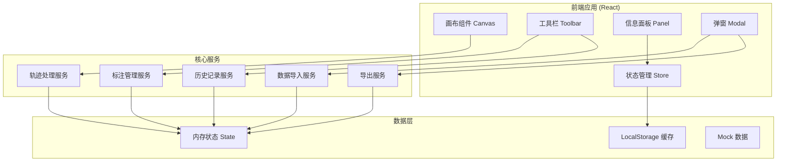
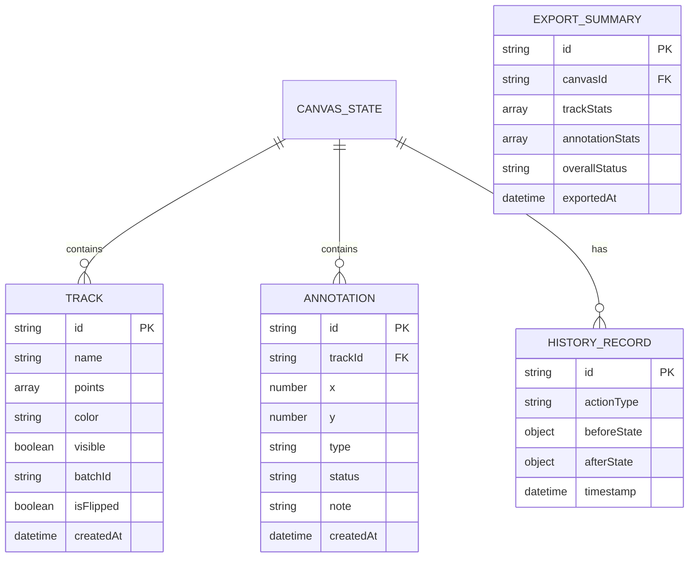

## 1. 架构设计



## 2. 技术描述

- 前端框架：React@18 + TypeScript
- 构建工具：Vite@5
- 样式方案：TailwindCSS@3
- 画布渲染：HTML5 Canvas API
- 状态管理：Zustand（轻量级，适合工具类应用）
- 图标库：Lucide React
- 动画方案：Framer Motion
- 数据存储：LocalStorage（前端持久化）
- 后端：无（纯前端工具，数据本地存储）

## 3. 路由定义

| 路由 | 用途 |
|------|------|
| / | 主画布界面（默认入口） |
| /review | 复核面板 |

## 4. 核心数据模型

### 4.1 数据模型定义



### 4.2 TypeScript 类型定义

```typescript
interface Point {
  x: number;
  y: number;
  timestamp?: number;
}

interface Track {
  id: string;
  name: string;
  points: Point[];
  color: string;
  visible: boolean;
  batchId: string;
  isFlipped: boolean;
  createdAt: Date;
}

type AnnotationType = 'normal' | 'abnormal' | 'pending';
type AnnotationStatus = 'draft' | 'confirmed' | 'rejected';

interface Annotation {
  id: string;
  trackId: string;
  x: number;
  y: number;
  type: AnnotationType;
  status: AnnotationStatus;
  note: string;
  createdAt: Date;
}

interface HistoryRecord {
  id: string;
  actionType: 'add' | 'update' | 'delete' | 'flip' | 'import';
  beforeState: object;
  afterState: object;
  timestamp: Date;
}

interface CanvasState {
  tracks: Track[];
  annotations: Annotation[];
  history: HistoryRecord[];
  historyIndex: number;
  selectedTrackId: string | null;
  zoom: number;
  pan: { x: number; y: number };
}

interface ImportResult {
  success: boolean;
  tracks?: Track[];
  errors?: ImportError[];
  warnings?: ImportWarning[];
}

interface ImportError {
  type: 'missing_scorecard' | 'invalid_format' | 'duplicate_batch';
  message: string;
  actionableHint: string;
}

interface ImportWarning {
  type: 'flipped_coordinates' | 'potential_duplicate';
  message: string;
  autoFixed: boolean;
}

interface ExportSummary {
  trackCount: number;
  annotationCount: number;
  abnormalCount: number;
  pendingCount: number;
  overallStatus: 'pass' | 'pending' | 'fail';
  exportedAt: Date;
}
```

## 5. 核心服务模块

### 5.1 数据导入服务

- **文件解析**：支持 CSV/JSON 格式的坐标数据导入
- **格式校验**：检查必填字段，识别缺失的评分表
- **翻转检测**：自动识别坐标翻转的轨迹记录
- **去重逻辑**：基于 batchId 检测重复导入，避免冲突
- **错误处理**：返回可操作的错误提示，而非内部异常

### 5.2 轨迹处理服务

- **坐标修正**：自动翻转检测到的异常坐标
- **渲染优化**：Canvas 批量绘制，支持大量轨迹点
- **交互处理**：拖拽、缩放、点选的坐标转换
- **筛选逻辑**：按时间、类型、状态筛选轨迹

### 5.3 历史记录服务

- **操作栈管理**：实现撤销/重做功能
- **状态快照**：每次操作前后保存完整状态
- **内存优化**：限制历史记录条数，支持清理

### 5.4 导出服务

- **多格式导出**：PDF/CSV/JSON 三种格式
- **摘要生成**：统计轨迹和标注信息
- **一致性校验**：确保导出内容与界面状态一致
- **重复检测**：导出前检查是否存在重复结论

## 6. 组件结构

```
src/
├── components/
│   ├── Canvas/
│   │   ├── Canvas.tsx          # 主画布组件
│   │   ├── TrackLayer.tsx      # 轨迹图层
│   │   └── AnnotationLayer.tsx # 标注图层
│   ├── Toolbar/
│   │   ├── Toolbar.tsx         # 左侧工具栏
│   │   └── ToolButton.tsx      # 工具按钮
│   ├── Panel/
│   │   ├── InfoPanel.tsx       # 右侧信息面板
│   │   ├── TrackList.tsx       # 轨迹列表
│   │   └── AnnotationList.tsx  # 标注列表
│   ├── Modal/
│   │   ├── ImportModal.tsx     # 导入弹窗
│   │   ├── ExportModal.tsx     # 导出弹窗
│   │   └── ReviewPanel.tsx     # 复核面板
│   └── common/
│       ├── Button.tsx
│       ├── Toast.tsx
│       └── StatusBadge.tsx
├── stores/
│   └── canvasStore.ts          # Zustand 状态管理
├── services/
│   ├── importService.ts
│   ├── trackService.ts
│   ├── historyService.ts
│   └── exportService.ts
├── types/
│   └── index.ts                # TypeScript 类型定义
├── utils/
│   ├── coordinate.ts           # 坐标处理工具
│   ├── deduplicate.ts          # 去重工具
│   └── validation.ts           # 校验工具
├── mock/
│   └── sampleData.ts           # 示例数据
├── App.tsx
├── main.tsx
└── index.css
```
