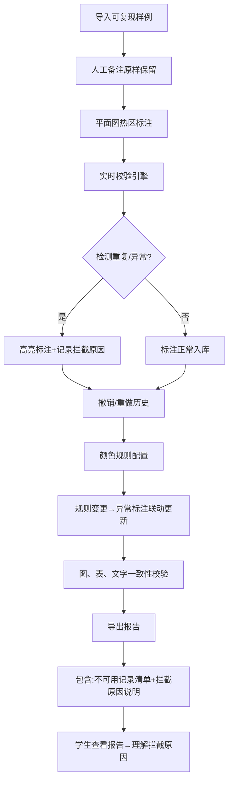

## 1. 产品概述

仓库拣货热区平面图系统是专为赛事运营场景设计的拣货热区标注与管理工具，解决演练前重复标注未提前暴露、人工备注被自动改写、导出报告无法说明拦截原因等核心问题。

- 核心用途：赛事拣货热区的标注、校验、审核与导出
- 目标用户：赛事运营人员、参赛学生、评审老师
- 产品价值：建立可复现的标注流程，确保图、表、文字三者一致性，保留人工备注原话，让学生从导出报告中理解规则

## 2. 核心功能

### 2.1 用户角色

| 角色 | 登录方式 | 核心权限 |
|------|----------|----------|
| 运营人员 | 账号登录 | 导入样例、配置颜色规则、审核标注、导出报告 |
| 参赛学生 | 只读访问 | 查看平面图、查看标注、下载导出报告 |

### 2.2 功能模块

1. **平面图工作台**：仓库平面可视化、热区标注绘制、撤销/重做操作、实时校验提示
2. **样例管理**：可复现样例库、人工备注保留、标注草稿管理
3. **颜色规则配置**：热区等级定义、异常标注规则、规则联动更新
4. **校验引擎**：重复标注检测、异常标注识别、拦截原因记录
5. **报告导出**：图文一致的 PDF/Excel 导出、拦截原因说明、不可用记录清单

### 2.3 页面详情

| 页面名称 | 模块名称 | 功能描述 |
|----------|----------|----------|
| 平面图工作台 | 画布区域 | SVG 仓库平面图展示、支持缩放平移、热区多边形绘制 |
| 平面图工作台 | 标注工具栏 | 画笔工具、颜色选择器、撤销/重做按钮、删除按钮 |
| 平面图工作台 | 实时校验面板 | 重复标注高亮、异常提示、拦截原因说明 |
| 样例管理页 | 样例列表 | 可复现样例卡片、人工备注原样展示、标注状态标签 |
| 样例管理页 | 详情面板 | 图、表、文字联动展示、三者一致性校验标识 |
| 颜色规则页 | 规则配置 | 热区等级颜色、阈值配置、规则变更后异常标注联动更新 |
| 报告导出页 | 导出配置 | 导出格式选择、报告模板预览、不可用记录高亮 |

## 3. 核心流程

用户从导入样例开始，在平面图上进行热区标注，系统实时校验重复和异常标注，支持撤销重做的完整历史记录，颜色规则变更后自动更新异常标注，最终导出包含拦截原因和不可用记录清单的报告。

## 4. 用户界面设计

### 4.1 设计风格

- **主色调**：工业蓝 #1E3A8A（专业严谨），搭配热区红 #DC2626、橙 #F59E0B、绿 #10B981 的警示色阶
- **按钮风格**：扁平直角按钮，2px 边框，点击时有明显的按压反馈
- **字体**：标题使用 "JetBrains Mono"（等宽工业感），正文使用 "Noto Sans SC"
- **布局风格**：左侧工具面板 + 中央画布 + 右侧校验面板的三栏工业布局
- **视觉细节**：画布添加网格纹理、标注添加虚线描边、异常区域使用抖动动画

### 4.2 页面设计概览

| 页面名称 | 模块名称 | UI 元素 |
|----------|----------|----------|
| 平面图工作台 | 画布区域 | 网格背景、SVG 仓库货架、热区多边形填充、重复区域交叉线纹理 |
| 平面图工作台 | 校验面板 | 红黄绿状态徽章、拦截原因时间线、人工备注引用框 |
| 样例管理页 | 样例卡片 | 缩略图预览、标注完成度进度条、人工备注原文标签 |
| 颜色规则页 | 规则表单 | 颜色拾色器、阈值滑块、联动更新预览区域 |
| 报告导出页 | 预览区 | 图文并排列表、不可用记录删除线样式、拦截原因脚注 |

### 4.3 响应式设计

- 桌面端优先（1440px+），三栏布局完整展示
- 平板端折叠右侧校验面板为抽屉式
- 移动端保留核心画布区域，工具条改为底部浮动栏

### 4.4 交互动效

- 标注绘制时：鼠标跟随的半透明预览
- 检测到重复：重复区域边缘红色脉冲动画
- 撤销重做：历史节点滑动过渡
- 规则更新：异常标注颜色渐变过渡（0.6s ease）
