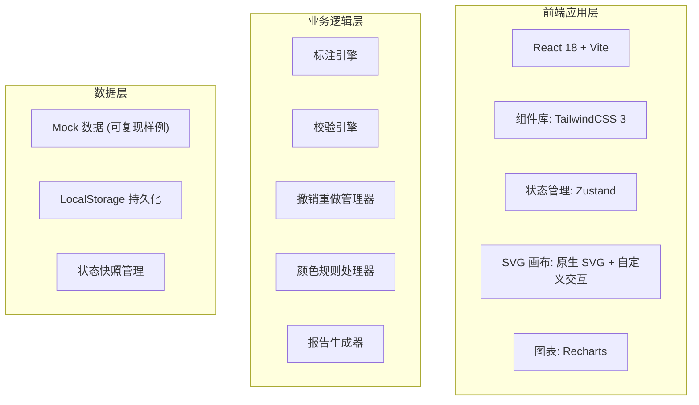
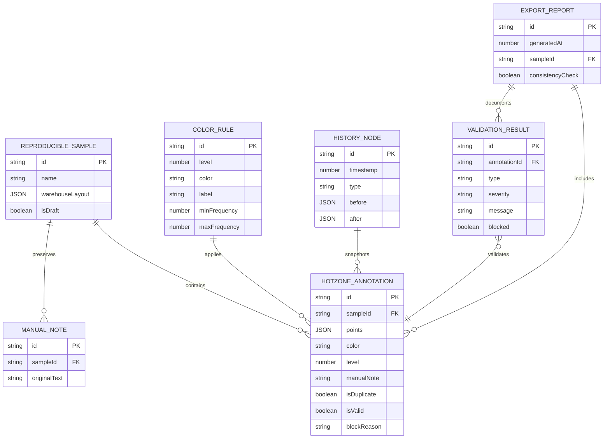

## 1. 架构设计



## 2. 技术描述

- **前端框架**: React@18.2 + TypeScript@5
- **构建工具**: Vite@5
- **样式方案**: TailwindCSS@3.4 + CSS Variables
- **状态管理**: Zustand@4 (轻量、支持时间旅行)
- **图表库**: Recharts@2 (统计表可视化)
- **图标**: Lucide React
- **后端**: 无后端，全前端 Mock 数据 + LocalStorage 持久化
- **数据持久化**: LocalStorage + 可导出 JSON 快照

## 3. 路由定义

| 路由 | 页面用途 |
|------|----------|
| / | 平面图工作台（主页面，三栏布局） |
| /samples | 样例管理页 |
| /rules | 颜色规则配置页 |
| /export | 报告导出页 |

## 4. 核心数据类型定义

```typescript
// 热区标注
interface HotzoneAnnotation {
  id: string;
  points: Point[];          // 多边形顶点
  color: string;            // 颜色（来自规则）
  level: number;            // 热区等级 1-5
  createdAt: number;
  updatedAt: number;
  manualNote?: string;      // 人工备注（原样保留）
  isDuplicate: boolean;     // 是否重复
  duplicateWith?: string[]; // 与哪些标注重复
  blockReason?: string;     // 拦截原因
  isValid: boolean;         // 是否可用
}

// 颜色规则
interface ColorRule {
  id: string;
  level: number;
  color: string;
  label: string;
  minFrequency: number;     // 最小拣货频次
  maxFrequency: number;     // 最大拣货频次
  createdAt: number;
}

// 可复现样例
interface ReproducibleSample {
  id: string;
  name: string;
  warehouseLayout: WarehouseShelf[];  // 仓库布局
  expectedAnnotations: HotzoneAnnotation[];
  manualNotes: string[];   // 人工备注（原样保留，不做任何格式化）
  createdAt: number;
  isDraft: boolean;
}

// 撤销重做历史节点
interface HistoryNode {
  id: string;
  timestamp: number;
  type: 'add' | 'delete' | 'modify' | 'rule_change';
  before: HotzoneAnnotation[];
  after: HotzoneAnnotation[];
  description: string;
}

// 校验结果
interface ValidationResult {
  annotationId: string;
  type: 'duplicate' | 'invalid_color' | 'out_of_bounds' | 'missing_level';
  severity: 'error' | 'warning';
  message: string;
  blocked: boolean;
}

// 导出报告
interface ExportReport {
  generatedAt: number;
  sampleId: string;
  validAnnotations: HotzoneAnnotation[];
  invalidAnnotations: HotzoneAnnotation[];
  blockReasons: Record<string, string[]>;
  consistencyCheck: boolean;  // 图表文是否一致
  manualNotes: string[];      // 原样保留
}
```

## 5. 数据模型 ER 图



## 6. 核心模块设计

### 6.1 撤销重做管理器
- 实现 Command 模式，每次操作生成完整快照
- 支持无限历史记录（不是一次性判断）
- 规则变更也作为历史节点，可回退

### 6.2 校验引擎
- 多边形重叠检测（Sutherland-Hodgman 算法）
- 实时校验，标注完成即检测
- 拦截原因与标注绑定存储

### 6.3 颜色规则联动
- 规则变更后触发全量重校验
- 异常标注自动更新颜色和状态
- 联动过程可撤销

### 6.4 报告生成器
- 图（SVG 转 PNG）、表（统计数据）、文（拦截原因）三者绑定
- 人工备注原样输出，不做任何格式化
- 不可用记录使用删除线 + 红色标注
