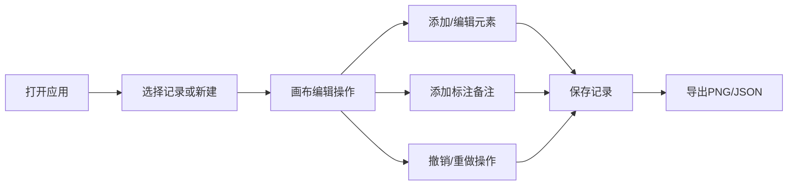

## 1. 产品概述

交通事故示意图编辑器是专为文保讲解员设计的专业工具，用于记录、编辑和复核交通事故现场示意图。解决当前依赖便签记录导致的前后差异丢失、截图素材管理混乱等问题。

- 核心价值：提供可视化操作画布、标注编辑、状态追踪、数据导出等功能，帮助文保讲解员高效处理交通事故记录，确保数据完整性和可追溯性。

## 2. 核心功能

### 2.1 用户角色

| 角色 | 注册方式 | 核心权限 |
|------|----------|----------|
| 文保讲解员 | 本地应用 | 记录编辑、标注、筛选、撤销、导出 |
| 评审老师 | 本地应用 | 查看、复核、导出 |

### 2.2 功能模块

1. **记录列表页**：记录筛选、状态标识、快速预览
2. **画布编辑器**：缩放平移、拖拽操作、元素标注、撤销重做
3. **数据导出**：PNG导出、JSON导出
4. **状态管理**：命中检测、来源材料关联

### 2.3 页面详情

| 页面名称 | 模块名称 | 功能描述 |
|-----------|----------|-------------|
| 记录列表页 | 筛选面板 | 按状态筛选（顺利/待确认/坏数据）、搜索、排序 |
| 记录列表页 | 记录卡片 | 状态颜色标识（绿色=可用、黄色=待确认、红色=需复核 |
| 画布编辑器 | 工具栏 | 缩放控制、平移、撤销/重做、标注工具、元素选择 |
| 画布编辑器 | 元素面板 | 车辆、道路、标注等示意图元素库 |
| 画布编辑器 | 属性面板 | 选中元素属性编辑 |
| 画布编辑器 | 备注面板 | 备注编辑、历史版本对比 |

## 3. 核心流程

## 4. 用户界面设计

### 4.1 设计风格
- 主色调：深蓝色（专业、严谨）
- 状态色：绿色（可用）、黄色（待确认）、红色（需复核）
- 字体：使用专业无衬线字体
- 布局：左侧工具栏 + 中央画布 + 右侧属性面板
- 图标：线性简约风格

### 4.2 页面设计概览

| 页面名称 | 模块名称 | UI元素 |
|-----------|----------|--------|
| 记录列表页 | 顶部导航 | Logo、新建按钮、搜索框 |
| 记录列表页 | 记录卡片网格 | 卡片式布局、状态标签色、预览缩略图 |
| 画布编辑器 | 工具栏 | 工具按钮组、缩放滑块 |
| 画布编辑器 | 画布区域 | 网格背景、可拖拽元素 |
| 画布编辑器 | 属性面板 | 表单输入、颜色选择器 |

### 4.3 响应式
- 桌面端优先，支持1200px以上屏幕
- 画布区域自适应，保持工具栏固定宽度

### 4.4 交互设计
- 画布缩放：鼠标滚轮缩放、拖拽平移
- 元素拖拽：从元素库拖拽到画布
- 撤销/重做：工具栏按钮 + 快捷键
- 命中检测：点击画布元素高亮并关联来源材料
- 颜色越界：自动检测并红色边框提示
