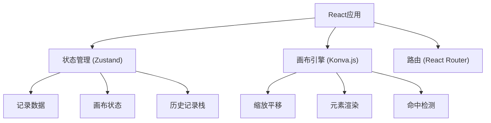
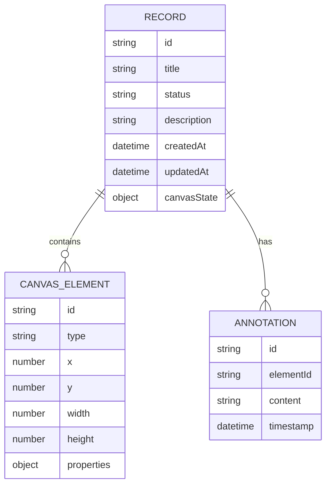

## 1. 架构设计

## 2. 技术描述

- Frontend: React@18 + TypeScript + Vite
- UI框架: TailwindCSS@3
- 状态管理: Zustand
- 画布引擎: react-konva (基于Canvas)
- 图标: Lucide React
- 本地存储: localStorage + IndexedDB
- 构建工具: Vite

## 3. 路由定义

| 路由 | 用途 |
|-------|---------|
| / | 记录列表页 |
| /editor/:id | 画布编辑器 |
| /editor/new | 新建记录 |

## 4. 数据模型

### 4.1 数据模型定义

### 4.2 记录状态枚举
- `valid`: 顺利记录 (绿色)
- `pending`: 待确认记录 (黄色)
- `invalid`: 坏数据 (红色)

### 4.3 画布元素类型
- `car`: 车辆
- `road`: 道路
- `arrow`: 方向箭头
- `marker`: 标注点
- `text`: 文本标注
- `shape`: 几何形状

## 5. 核心功能实现方案

### 5.1 缩放平移
- 使用 Konva 的 Stage 缩放和平移功能
- 鼠标滚轮缩放，按住空格拖拽平移
- 缩放范围: 0.2x - 3x

### 5.2 撤销重做
- 历史记录栈存储画布状态快照
- 最大记录50步
- 快捷键: Ctrl+Z (撤销), Ctrl+Y (重做)

### 5.3 命中检测
- Konva 内置的形状命中检测
- 点击元素时高亮显示并关联来源材料
- 颜色越界检测: 自动检测RGB值超出范围的元素

### 5.4 数据导出
- PNG导出: 使用 Konva 的 toDataURL 方法
- JSON导出: 序列化画布状态和元数据

### 5.5 脏数据处理
- 空值检测: 记录创建时校验必填字段
- 重复检测: 元素位置和属性去重
- 备注混写: 支持富文本备注，保留历史版本
