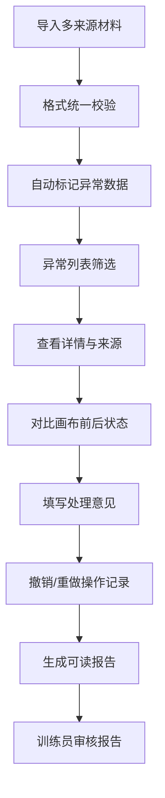

## 1. 产品概述

海岸线变化描边器是一款面向训练员和地图编辑的专业工具，用于统一处理多口径的海岸线变化数据，自动筛选异常数据并提供可视化的对比分析。

- 解决多来源材料（颜色规则、评分表、底图坐标）口径不一致的问题
- 目标用户：地图编辑人员、AI训练员、数据审核人员

## 2. 核心功能

### 2.1 用户角色

| 角色 | 登录方式 | 核心权限 |
|------|----------|----------|
| 地图编辑 | 本地登录 | 导入数据、筛选异常、编辑描边、撤销重做、导出报告 |
| 训练员 | 本地登录 | 查看数据、审核异常、阅读最终报告 |

### 2.2 功能模块

1. **数据导入页面**：多文件导入、格式校验、样例数据展示
2. **异常筛选页面**：列表视图、颜色规则高亮、异常分类筛选
3. **详情对比页面**：数据来源、处理意见、前后版本对比、画布状态
4. **报告导出页面**：人-readable报告、图层遮挡追踪、离线素材说明

### 2.3 页面详情

| 页面名称 | 模块名称 | 功能描述 |
|----------|----------|----------|
| 数据导入页面 | 文件上传区 | 拖拽上传、格式自动识别、进度条显示 |
| 数据导入页面 | 样例数据区 | 展示贴近日常的坏数据样例（旧表、补录备注、漏填单位） |
| 异常筛选页面 | 异常列表 | 按异常类型分组、颜色规则高亮、快捷操作按钮 |
| 异常筛选页面 | 筛选器 | 按数据源、异常类型、严重程度筛选 |
| 详情对比页面 | 数据来源区 | 显示原始材料来源、字段映射关系 |
| 详情对比页面 | 画布状态区 | 撤销重做历史、前后版本视觉对比 |
| 详情对比页面 | 处理意见区 | 意见输入、历史意见追溯 |
| 报告导出页面 | 报告预览 | 全文可读格式、无技术术语、图层遮挡定位 |
| 报告导出页面 | 导出设置 | 格式选择、包含内容配置 |

## 3. 核心流程

用户导入多口径海岸线数据 → 系统自动校验并标记异常 → 编辑人员筛选查看异常详情 → 对比前后版本并给出处理意见 → 撤销重做记录画布状态 → 导出人-readable报告供训练员审核

## 4. 用户界面设计

### 4.1 设计风格
- **主色调**：深海蓝 (#0D47A1)，代表专业与海洋主题
- **辅助色**：珊瑚橙 (#FF7043) 标记异常，海藻绿 (#43A047) 标记正常，沙土黄 (#FDD835) 标记警告
- **按钮风格**：扁平化圆角按钮，悬停有轻微上浮效果
- **字体**：标题使用 Noto Serif SC（衬线体增加专业感），正文使用 Noto Sans SC（易读性）
- **布局风格**：三栏式布局，左侧导航+中间内容+右侧详情面板
- **图标风格**：线性图标，统一2px线宽

### 4.2 页面设计概述

| 页面名称 | 模块名称 | UI元素 |
|----------|----------|--------|
| 数据导入页面 | 文件上传区 | 虚线边框拖放区、文件图标动画、上传进度条 |
| 数据导入页面 | 样例数据区 | 表格样式模拟旧Excel表、删除线表示补录、红色标注漏填单位 |
| 异常筛选页面 | 异常列表 | 斑马纹表格、颜色标签、悬停高亮行 |
| 详情对比页面 | 画布状态区 | 左右分屏对比、时间轴滑块、差异高亮 |
| 报告导出页面 | 报告预览 | 卡片式布局、大标题分区、Plain Language说明 |

### 4.3 响应式
- 桌面端优先设计（1920px优化）
- 平板端（1024px）：右侧面板折叠为抽屉
- 移动端（768px）：导航转为底部tab栏

### 4.4 数据可视化设计
- 异常分布：堆叠条形图展示各数据源异常数量
- 画布对比：半透明叠加层显示前后差异
- 时间轴：水平时间线展示撤销重做历史
