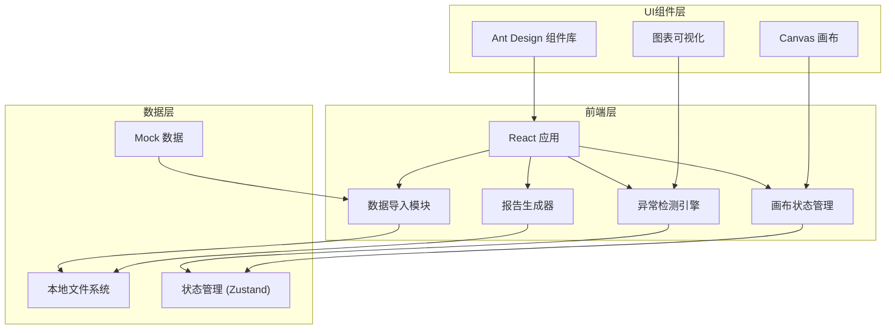
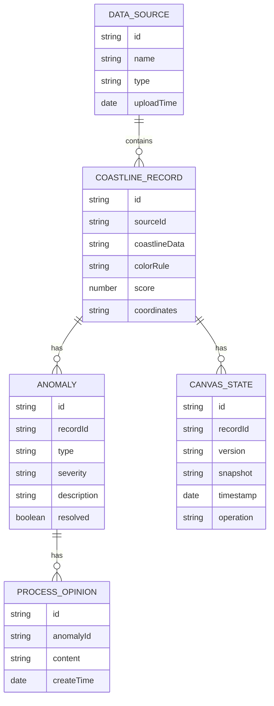

## 1. 架构设计



## 2. 技术描述

- **前端框架**：React@18 + TypeScript + Vite@5
- **样式方案**：TailwindCSS@3
- **状态管理**：Zustand（轻量级，适合撤销重做功能）
- **UI组件**：Ant Design@5
- **图表可视化**：Recharts
- **画布**：HTML5 Canvas API
- **后端**：无后端，纯前端应用
- **数据存储**：本地文件系统 + 浏览器本地存储
- **初始化工具**：Vite 脚手架

## 3. 路由定义

| 路由 | 页面名称 |
|-------|----------|
| / | 数据导入页面 |
| /anomalies | 异常筛选页面 |
| /detail/:id | 详情对比页面 |
| /report | 报告导出页面 |

## 4. 数据模型

### 4.1 数据模型定义



### 4.2 核心数据类型定义

```typescript
// 数据源类型
interface DataSource {
  id: string;
  name: string;
  type: 'color_rule' | 'score_table' | 'basemap_coords';
  uploadTime: Date;
  fileName: string;
}

// 海岸线记录
interface CoastlineRecord {
  id: string;
  sourceId: string;
  segmentName: string;
  colorRule: string;
  score: number;
  coordinates: [number, number][];
  unit?: string;
  remark?: string;
  hasAnomaly: boolean;
}

// 异常数据
interface Anomaly {
  id: string;
  recordId: string;
  type: 'missing_unit' | 'color_mismatch' | 'coordinate_outlier' | 'score_abnormal' | 'layer_occlusion';
  severity: 'low' | 'medium' | 'high';
  description: string;
  humanReadableReason: string;
  resolved: boolean;
  sourceMaterial: string;
}

// 处理意见
interface ProcessOpinion {
  id: string;
  anomalyId: string;
  content: string;
  createTime: Date;
  author: string;
}

// 画布状态
interface CanvasState {
  id: string;
  recordId: string;
  version: number;
  snapshot: string;
  timestamp: Date;
  operation: 'create' | 'modify' | 'undo' | 'redo';
}

// 撤销重做历史
interface HistoryState {
  past: CanvasState[];
  present: CanvasState | null;
  future: CanvasState[];
}
```

## 5. 撤销重做实现方案

- 使用 Zustand 的 Immer 中间件实现状态不可变更新
- 历史栈结构：past / present / future
- 画布快照使用 JSON 序列化存储
- 最大历史记录限制为 50 条

## 6. 报告导出方案

- 导出格式：HTML（人-readable，便于离线查看
- 使用浏览器打印功能转 PDF
- 报告包含：异常汇总表、图层遮挡追踪、素材缺失原因（自然语言描述
