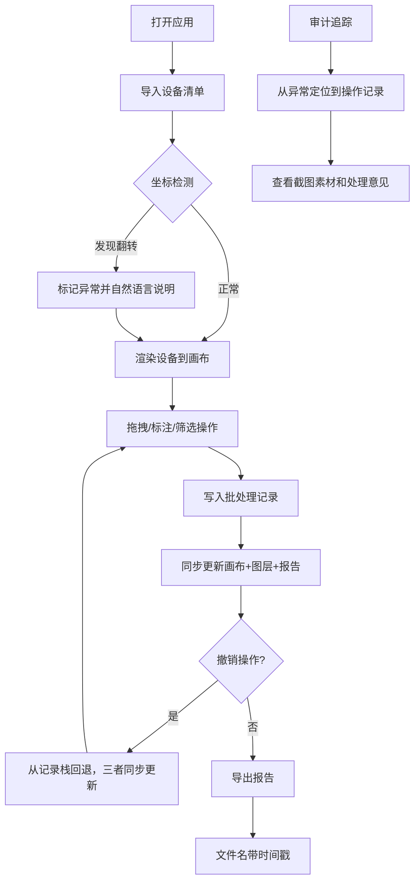

## 1. 产品概述

工地安全风险贴图是一款面向车间主管和安全管理人员的交互式风险标注与分析工具，解决传统静态演示无法支持实际操作、撤销状态不同步、报告数据割裂等问题。

- 核心用户：车间主管、安全管理人员、实习学生
- 核心价值：画布状态与图层管理共用同一批处理记录，确保界面与报告数据一致，支持完整审计追踪

## 2. 核心功能

### 2.1 用户角色
| 角色 | 注册方式 | 核心权限 |
|------|----------|----------|
| 车间主管 | 本地登录 | 完整操作权限、导出报告、审计回溯 |
| 实习学生 | 本地登录 | 画布操作、标注、查看报告 |
| 安全管理员 | 本地登录 | 设备清单管理、风险模板配置 |

### 2.2 功能模块
1. **主画布页面**：交互式画布、图层管理、工具栏、批处理记录面板
2. **设备导入页面**：设备清单导入、坐标翻转检测、数据去重
3. **报告查看页面**：同步报告、审计追踪、异常回溯
4. **导出中心**：多格式导出、运行区分、易读报告生成

### 2.3 页面详情
| 页面名称 | 模块名称 | 功能描述 |
|----------|----------|----------|
| 主画布页面 | 交互式画布 | 支持设备图标拖拽、位置调整、缩放平移、坐标实时显示 |
| 主画布页面 | 标注工具 | 风险区域绘制、文字标注、箭头指向、颜色区分风险等级 |
| 主画布页面 | 撤销/重做 | 完整历史记录栈，画布与报告状态同步撤销 |
| 主画布页面 | 图层管理 | 设备图层、标注图层、风险热力图层，支持显隐、排序、筛选 |
| 主画布页面 | 批处理记录 | 所有操作统一记录，画布、图层、报告共用同一条时间线 |
| 设备导入页面 | 清单导入 | CSV/Excel导入，自动去重，第二次导入不产生冲突结论 |
| 设备导入页面 | 坐标翻转检测 | 自动识别经纬度颠倒、坐标系错误，提供可视化原因说明 |
| 报告查看页面 | 同步报告 | 报告内容与画布状态实时同步，撤销操作即时反映 |
| 报告查看页面 | 审计追踪 | 异常记录可回溯到截图素材、处理意见、操作人、时间戳 |
| 导出中心 | 文件导出 | 文件名包含运行时间戳，区分本次与上次运行结果 |
| 导出中心 | 易读报告 | 坐标翻转等异常原因用自然语言说明，避免纯字段名 |

## 3. 核心流程

用户打开应用 → 导入或加载设备清单 → 在画布上拖拽调整设备位置 → 标注风险区域和处理意见 → 系统自动同步生成报告 → 可随时撤销/重做任何操作 → 遇到坐标翻转等异常时系统自动标记并说明原因 → 导出带时间戳的报告文件 → 需要审计时从异常记录回溯到操作全链路

## 4. 用户界面设计

### 4.1 设计风格
- 主色调：工业深蓝 #1e3a5f，搭配警示橙 #ff6b35、安全绿 #2ecc71、风险红 #e74c3c
- 辅色调：深灰 #2d3748、浅灰 #f7fafc
- 按钮风格：硬朗直角边框，hover时有轻微上浮阴影，危险操作配警示色
- 字体：标题用 Roboto Slab 粗体，正文用 JetBrains Mono 等宽字体（便于坐标和数据对齐显示）
- 布局：三栏式，左侧图层管理+设备列表，中间画布，右侧批处理记录+报告
- 图标风格：Lucide 线性图标，工业感，避免圆润卡通风格

### 4.2 页面设计概述
| 页面名称 | 模块名称 | UI 元素 |
|----------|----------|----------|
| 主画布页面 | 顶部工具栏 | 撤销/重做按钮、导出按钮、筛选下拉框、视图切换、风险图例 |
| 主画布页面 | 左侧面板 | 图层树（带显隐复选框）、设备列表（可拖拽到画布） |
| 主画布页面 | 中央画布 | 网格背景、设备图标（可拖拽）、标注图形、坐标标尺 |
| 主画布页面 | 右侧面板 | 批处理时间线、操作详情、实时报告摘要 |
| 主画布页面 | 底部状态栏 | 鼠标坐标、当前图层、选中设备信息、操作计数 |
| 设备导入页面 | 导入区域 | 拖拽上传区、预览表格、异常高亮行 |
| 设备导入页面 | 异常说明 | 卡片式展示，红/橙/绿三色标记，原因用通俗语言 |
| 报告查看页面 | 审计追踪 | 时间线式布局，点击异常展开关联截图和意见 |
| 导出中心 | 格式选择 | 卡片式选项，带预览图标，文件名自动生成预览 |

### 4.3 响应式
- 桌面端优先，三栏布局固定宽度
- 平板端折叠左右面板为抽屉式
- 移动端保留核心画布操作，其余功能折叠到菜单

### 4.4 动效设计
- 画布元素拖拽有磁吸吸附效果，释放时有轻微弹跳
- 撤销/重做时高亮显示被影响的元素
- 异常检测结果用脉冲动画提示
- 时间线记录添加时有滑入动效
- 图层显隐有淡入淡出过渡
