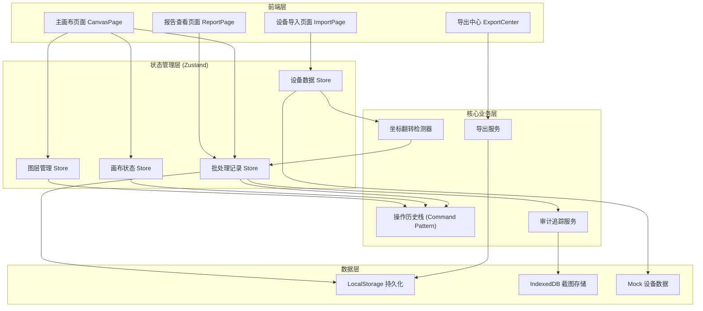
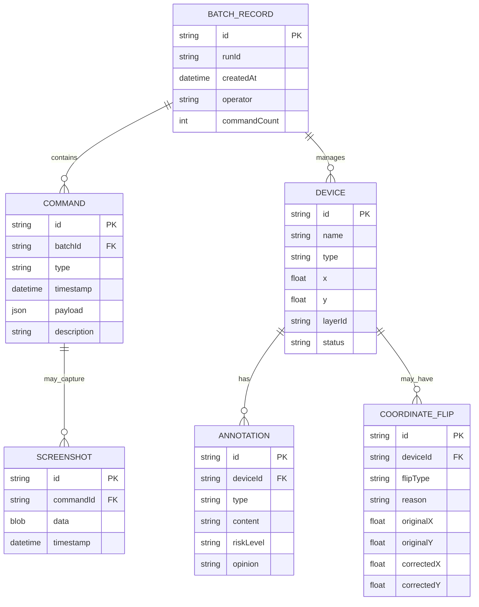

## 1. 架构设计



## 2. 技术描述

- **前端**：React@18 + TypeScript + tailwindcss@3 + Vite
- **初始化工具**：vite-init
- **状态管理**：Zustand（单一状态树，批处理记录为核心数据源）
- **画布渲染**：HTML5 Canvas API + Konva.js（支持拖拽、缩放、图层）
- **后端**：None（纯前端应用，数据本地持久化）
- **数据存储**：LocalStorage（状态） + IndexedDB（截图素材）
- **图标库**：lucide-react
- **路由**：react-router-dom

## 3. 核心设计原则

### 3.1 批处理记录单一数据源
- 所有操作（拖拽、标注、导入、撤销）都写入同一批处理记录栈
- 画布状态、图层显隐、报告内容都从批处理记录派生计算
- 撤销操作从记录栈回退，自动同步更新所有派生状态

### 3.2 命令模式实现撤销/重做
```typescript
interface Command {
  id: string;
  type: 'drag' | 'annotate' | 'import' | 'layerToggle' | 'filter';
  timestamp: number;
  payload: Record<string, unknown>;
  execute(): void;
  undo(): void;
}
```

### 3.3 坐标翻转检测
- 导入时自动检测：经纬度值范围异常、数值颠倒、坐标系不匹配
- 同一设备清单第二次导入时，基于设备ID去重，不产生冲突结论
- 异常原因用自然语言模板生成，而非纯字段名

## 4. 路由定义

| 路由 | 用途 |
|------|------|
| / | 主画布页面（默认） |
| /import | 设备导入页面 |
| /report | 报告查看与审计追踪 |
| /export | 导出中心 |

## 5. 数据模型

### 5.1 数据模型定义



### 5.2 状态管理结构

```typescript
// 批处理记录 - 唯一真实来源
interface BatchRecord {
  id: string;
  runId: string;                    // 运行ID，用于区分不同运行
  commands: Command[];              // 操作历史栈
  currentIndex: number;             // 当前撤销位置
}

// 命令类型
type CommandType = 
  | 'device_drag' 
  | 'device_import' 
  | 'annotation_add'
  | 'annotation_edit'
  | 'layer_toggle'
  | 'filter_apply'
  | 'coordinate_correction';

interface Command<T = unknown> {
  id: string;
  type: CommandType;
  timestamp: number;
  operator: string;
  description: string;              // 易读描述，用于报告和审计
  payload: T;
  previousState?: T;                // 用于撤销
  screenshotId?: string;            // 关联截图
}

// 设备数据
interface Device {
  id: string;
  name: string;
  type: 'crane' | 'scaffold' | 'fire_extinguisher' | 'electrical';
  x: number;
  y: number;
  layerId: string;
  riskLevel: 'safe' | 'warning' | 'danger';
  coordinateFlip?: CoordinateFlipInfo;
  annotations: Annotation[];
}

// 坐标翻转信息
interface CoordinateFlipInfo {
  type: 'lat_lng_swapped' | 'out_of_range' | 'wrong_coordinate_system';
  originalX: number;
  originalY: number;
  correctedX: number;
  correctedY: number;
  reason: string;                   // 自然语言说明
  userConfirmed: boolean;
}

// 图层
interface Layer {
  id: string;
  name: string;
  visible: boolean;
  zIndex: number;
  filter?: FilterCondition;
}

// 标注
interface Annotation {
  id: string;
  deviceId: string;
  type: 'rectangle' | 'text' | 'arrow' | 'comment';
  content: string;
  riskLevel: 'safe' | 'warning' | 'danger';
  opinion: string;                  // 处理意见
  timestamp: number;
}
```

## 6. 核心模块设计

### 6.1 批处理记录 Store (Zustand)

```typescript
interface BatchStore {
  currentBatch: BatchRecord;
  // 写入命令（同时更新画布、图层、报告）
  executeCommand: <T>(command: Omit<Command<T>, 'id' | 'timestamp'>) => void;
  // 撤销
  undo: () => void;
  // 重做
  redo: () => void;
  // 派生状态计算
  getCanvasState: () => CanvasState;
  getLayers: () => Layer[];
  getReport: () => ReportData;
  getAuditTrail: (anomalyId: string) => AuditEntry[];
}
```

### 6.2 坐标翻转检测服务

```typescript
interface CoordinateCheckResult {
  hasFlip: boolean;
  flipType?: 'lat_lng_swapped' | 'out_of_range' | 'wrong_system';
  reason: string;                   // 自然语言
  correctedX: number;
  correctedY: number;
}

class CoordinateFlipDetector {
  // 检测经纬度是否颠倒
  static detectLatLngSwap(x: number, y: number): CoordinateCheckResult;
  // 检测数值范围异常
  static detectOutOfRange(x: number, y: number): CoordinateCheckResult;
  // 生成易读原因
  static generateReadableReason(flipType: string, values: number[]): string;
  // 去重合并
  static deduplicateDevices(newDevices: Device[], existing: Device[]): Device[];
}
```

### 6.3 导出服务

```typescript
class ExportService {
  // 生成带时间戳的文件名
  static generateFileName(type: string, runId: string): string;
  // 导出PDF报告（含自然语言说明）
  static exportPDF(data: ExportData): Promise<Blob>;
  // 导出CSV数据
  static exportCSV(devices: Device[]): Blob;
  // 导出JSON（含完整批处理记录）
  static exportJSON(batch: BatchRecord): Blob;
  // 生成坐标翻转的易读说明
  static generateFlipExplanation(flip: CoordinateFlipInfo): string;
}
```

## 7. 组件结构

```
src/
├── components/
│   ├── canvas/
│   │   ├── Canvas.tsx             # 主画布
│   │   ├── DraggableDevice.tsx    # 可拖拽设备
│   │   ├── AnnotationTool.tsx     # 标注工具
│   │   └── GridBackground.tsx     # 网格背景
│   ├── layers/
│   │   ├── LayerPanel.tsx         # 图层面板
│   │   └── LayerTreeItem.tsx      # 图层树节点
│   ├── batch/
│   │   ├── CommandTimeline.tsx    # 批处理时间线
│   │   └── CommandDetail.tsx      # 操作详情
│   ├── import/
│   │   ├── FileUpload.tsx         # 文件上传
│   │   ├── ImportPreview.tsx      # 导入预览
│   │   └── FlipAlertCard.tsx      # 坐标翻转提示卡
│   ├── report/
│   │   ├── SyncReport.tsx         # 同步报告
│   │   ├── AuditTrail.tsx         # 审计追踪
│   │   └── AnomalyDetail.tsx      # 异常详情
│   └── export/
│       ├── ExportPanel.tsx        # 导出面板
│       └── FileNamePreview.tsx    # 文件名预览
├── stores/
│   ├── useBatchStore.ts           # 批处理记录Store
│   ├── useCanvasStore.ts          # 画布状态Store
│   └── useDeviceStore.ts          # 设备数据Store
├── services/
│   ├── commandExecutor.ts         # 命令执行器
│   ├── coordinateDetector.ts      # 坐标翻转检测
│   ├── exportService.ts           # 导出服务
│   └── auditService.ts            # 审计服务
├── hooks/
│   ├── useUndoRedo.ts             # 撤销重做Hook
│   ├── useCanvasDrag.ts           # 画布拖拽Hook
│   └── useAuditTrail.ts           # 审计追踪Hook
├── types/
│   └── index.ts                   # 类型定义
├── utils/
│   ├── mockData.ts                # Mock数据
│   ├── storage.ts                 # 本地存储
│   └── helpers.ts                 # 工具函数
└── pages/
    ├── CanvasPage.tsx
    ├── ImportPage.tsx
    ├── ReportPage.tsx
    └── ExportPage.tsx
```

## 8. 关键技术实现点

1. **单一数据源原则**：所有状态变更都通过写入批处理记录，画布、图层、报告都是派生状态
2. **命令模式撤销**：每个操作封装为Command对象，支持execute/undo，可序列化持久化
3. **坐标翻转去重**：第二次导入时基于设备ID进行diff合并，不生成重复异常记录
4. **运行ID区分**：每次启动生成唯一runId，导出文件名包含runId和时间戳
5. **自然语言模板**：坐标翻转原因通过模板生成，例如"经纬度数值颠倒：原始纬度31.23（正常值域-90~90）被误填为经度，经度121.47（正常值域-180~180）被误填为纬度"
6. **审计回溯链**：异常记录 → 关联命令 → 操作截图 → 处理意见 → 操作人/时间
