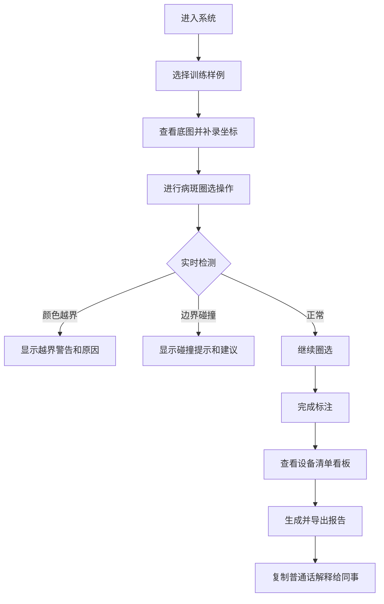

## 1. 产品概述

植物叶片病斑圈选康复训练系统，用于培训康复训练师进行图像标注和质量检测。解决颜色越界和碰撞边界误判的复杂问题，提供设备清单看板、实时检测、报告导出等完整功能。

- 核心目标：提升康复训练师对病斑圈选的判断能力
- 目标用户：康复训练师、培训人员

## 2. 核心功能

### 2.1 用户角色
| 角色 | 注册方式 | 核心权限 |
|------|----------|----------|
| 康复训练师 | 系统登录 | 进行病斑圈选、查看设备清单、导出报告 |
| 培训管理员 | 系统登录 | 管理样例数据、查看训练进度 |

### 2.2 功能模块
1. **病斑圈选主页**：图像展示、圈选工具、实时检测提示
2. **设备清单看板**：设备列表、统计图表、数据明细
3. **报告导出页面**：检测结果、普通话解释、一键下载
4. **样例管理**：三条典型样例（顺利、待确认、坏数据）

### 2.3 页面详情
| 页面名称 | 模块名称 | 功能描述 |
|----------|----------|----------|
| 病斑圈选主页 | 图像操作区 | 支持缩放、平移、坐标实时更新 |
| 病斑圈选主页 | 圈选工具 | 多边形/圆形圈选、实时命中检测 |
| 病斑圈选主页 | 检测提示 | 颜色越界、边界碰撞的动态提示 |
| 设备清单看板 | 设备列表 | 设备状态、使用记录筛选 |
| 设备清单看板 | 统计图表 | 检测通过率、错误类型分布 |
| 设备清单看板 | 数据明细 | 同批数据展示、支持搜索 |
| 报告导出 | 结果汇总 | 检测项、判定结果、原因说明 |
| 报告导出 | 普通话解释 | 可复制的标准解释文本 |
| 报告导出 | 下载功能 | PDF/Excel导出、数据一致性保证 |

## 3. 核心流程

用户选择训练样例后，在图像上进行病斑圈选。系统实时检测颜色越界和边界碰撞，给出动态提示。完成后可查看设备统计看板，最后生成包含普通话解释的报告并导出。

## 4. 用户界面设计

### 4.1 设计风格
- **主色调**：深绿色 (#2D5A27)，代表自然植物
- **辅助色**：珊瑚红 (#E07A5F) 用于警告，天蓝色 (#81B29A) 用于成功提示
- **按钮风格**：圆角矩形，带有微妙阴影，悬停时有上浮效果
- **字体**：标题使用 Lora（衬线字体，专业感），正文使用 Noto Sans SC（易读性）
- **布局风格**：左侧工具面板 + 中央画布 + 右侧检测面板的三栏布局
- **图标风格**：线性图标，与植物/医疗主题呼应

### 4.2 页面设计概览
| 页面名称 | 模块名称 | UI 元素 |
|----------|----------|---------|
| 病斑圈选主页 | 图像画布 | 植物叶片底图、网格辅助线、缩放控件 |
| 病斑圈选主页 | 工具面板 | 圈选工具按钮、颜色选择器、撤销/重做 |
| 病斑圈选主页 | 检测面板 | 实时状态指示器、错误原因解释 |
| 设备清单看板 | 顶部统计 | 卡片式数据概览、趋势小图表 |
| 设备清单看板 | 图表区域 | 饼图展示错误类型、柱状图展示通过率 |
| 设备清单看板 | 明细表格 | 可排序、可筛选的数据列表 |
| 报告导出页 | 结果卡片 | 分状态展示（通过/待确认/失败） |
| 报告导出页 | 解释区域 | 大文本框、一键复制按钮 |

### 4.3 响应式
- **桌面优先**：1280px 及以上使用三栏布局
- **平板适配**：992px 以下改为上下布局，工具面板移至顶部
- **移动优化**：触控操作支持，按钮最小尺寸 44px

### 4.4 交互动效
- 页面加载：元素从上至下渐入，错开 100ms 延迟
- 圈选时：线条绘制动画，端点有呼吸效果
- 检测警告：红色边框脉冲动画，文字淡入
- 按钮悬停：背景色渐变过渡，轻微放大
