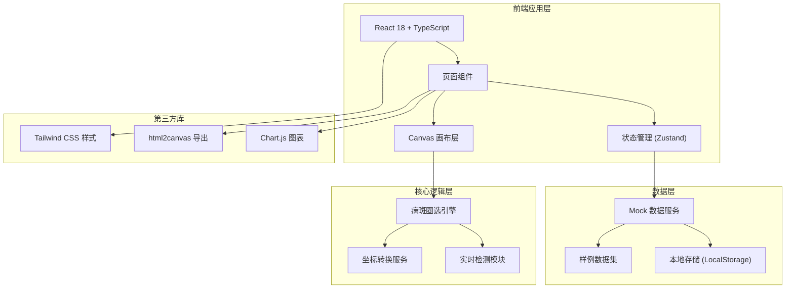
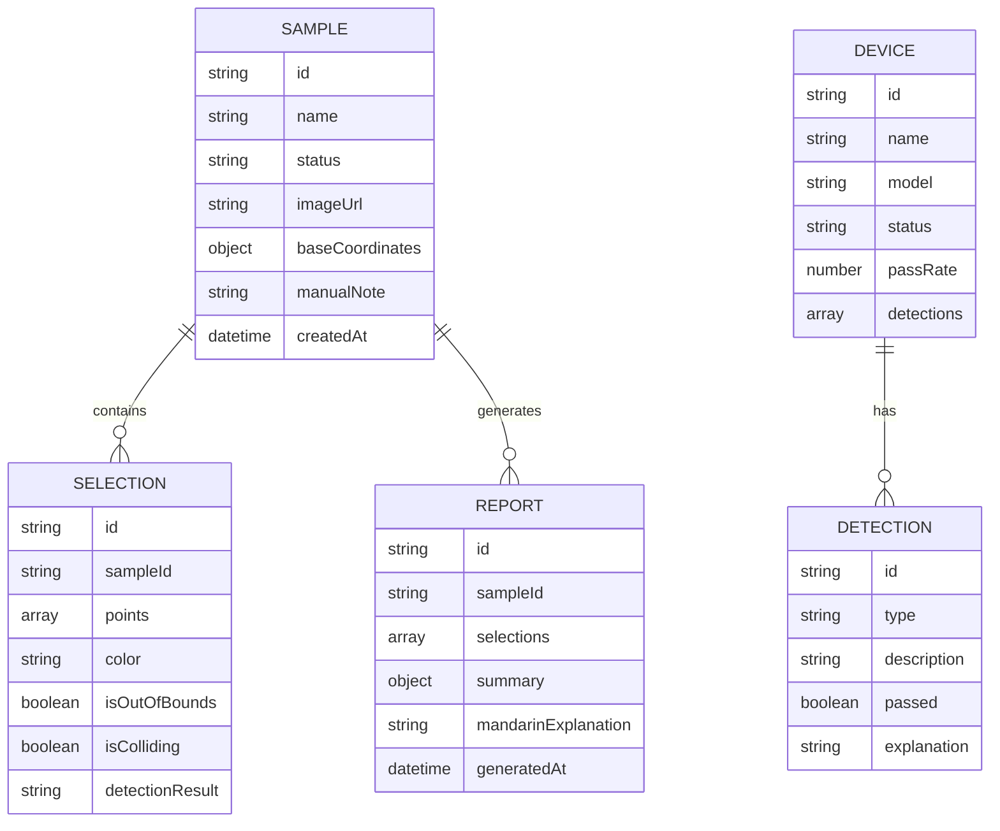

## 1. 架构设计



## 2. 技术描述

- **前端框架**：React@18.2.0 + TypeScript@5.0.0
- **构建工具**：Vite@5.0.0
- **样式方案**：Tailwind CSS@3.4.0
- **状态管理**：Zustand@4.4.0（轻量级状态管理）
- **图表库**：Chart.js@4.4.0 + react-chartjs-2
- **导出功能**：html2canvas + jspdf
- **路由**：React Router@6.20.0
- **后端**：无后端，使用 Mock 数据

## 3. 路由定义

| 路由 | 页面 | 用途 |
|-------|------|------|
| / | 病斑圈选主页 | 进行病斑圈选操作、实时检测 |
| /dashboard | 设备清单看板 | 设备统计、图表展示、数据明细 |
| /report | 报告导出页 | 生成报告、普通话解释、下载结果 |
| /samples | 样例管理 | 三条训练样例选择 |

## 4. 数据模型

### 4.1 数据模型定义



### 4.2 核心数据类型定义

```typescript
// 样例数据类型
interface Sample {
  id: string;
  name: string;
  status: 'success' | 'pending' | 'bad';
  imageUrl: string;
  baseCoordinates: {
    x: number;
    y: number;
    width: number;
    height: number;
  };
  manualNote?: string;
  createdAt: Date;
}

// 圈选数据类型
interface Selection {
  id: string;
  sampleId: string;
  points: { x: number; y: number }[];
  color: string;
  isOutOfBounds: boolean;
  isColliding: boolean;
  detectionResult: 'pass' | 'warning' | 'fail';
}

// 检测结果类型
interface DetectionResult {
  type: 'color-boundary' | 'collision' | 'success';
  passed: boolean;
  description: string;
  explanation: string;
}

// 设备类型
interface Device {
  id: string;
  name: string;
  model: string;
  status: 'active' | 'inactive' | 'maintenance';
  passRate: number;
  detections: DetectionResult[];
}
```

## 5. 核心模块说明

### 5.1 画布模块 (Canvas)
- 支持图像缩放、平移
- 坐标实时转换（屏幕坐标 -> 图像坐标）
- 多边形/圆形圈选绘制
- 实时命中检测触发

### 5.2 检测模块 (Detection)
- 颜色越界检测：判断圈选区域颜色是否在容许范围内
- 边界碰撞检测：判断圈选是否超出叶片边界
- 持续检测机制：非一次性判断，随操作实时更新

### 5.3 数据模块 (Data)
- 统一数据源：图表、明细、下载使用同一批数据
- 样例数据：三条典型样例（顺利、待确认、坏数据）
- 人工备注保留：原样存储，不做自动格式化

### 5.4 导出模块 (Export)
- 报告生成：汇总检测结果
- 普通话解释模板：标准化可复制文本
- PDF/Excel 导出功能

## 6. 目录结构

```
src/
├── components/
│   ├── canvas/
│   │   ├── ImageCanvas.tsx      # 图像画布组件
│   │   ├── SelectionTool.tsx   # 圈选工具
│   │   └── ZoomControls.tsx   # 缩放控制
│   ├── dashboard/
│   │   ├── StatCards.tsx       # 统计卡片
│   │   ├── Charts.tsx       # 图表组件
│   │   └── DataTable.tsx    # 数据明细表
│   ├── report/
│   │   ├── ResultSummary.tsx # 结果汇总
│   │   ├── Explanation.tsx # 普通话解释
│   │   └── ExportButton.tsx  # 导出按钮
│   └── common/
│       ├── Header.tsx
│       ├── Sidebar.tsx
│       └── StatusBadge.tsx
├── store/
│   ├── useCanvasStore.ts     # 画布状态
│   ├── useSampleStore.ts     # 样例数据状态
│   └── useReportStore.ts     # 报告状态
├── services/
│   ├── detectionService.ts # 检测服务
│   ├── coordinateService.ts # 坐标转换服务
│   └── exportService.ts    # 导出服务
├── data/
│   ├── mockSamples.ts      # Mock样例数据
│   └── mockDevices.ts     # Mock设备数据
├── types/
│   └── index.ts         # 类型定义
├── pages/
│   ├── Home.tsx
│   ├── Dashboard.tsx
│   ├── Report.tsx
│   └── Samples.tsx
├── App.tsx
├── main.tsx
└── index.css
```

## 7. 关键技术实现要点

1. **Canvas 坐标系统
- 使用 Canvas API 实现高性能图像渲染
- 实现变换矩阵管理缩放平移
- 坐标双向转换保证精度

2. **实时检测算法
- 颜色直方图比对
- 多边形碰撞检测（Separating Axis Theorem
- 节流优化性能

3. **数据一致性
- 单一数据源原则
- 状态管理集中化
- 导出前数据校验

4. **报告解释模板
- 预置普通话解释模板库
- 根据检测结果动态生成
- 支持一键复制功能
