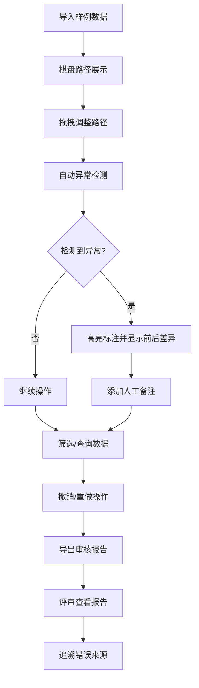

## 1. 产品概述
矿区运输路径棋盘是一款供教研老师和评审老师使用的交互式路径审核工具。该工具整合分散的评分表、坐标数据和轨迹记录，支持拖拽、筛选、标注、撤销和导出等操作，帮助老师高效审核矿区运输路径规划。

- **核心问题**：解决教研老师资料分散、难以统一操作和标注的痛点
- **目标用户**：教研老师（数据录入与复核）、评审老师（报告查看与审核）
- **产品价值**：提升路径审核效率，可视化异常检测，保留审核痕迹

## 2. 核心功能

### 2.1 用户角色
| 角色 | 使用场景 | 核心权限 |
|------|----------|----------|
| 教研老师 | 整合资料、复核数据、标注异常 | 拖拽路径、筛选数据、添加标注、撤销操作、导出结果 |
| 评审老师 | 查看最终报告、追溯问题来源 | 查看审核历史、定位错误来源、对比检测前后差异 |

### 2.2 功能模块
1. **主操作面板**：棋盘底图展示、路径拖拽编辑、坐标网格
2. **数据筛选器**：按来源、时间、状态筛选轨迹记录
3. **标注系统**：异常标注、备注添加、前后差异对比
4. **操作历史**：撤销/重做、操作日志追溯
5. **导出中心**：多格式导出、审核报告生成
6. **样例数据集**：包含旧表数据、补录备注、漏填单位等真实场景

### 2.3 页面详情
| 页面名称 | 模块名称 | 功能描述 |
|-----------|-------------|---------------------|
| 主棋盘页面 | 棋盘底图 | SVG可缩放网格底图，支持坐标翻转检测 |
| 主棋盘页面 | 路径拖拽 | 拖拽节点调整路径，实时显示坐标信息 |
| 主棋盘页面 | 异常标注层 | 高亮显示比例尺错用、坐标翻转等问题 |
| 侧边工具栏 | 数据筛选 | 按来源（旧表/补录/原始）、状态筛选 |
| 侧边工具栏 | 标注面板 | 添加备注，查看命中检测前后差异 |
| 操作历史栏 | 撤销重做 | 时间线展示操作历史，支持回退 |
| 导出面板 | 报告生成 | 生成包含错误溯源的审核报告 |

## 3. 核心流程

### 3.1 教研老师操作流程
1. 导入/加载矿区运输路径样例数据
2. 在棋盘上拖拽调整路径节点
3. 系统自动检测比例尺错用、坐标翻转等异常
4. 对异常进行标注和添加备注
5. 筛选查看不同来源的数据
6. 撤销错误操作，确认最终结果
7. 导出审核报告

### 3.2 评审老师查看流程
1. 打开最终审核报告
2. 查看异常标注列表
3. 点击异常项查看命中检测前后对比
4. 追溯比例尺错用来源（哪份材料、哪条记录）
5. 查看操作历史，了解审核过程

## 4. 用户界面设计

### 4.1 设计风格
- **主色调**：工业蓝（#1e3a5f）+ 矿区橙（#e67e22），体现专业工业感
- **辅助色**：错误红（#e74c3c）、警告黄（#f39c12）、成功绿（#27ae60）
- **按钮风格**：微立体按钮，圆角4px，hover时有轻微上浮效果
- **字体**：标题使用 Noto Sans SC Bold，正文使用 Noto Sans SC Regular
- **布局风格**：三栏布局（左侧工具、中间棋盘、右侧详情）
- **视觉元素**：棋盘网格纹理、路径线条动画、异常脉冲效果

### 4.2 页面设计概览
| 页面名称 | 模块名称 | UI元素 |
|-----------|-------------|-------------|
| 主棋盘页面 | 中心棋盘区 | SVG网格、可拖拽节点、路径连线、异常高亮层 |
| 主棋盘页面 | 左侧工具栏 | 筛选标签、工具按钮、操作历史时间线 |
| 主棋盘页面 | 右侧详情栏 | 轨迹信息、标注面板、前后差异对比卡片 |
| 主棋盘页面 | 底部状态栏 | 坐标显示、比例尺信息、数据来源标识 |

### 4.3 响应式设计
- 桌面端（≥1200px）：三栏完整布局
- 平板端（768px-1199px）：左右侧栏可折叠，棋盘居中
- 移动端（&lt;768px）：单栏布局，侧栏转为抽屉式

### 4.4 交互细节
- 拖拽路径节点时显示实时坐标提示
- 异常检测命中时有脉冲动画提醒
- 悬停在标注上显示前后对比预览
- 操作历史时间线支持点击跳转
- 比例尺错用示例使用不同颜色边框区分来源

## 5. 边界案例设计

### 5.1 比例尺错用示例（3个真实案例）
1. **案例一：旧表坐标单位混淆**
   - 来源：2023年旧数据表
   - 问题：米/千米单位混淆，路径长度偏差1000倍
   - 影响：运输成本计算完全错误

2. **案例二：补录数据坐标翻转**
   - 来源：人工补录备注
   - 问题：X/Y坐标写反，路径走向完全颠倒
   - 影响：路径经过禁止通行区域

3. **案例三：漏填比例尺参数**
   - 来源：漏填单位的记录
   - 问题：使用默认1:1比例尺，实际应为1:5000
   - 影响：矿区范围显示异常缩小

### 5.2 数据样例特征
- 混合多种数据来源：旧表导出、人工补录、系统原始记录
- 包含真实的脏数据：格式不一致、缺省值、备注文本混杂
- 异常数据隐蔽性强，类似日常工作中混入的小错误
