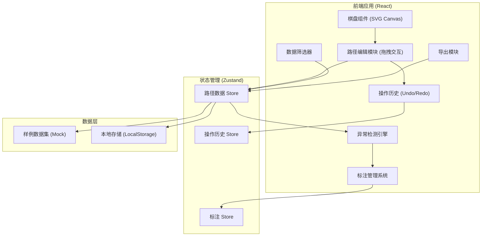

## 1. 架构设计



## 2. 技术选型

- **前端框架**：React@18 + TypeScript
- **构建工具**：Vite@5
- **样式方案**：TailwindCSS@3 + CSS Modules
- **状态管理**：Zustand（轻量型，适合编辑器类应用）
- **图标库**：Lucide React
- **拖拽实现**：原生 HTML5 Drag API + 自定义指针事件
- **导出功能**：jsPDF（PDF导出）+ html2canvas（截图导出）
- **数据持久化**：LocalStorage

## 3. 项目结构

```
src/
├── components/
│   ├── Chessboard/         # 棋盘组件
│   │   ├── Grid.tsx        # 网格底图
│   │   ├── PathNode.tsx    # 可拖拽路径节点
│   │   ├── PathLine.tsx    # 路径连线
│   │   └── AnomalyLayer.tsx# 异常标注层
│   ├── Toolbar/            # 左侧工具栏
│   │   ├── FilterPanel.tsx # 数据筛选
│   │   └── HistoryTimeline.tsx # 操作历史
│   ├── DetailPanel/        # 右侧详情栏
│   │   ├── TrackInfo.tsx   # 轨迹信息
│   │   ├── AnnotationPanel.tsx # 标注面板
│   │   └── DiffViewer.tsx  # 前后差异对比
│   └── ExportModal/        # 导出弹窗
├── store/
│   ├── usePathStore.ts     # 路径数据状态
│   ├── useAnnotationStore.ts # 标注状态
│   └── useHistoryStore.ts  # 操作历史
├── hooks/
│   ├── useDragNode.ts      # 拖拽节点hook
│   ├── useUndoRedo.ts      # 撤销重做hook
│   └── useAnomalyDetection.ts # 异常检测hook
├── data/
│   └── sampleData.ts       # 样例数据集
├── types/
│   └── index.ts            # 类型定义
├── utils/
│   ├── export.ts           # 导出工具
│   └── detection.ts        # 检测算法
├── App.tsx
└── main.tsx
```

## 4. 核心数据模型

### 4.1 类型定义

```typescript
// 坐标点
interface Point {
  id: string;
  x: number;
  y: number;
  label?: string;
}

// 路径节点
interface PathNode extends Point {
  isDraggable: boolean;
  anomalies: Anomaly[];
}

// 运输路径
interface TransportPath {
  id: string;
  name: string;
  nodes: PathNode[];
  source: DataSource;
  scale: ScaleInfo;
  createdAt: string;
  updatedAt: string;
}

// 数据来源
type DataSourceType = 'old_table' | 'manual' | 'original' | 'mixed';
interface DataSource {
  type: DataSourceType;
  name: string;
  description: string;
}

// 比例尺信息
interface ScaleInfo {
  ratio: string;        // 如 "1:5000"
  unit: 'meter' | 'kilometer' | 'unknown';
  isCorrect: boolean;
  expectedRatio?: string;
}

// 异常类型
type AnomalyType = 'scale_mismatch' | 'coordinate_flip' | 'unit_missing' | 'manual_note';
interface Anomaly {
  id: string;
  type: AnomalyType;
  severity: 'high' | 'medium' | 'low';
  description: string;
  sourceRef: string;    // 引用来源材料
  beforeState: any;     // 检测前状态
  afterState: any;      // 检测后状态
  createdAt: string;
  annotation?: string;  // 人工备注
}

// 操作历史
interface HistoryAction {
  id: string;
  type: 'move_node' | 'add_annotation' | 'fix_anomaly' | 'delete';
  timestamp: string;
  description: string;
  previousState: any;
  nextState: any;
}
```

## 5. 异常检测算法

### 5.1 比例尺错用检测
```typescript
function detectScaleMismatch(path: TransportPath): Anomaly | null {
  // 检测逻辑：
  // 1. 检查路径长度是否在合理范围内（矿区通常在几百米到几公里）
  // 2. 对比预期比例尺与实际比例尺
  // 3. 检测单位缺失或混淆（米/千米）
}
```

### 5.2 坐标翻转检测
```typescript
function detectCoordinateFlip(nodes: PathNode[]): Anomaly | null {
  // 检测逻辑：
  // 1. 检查X/Y坐标范围是否异常
  // 2. 对比矿区标准坐标系
  // 3. 检测路径是否穿越禁止区域
}
```

## 6. 核心功能实现要点

### 6.1 拖拽功能
- 使用 `useDragNode` hook 管理拖拽状态
- 实时更新节点坐标，触发异常检测
- 支持吸附到网格功能

### 6.2 撤销/重做
- 采用命令模式（Command Pattern）
- 每步操作保存完整状态快照
- 历史栈深度限制为50步

### 6.3 前后差异对比
- 深拷贝保存检测前后状态
- 使用 DiffViewer 组件可视化展示差异
- 支持并排对比和叠加对比两种模式

### 6.4 导出报告
- 包含：路径概览、异常列表、差异对比、溯源信息
- 支持 PDF 和 JSON 两种格式
- PDF 报告嵌入溯源链接

## 7. 样例数据设计

包含3条典型运输路径，每条都有真实的脏数据特征：

1. **路径A（旧表导出）**：单位混淆（米写成千米），比例尺标注为1:1000实际应为1:5000
2. **路径B（人工补录）**：X/Y坐标写反，混入中文备注，格式不统一
3. **路径C（混合来源）**：部分节点漏填单位，存在人工标注的红色笔迹备注
