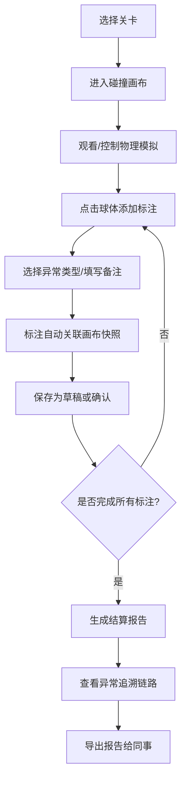

## 1. 产品概述

本产品是面向赛事运营和训练员的二维物理碰撞演示与标注系统，用于记录、复核和报告比赛中的碰撞事件，解决边界误判、证据留存和训练复盘等实际问题。

- 核心用户：赛事运营人员、训练员、裁判助理
- 解决问题：碰撞边界误判、证据留存不完整、训练结果追溯困难
- 产品价值：提供统一的标注-审核-报告链路，让不懂技术的运营人员也能清晰理解和传递碰撞分析结果

## 2. 核心 Features

### 2.1 用户角色

| 角色 | 使用场景 | 核心需求 |
|------|----------|----------|
| 赛事运营 | 比赛现场标注、赛后报告生成 | 快速标注、一键导出、普通话解释 |
| 训练员 | 训练复盘、技术分析 | 碰撞细节、边界判定、数据追溯 |
| 审核人员 | 争议事件复核 | 完整记录、处理意见、异常链路 |

### 2.2 功能模块

1. **物理碰撞画布页**：实时物理模拟、手动标注、异常标记
2. **关卡选择页**：3个预设关卡（边界失败、撤销重开、正常结算）
3. **结算报告页**：碰撞统计、异常列表、普通话解释、导出功能
4. **标注草稿面板**：未完成标注、处理意见、历史记录追溯

### 2.3 页面详情

| 页面名称 | 模块名称 | 功能描述 |
|----------|----------|----------|
| 物理碰撞画布页 | 物理模拟区 | Canvas 渲染 2D 球体碰撞，支持暂停/播放 |
| 物理碰撞画布页 | 标注工具栏 | 点击球体添加标注、标记异常类型、填写备注 |
| 物理碰撞画布页 | 状态记录栏 | 撤销/重做、重置关卡、保存草稿 |
| 物理碰撞画布页 | 草稿列表 | 显示当前关卡所有标注，支持点击定位 |
| 关卡选择页 | 关卡卡片 | 3个关卡，每个标注预设场景和目标 |
| 关卡选择页 | 进度指示 | 显示已完成/异常/草稿数量 |
| 结算报告页 | 碰撞统计 | 总碰撞次数、边界碰撞、异常碰撞数量 |
| 结算报告页 | 异常详情 | 每条异常关联标注草稿和处理意见 |
| 结算报告页 | 普通话解释 | 可复制的自然语言说明 |
| 结算报告页 | 导出功能 | 导出 HTML/PDF 报告 |

## 3. 核心流程

**场景说明**：
1. **边界失败关卡**：预设一个球体高速撞向边界，触发边界误判场景，要求运营人员标注出边界判定失败的瞬间
2. **撤销重开关卡**：模拟一次错误标注后需要撤销重开的场景，训练运营人员正确使用状态管理
3. **正常结算关卡**：完整的多球碰撞场景，要求标注所有异常碰撞，最终生成完整报告

## 4. 数据样例设计

### 4.1 贴近日常的标注样例

| 标注ID | 时间点 | 异常类型 | 标注内容 | 状态 |
|--------|--------|----------|----------|------|
| ANNO-001 | 1.2s | 边界误判 | 旧表：红方3号出界，但画面显示还在线内 | 已确认 |
| ANNO-002 | 2.5s | 碰撞漏标 | 补录备注：刚才那个蓝黄碰撞没标上，补一下 | 草稿 |
| ANNO-003 | 3.8s | 单位缺失 | 漏填单位：速度写了5，应该是5 m/s | 待审核 |
| ANNO-004 | 4.2s | 重复标注 | 注意：这个碰撞和ANNO-002是同一个事件，因为角度不同 | 已合并 |

### 4.2 普通话解释示例

> "各位同事，关于今天比赛第3局的碰撞争议，我们在1.2秒处发现红方3号球体的边界判定存在问题。根据画面回放，球体实际上还有约2厘米在线内，但系统判定为出界。这可能是由于高速运动下的采样间隔导致的。建议后续比赛增加高速摄像头的采样频率，或者在关键区域增设人工复核环节。"

## 5. 用户界面设计

### 5.1 设计风格

**设计方向**：专业严谨的赛事分析工具风格，偏向「编辑室/控制室」审美
- 主色调：深海军蓝 (#165DFF) 搭配琥珀橙 (#FF7D00) 作为异常高亮
- 辅助色：石墨灰 (#4E5969) 作为中性色，薄荷绿 (#00B42A) 标记正常
- 字体：标题用 Space Grotesk（避免与其他项目雷同），正文用 Inter
- 按钮风格：微立体边框，hover 时有轻微上浮效果，异常按钮带脉冲动画
- 布局：三栏式布局（左侧草稿列表、中间画布、右侧属性面板）
- 图标：使用 lucide-react，异常状态加红色小圆点 badge

### 5.2 页面设计概述

| 页面名称 | 模块名称 | UI 元素 |
|----------|----------|----------|
| 关卡选择页 | 关卡卡片 | 大号序号、状态徽章、场景描述、进入按钮 |
| 关卡选择页 | 顶部导航 | 项目标题、总进度条、帮助按钮 |
| 物理碰撞画布页 | Canvas 区域 | 深色背景、网格线、球体带拖尾效果 |
| 物理碰撞画布页 | 标注工具 | 浮动工具栏，标注时画布变暗聚焦 |
| 物理碰撞画布页 | 草稿列表 | 可展开卡片，点击高亮对应球体 |
| 物理碰撞画布页 | 时间轴 | 底部时间轴，标注点用彩色标记 |
| 结算报告页 | 统计概览 | 大号数字卡片，带趋势小箭头 |
| 结算报告页 | 异常列表 | 时间线布局，每条可展开看详情 |
| 结算报告页 | 解释文案 | 带复制按钮的卡片，边框高亮 |
| 结算报告页 | 追溯链路 | 横向流程图，点击节点跳转 |

### 5.3 关键交互设计

1. **标注交互**：点击球体 → 画布暂停 → 弹出标注面板 → 球体周围出现虚线框 → 填写完成后点击保存 → 时间轴上出现标记点
2. **异常追溯**：报告中点击异常条目 → 自动回溯到标注草稿 → 显示当时的画布快照 → 可查看处理意见的修改历史
3. **撤销重开**：顶部撤销按钮 → 状态回退到上一步 → 时间轴上对应标记变灰 → 可选择恢复或永久删除

### 5.4 响应式设计

- 桌面端（默认）：三栏布局，画布占60%宽度
- 平板端：两栏布局，草稿列表改为底部抽屉
- 移动端：单栏布局，画布自适应，工具栏改为底部浮动
- 触摸优化：标注按钮增大点击区域，支持双指缩放画布

## 6. 验收标准

### 6.1 功能验收

- ✅ 3个关卡均可正常进入和完成
- ✅ 边界失败关卡能正确触发边界误判场景
- ✅ 撤销功能可回退至少5步操作
- ✅ 重置关卡可清空所有标注并恢复初始状态
- ✅ 异常标注与画布状态共用同一批记录ID
- ✅ 从报告异常点可回溯到标注草稿和处理意见
- ✅ 报告包含可复制的普通话解释
- ✅ 导出的HTML报告无需代码环境即可查看

### 6.2 数据完整性验收

- 标注草稿包含：时间点、球体ID、坐标、标注类型、备注、创建时间、修改历史
- 画布状态包含：所有球体位置/速度、时间戳、碰撞事件列表
- 异常追溯链路：报告异常 → 标注记录 → 画布快照 → 处理意见，四者ID一致
