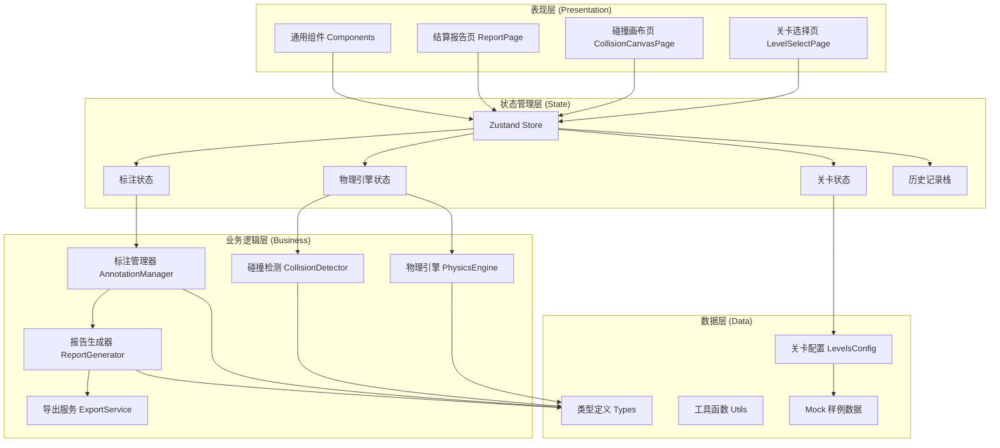
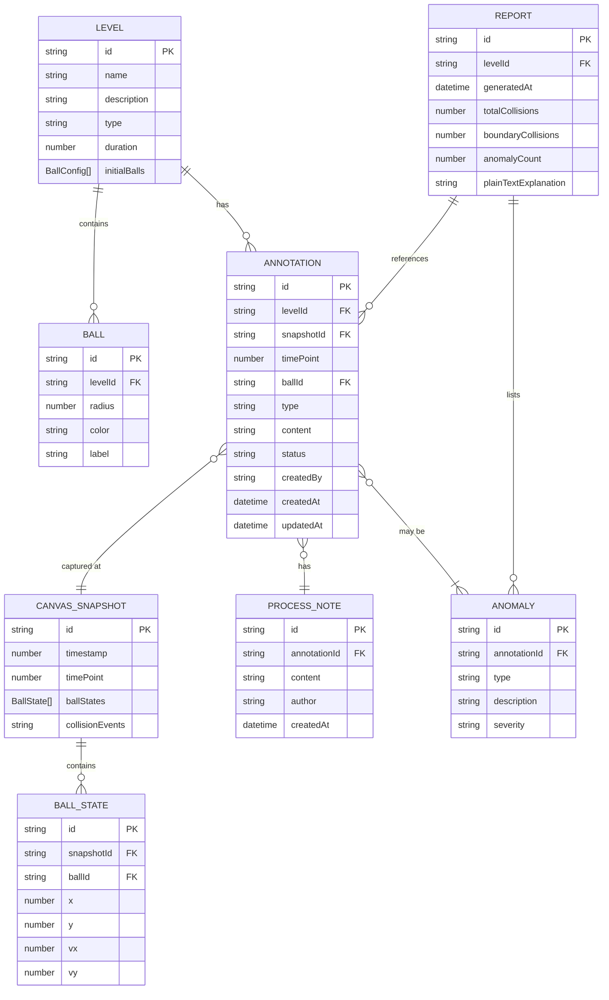

## 1. 架构设计



## 2. 技术描述

- **前端框架**: React 18 + TypeScript 5
- **构建工具**: Vite 5
- **样式方案**: Tailwind CSS 3
- **状态管理**: Zustand 4
- **路由**: React Router DOM 6
- **图标库**: lucide-react
- **物理引擎**: 自定义实现（轻量级 2D 刚体碰撞）
- **导出方案**: 原生 JS 生成 HTML + 浏览器打印功能

**关键设计决策**:
1. 不引入第三方物理引擎（如 Matter.js），自定义实现以确保标注与物理状态的精确对应
2. 所有状态通过 Zustand 统一管理，确保标注、画布、报告共用同一数据源
3. 历史记录使用 Command 模式实现撤销/重做，支持至少 50 步回退
4. 导出报告为单文件 HTML，内嵌所有样式和数据，无需外部依赖

## 3. 目录结构

```
src/
├── components/          # 通用组件
│   ├── Canvas/         # 画布相关组件
│   │   ├── PhysicsCanvas.tsx
│   │   ├── Ball.tsx
│   │   └── AnnotationMarker.tsx
│   ├── Annotation/     # 标注相关组件
│   │   ├── AnnotationPanel.tsx
│   │   ├── AnnotationList.tsx
│   │   └── AnnotationCard.tsx
│   ├── Timeline/       # 时间轴组件
│   │   └── Timeline.tsx
│   ├── Toolbar/        # 工具栏组件
│   │   ├── PlayControls.tsx
│   │   └── AnnotationTools.tsx
│   ├── Report/         # 报告组件
│   │   ├── StatsOverview.tsx
│   │   ├── AnomalyTimeline.tsx
│   │   ├── ExplanationCard.tsx
│   │   └── TraceFlow.tsx
│   └── ui/             # 基础 UI 组件
│       ├── Button.tsx
│       ├── Card.tsx
│       └── Badge.tsx
├── pages/              # 页面组件
│   ├── LevelSelectPage.tsx
│   ├── CollisionCanvasPage.tsx
│   └── ReportPage.tsx
├── store/              # Zustand 状态管理
│   ├── usePhysicsStore.ts
│   ├── useAnnotationStore.ts
│   ├── useLevelStore.ts
│   └── useHistoryStore.ts
├── engine/             # 物理引擎
│   ├── PhysicsEngine.ts
│   ├── CollisionDetector.ts
│   ├── Ball.ts
│   └── Vector2.ts
├── services/           # 业务服务
│   ├── AnnotationManager.ts
│   ├── ReportGenerator.ts
│   └── ExportService.ts
├── data/               # 数据配置
│   ├── levels.ts
│   └── mockData.ts
├── types/              # TypeScript 类型定义
│   ├── physics.ts
│   ├── annotation.ts
│   ├── level.ts
│   └── report.ts
├── utils/              # 工具函数
│   ├── id.ts
│   ├── time.ts
│   └── export.ts
├── hooks/              # 自定义 Hooks
│   ├── usePhysicsLoop.ts
│   ├── useCanvasInteraction.ts
│   └── useAnnotation.ts
├── App.tsx
├── main.tsx
└── index.css
```

## 4. 路由定义

| 路由路径 | 页面名称 | 用途 |
|----------|----------|------|
| `/` | 关卡选择页 | 展示 3 个关卡卡片，选择进入对应场景 |
| `/level/:levelId` | 碰撞画布页 | 物理模拟主界面，进行标注操作 |
| `/report/:levelId` | 结算报告页 | 展示统计、异常列表、追溯链路，支持导出 |

## 5. 数据模型

### 5.1 ER 图



### 5.2 核心类型定义

```typescript
// physics.ts
interface Vector2 {
  x: number;
  y: number;
}

interface BallConfig {
  id: string;
  radius: number;
  color: string;
  label: string;
  initialPosition: Vector2;
  initialVelocity: Vector2;
  mass: number;
}

interface BallState {
  id: string;
  position: Vector2;
  velocity: Vector2;
  radius: number;
  color: string;
  label: string;
}

interface CollisionEvent {
  id: string;
  timestamp: number;
  type: 'ball-ball' | 'ball-wall';
  ballIds: string[];
  position: Vector2;
  isBoundaryError?: boolean;
}

interface CanvasSnapshot {
  id: string;
  timePoint: number;
  timestamp: number;
  ballStates: BallState[];
  collisionEvents: CollisionEvent[];
}

// annotation.ts
type AnnotationType = 
  | 'boundary_error' 
  | 'collision_miss' 
  | 'missing_unit' 
  | 'duplicate' 
  | 'normal' 
  | 'other';

type AnnotationStatus = 'draft' | 'confirmed' | 'pending_review' | 'merged';

interface Annotation {
  id: string;
  levelId: string;
  snapshotId: string;
  timePoint: number;
  ballId: string;
  ballPosition: Vector2;
  type: AnnotationType;
  content: string;
  status: AnnotationStatus;
  createdBy: string;
  createdAt: number;
  updatedAt: number;
  processNotes: ProcessNote[];
}

interface ProcessNote {
  id: string;
  annotationId: string;
  content: string;
  author: string;
  createdAt: number;
}

// level.ts
type LevelType = 'boundary_failure' | 'undo_restart' | 'full_settlement';

interface Level {
  id: string;
  name: string;
  description: string;
  type: LevelType;
  duration: number;
  initialBalls: BallConfig[];
  targetAnnotations: number;
  hint: string;
}

// report.ts
interface ReportStats {
  totalCollisions: number;
  boundaryCollisions: number;
  anomalyCount: number;
  normalAnnotations: number;
  draftCount: number;
  avgAnnotationTime: number;
}

interface AnomalyItem {
  id: string;
  annotationId: string;
  type: AnnotationType;
  timePoint: number;
  description: string;
  severity: 'low' | 'medium' | 'high';
  annotationContent: string;
  processNotes: ProcessNote[];
}

interface Report {
  id: string;
  levelId: string;
  levelName: string;
  generatedAt: number;
  stats: ReportStats;
  anomalies: AnomalyItem[];
  annotations: Annotation[];
  plainTextExplanation: string;
  traceChain: TraceNode[];
}

interface TraceNode {
  id: string;
  type: 'anomaly' | 'annotation' | 'snapshot' | 'process_note';
  title: string;
  description: string;
  timestamp: number;
  linkId: string;
}
```

## 6. 核心模块设计

### 6.1 物理引擎 (PhysicsEngine)

**职责**: 管理 2D 刚体运动和碰撞检测

```typescript
class PhysicsEngine {
  private balls: Ball[];
  private width: number;
  private height: number;
  private gravity: number = 0;
  private friction: number = 0.999;
  private collisionEvents: CollisionEvent[] = [];

  update(dt: number): CollisionEvent[];
  detectCollisions(): CollisionEvent[];
  handleBallBallCollision(ball1: Ball, ball2: Ball): void;
  handleBallWallCollision(ball: Ball): CollisionEvent | null;
  takeSnapshot(timePoint: number): CanvasSnapshot;
  getBallStates(): BallState[];
  reset(balls: BallConfig[]): void;
}
```

**关键算法**:
- 使用分离轴定理 (SAT) 进行圆形碰撞检测
- 弹性碰撞响应公式: v1' = v1 - (2m2/(m1+m2)) * (v1-v2)·n * n
- 边界误判模拟: 当球体速度 > 阈值时，有概率触发边界判定误差

### 6.2 标注管理器 (AnnotationManager)

**职责**: 统一管理标注的创建、修改、查询，确保与画布状态共用记录

```typescript
class AnnotationManager {
  createAnnotation(params: CreateAnnotationParams): Annotation;
  updateAnnotation(id: string, updates: Partial<Annotation>): Annotation;
  deleteAnnotation(id: string): void;
  getAnnotation(id: string): Annotation | undefined;
  getAnnotationsByLevel(levelId: string): Annotation[];
  addProcessNote(annotationId: string, content: string, author: string): ProcessNote;
  markAsAnomaly(annotationId: string, type: AnnotationType, description: string): void;
  linkToSnapshot(annotationId: string, snapshotId: string): void;
}
```

**关键约束**:
- 每个标注必须关联一个 `snapshotId`，确保可追溯到画布状态
- 标注 ID 与关联的异常、处理意见、报告引用使用同一 ID 体系
- 修改历史自动记录在 `processNotes` 中

### 6.3 历史记录 (useHistoryStore)

**职责**: 实现撤销/重做功能，使用 Command 模式

```typescript
interface HistoryState {
  past: HistoryEntry[];
  present: AppState;
  future: HistoryEntry[];
}

interface HistoryEntry {
  type: 'annotation_create' | 'annotation_update' | 'annotation_delete' | 'level_reset';
  stateSnapshot: AppState;
  timestamp: number;
}

const useHistoryStore = create<HistoryState & {
  undo: () => void;
  redo: () => void;
  canUndo: () => boolean;
  canRedo: () => boolean;
  pushHistory: (type: HistoryEntry['type']) => void;
}>()
```

### 6.4 报告生成器 (ReportGenerator)

**职责**: 生成结算报告，包括普通话解释

```typescript
class ReportGenerator {
  generate(levelId: string): Report;
  generateStats(annotations: Annotation[], collisions: CollisionEvent[]): ReportStats;
  generateAnomalies(annotations: Annotation[]): AnomalyItem[];
  generatePlainTextExplanation(report: Report): string;
  generateTraceChain(anomaly: AnomalyItem): TraceNode[];
}
```

**普通话解释生成规则**:
1. 开头说明场景和时间
2. 逐条说明异常情况，用自然语言描述
3. 解释可能的原因
4. 给出处理建议
5. 结尾署名和时间

### 6.5 导出服务 (ExportService)

```typescript
class ExportService {
  exportAsHTML(report: Report): string;
  downloadHTML(html: string, filename: string): void;
  exportAsJSON(report: Report): string;
  printReport(report: Report): void;
}
```

## 7. 状态管理设计

### 7.1 usePhysicsStore - 物理状态

```typescript
{
  engine: PhysicsEngine | null;
  isPlaying: boolean;
  currentTime: number;
  speed: number;
  snapshots: CanvasSnapshot[];
  collisionEvents: CollisionEvent[];
  actions: {
    initEngine: (width: number, height: number) => void;
    loadLevel: (level: Level) => void;
    play: () => void;
    pause: () => void;
    reset: () => void;
    setSpeed: (speed: number) => void;
    seekTo: (timePoint: number) => void;
    takeSnapshot: () => CanvasSnapshot;
  }
}
```

### 7.2 useAnnotationStore - 标注状态

```typescript
{
  annotations: Annotation[];
  selectedAnnotationId: string | null;
  isAnnotating: boolean;
  annotationManager: AnnotationManager;
  actions: {
    startAnnotation: (ballId: string, position: Vector2) => void;
    saveAnnotation: (params: SaveAnnotationParams) => void;
    cancelAnnotation: () => void;
    selectAnnotation: (id: string | null) => void;
    updateAnnotation: (id: string, updates: Partial<Annotation>) => void;
    deleteAnnotation: (id: string) => void;
    addProcessNote: (annotationId: string, content: string) => void;
  }
}
```

### 7.3 useLevelStore - 关卡状态

```typescript
{
  levels: Level[];
  currentLevelId: string | null;
  completedLevels: string[];
  actions: {
    setCurrentLevel: (levelId: string) => void;
    completeLevel: (levelId: string) => void;
    getCurrentLevel: () => Level | undefined;
  }
}
```

## 8. 关键技术实现点

### 8.1 统一 ID 体系

所有实体使用同一 ID 生成器，确保追溯链路畅通：

```typescript
// utils/id.ts
export function generateId(prefix: string): string {
  const timestamp = Date.now().toString(36);
  const random = Math.random().toString(36).substring(2, 8);
  return `${prefix.toUpperCase()}-${timestamp}-${random}`;
}

// 示例:
// ANNO-1234567-abcdef  (标注)
// SNAP-1234567-abcdef  (快照)
// ANOM-1234567-abcdef  (异常)
// NOTE-1234567-abcdef  (处理意见)
```

### 8.2 画布与标注共用快照

标注创建时自动捕获当前画布状态，确保数据一致性：

```typescript
// 创建标注时
const snapshot = physicsStore.takeSnapshot();
const annotation = annotationManager.createAnnotation({
  ...params,
  snapshotId: snapshot.id,  // 关联快照
  ballPosition: snapshot.ballStates.find(b => b.id === ballId)?.position || params.position,
});
```

### 8.3 异常追溯链路

从报告异常点可完整回溯：

```typescript
// 追溯链路构建
function buildTraceChain(anomaly: AnomalyItem): TraceNode[] {
  const annotation = annotationStore.getAnnotation(anomaly.annotationId);
  const snapshot = physicsStore.snapshots.find(s => s.id === annotation?.snapshotId);
  
  return [
    { id: anomaly.id, type: 'anomaly', title: '异常报告', ... },
    { id: annotation.id, type: 'annotation', title: '标注记录', ... },
    { id: snapshot.id, type: 'snapshot', title: '画布快照', ... },
    ...annotation.processNotes.map(note => ({
      id: note.id, type: 'process_note', title: '处理意见', ...
    }))
  ];
}
```

## 9. 性能优化

1. **Canvas 渲染**: 使用 `requestAnimationFrame`，只在球体位置变化时重绘
2. **快照存储**: 只存储关键帧（碰撞发生时、标注创建时），而非每一帧
3. **历史记录**: 使用状态 diff 而非全量复制，减少内存占用
4. **列表渲染**: 标注列表使用虚拟滚动，处理大量标注时保持流畅

## 10. 安全考量

1. 导出的 HTML 报告进行 XSS 防护，所有用户输入内容转义
2. 标注内容长度限制，防止存储溢出
3. 处理意见记录作者信息，便于审计追踪
