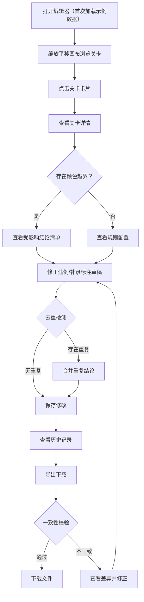

## 1. 产品概述

桌游规则关卡编辑器是一款本地 Web 工作台，面向文保讲解员等非技术用户，用于编辑、复核和管理桌游规则关卡配置。核心解决：颜色越界等规则违例影响哪些结论不可追踪、重复导入导致结论重复、导出与界面摘要不一致、错误信息不可操作等问题。

- 目标用户：文保讲解员（非技术背景），需要清晰可视化的规则关卡管理工具
- 核心价值：让规则关卡编辑可追溯、可校验、可导出，避免同一违例出现多份结论

## 2. 核心功能

### 2.1 用户角色

| 角色 | 注册方式 | 核心权限 |
|------|----------|----------|
| 文保讲解员 | 本地直接使用 | 编辑关卡、查看详情、修正记录、导出下载 |

### 2.2 功能模块

1. **关卡列表页**：所有关卡的总览，支持搜索、筛选、状态标记
2. **关卡详情页**：关卡规则详情、颜色越界违例追踪及受影响结论清单
3. **关卡修正页**：对违例记录进行修正、补录标注草稿
4. **历史记录页**：所有操作的变更历史，支持回溯
5. **导出下载页**：导出关卡配置，确保导出内容与界面摘要一致

### 2.3 页面详情

| 页面名称 | 模块名称 | 功能描述 |
|----------|----------|----------|
| 关卡列表页 | 搜索筛选栏 | 按名称、状态、违例类型筛选关卡 |
| 关卡列表页 | 关卡卡片列表 | 展示关卡缩略信息，含颜色越界标记 |
| 关卡列表页 | 画布入口 | 缩放平移画布作为日常入口，展示关卡布局 |
| 关卡详情页 | 规则详情面板 | 展示关卡规则配置及颜色使用范围 |
| 关卡详情页 | 颜色越界影响面板 | 列出每条颜色越界影响了哪些结论 |
| 关卡详情页 | 结论清单 | 展示所有结论及来源标注草稿状态 |
| 关卡修正页 | 违例修正表单 | 修正颜色越界等违例，补录缺失标注草稿 |
| 关卡修正页 | 去重检测 | 重复导入/补录后自动检测并合并同一结论 |
| 关卡修正页 | 可操作错误提示 | 失败时明确提示缺哪份标注草稿等可操作信息 |
| 历史记录页 | 变更时间线 | 按时间展示所有修改记录 |
| 历史记录页 | 版本对比 | 对比两个版本的差异 |
| 导出下载页 | 导出配置 | 导出 JSON/CSV 格式，与界面摘要一致性校验 |
| 导出下载页 | 一致性校验报告 | 导出前自动校验，不一致时列出差异 |

## 3. 核心流程

用户日常使用流程：打开编辑器 → 缩放平移画布浏览关卡 → 点击关卡进入详情 → 查看颜色越界影响 → 修正违例/补录 → 历史记录确认 → 导出下载

## 4. 用户界面设计

### 4.1 设计风格

- 主色调：深墨绿 (#1a2f23) + 暖琥珀 (#d4a847) 点缀，营造文保档案质感
- 辅助色：石板灰 (#4a5568) 用于背景层次，象牙白 (#faf8f0) 用于内容区
- 错误/越界色：赤陶红 (#c4533a)，通过状态色：青苔绿 (#5a8a6e)
- 按钮风格：圆角微凸（3D 轻浮雕），主按钮墨绿底白字，危险操作赤陶红
- 字体：思源宋体（Noto Serif SC）用于标题，思源黑体（Noto Sans SC）用于正文
- 布局风格：左侧导航 + 右侧内容区，卡片式关卡展示
- 图标：lucide-react 线性图标

### 4.2 页面设计概览

| 页面名称 | 模块名称 | UI 元素 |
|----------|----------|---------|
| 关卡列表页 | 搜索筛选栏 | 圆角输入框、下拉筛选器、状态标签色块 |
| 关卡列表页 | 关卡卡片列表 | 浮雕卡片、越界标记角标、状态徽章 |
| 关卡列表页 | 画布入口 | 全幅画布、缩放平移控件、网格吸附开关 |
| 关卡详情页 | 规则详情面板 | 折叠面板、颜色条预览、范围标注 |
| 关卡详情页 | 颜色越界影响面板 | 红色警示条、受影响结论列表、跳转链接 |
| 关卡详情页 | 结论清单 | 表格、来源标注草稿状态图标、操作按钮 |
| 关卡修正页 | 违例修正表单 | 表单输入、颜色选择器、标注草稿上传区 |
| 关卡修正页 | 去重检测结果 | 黄色警示条、重复结论对比、合并按钮 |
| 关卡修正页 | 错误提示 | 红色横幅、可操作建议按钮、缺失草稿列表 |
| 历史记录页 | 变更时间线 | 竖向时间轴、操作类型图标、变更摘要 |
| 历史记录页 | 版本对比 | 左右分栏对比、差异高亮 |
| 导出下载页 | 导出配置 | 格式选择、范围选择、导出按钮 |
| 导出下载页 | 一致性校验报告 | 绿色/红色校验状态、差异列表、修正跳转 |

### 4.3 响应式

- 桌面优先设计（1280px+ 最佳体验）
- 平板适配（768px-1280px）侧边栏可折叠
- 移动端暂不作为主要目标

### 4.4 3D 场景指导

不适用
