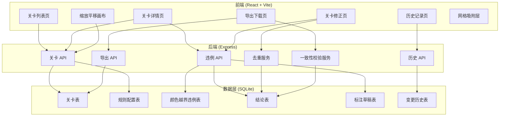
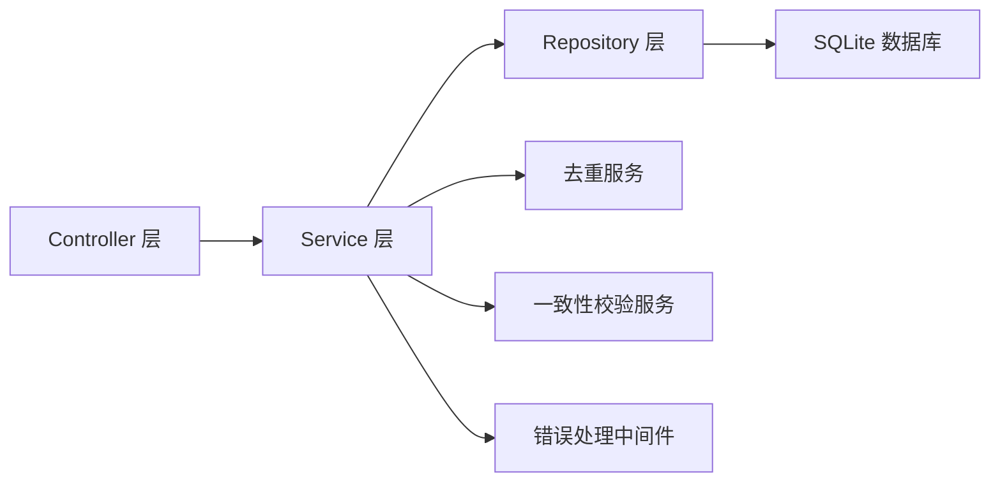
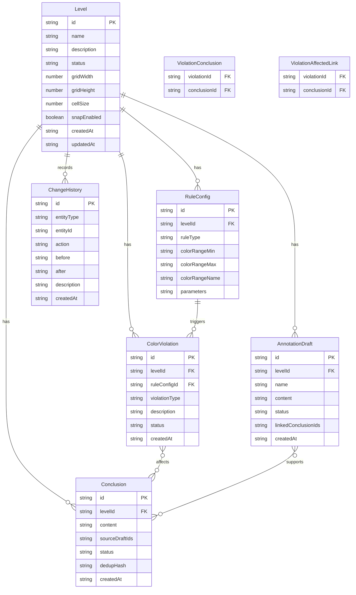

## 1. 架构设计



## 2. 技术说明

- 前端：React@18 + tailwindcss@3 + vite + zustand（状态管理）
- 初始化工具：vite-init
- 后端：Express@4 + TypeScript（ESM 格式）
- 数据库：SQLite（better-sqlite3），本地文件存储
- 画布：HTML5 Canvas + 自定义缩放平移 + 网格吸附逻辑
- 模板：react-express-ts

## 3. 路由定义

| 路由 | 用途 |
|------|------|
| / | 关卡列表页，含缩放平移画布入口 |
| /level/:id | 关卡详情页，展示规则和颜色越界影响 |
| /level/:id/edit | 关卡修正页，修正违例和补录 |
| /history | 历史记录页，变更时间线 |
| /export | 导出下载页，含一致性校验 |

## 4. API 定义

```typescript
interface Level {
  id: string;
  name: string;
  description: string;
  status: "draft" | "review" | "confirmed";
  gridConfig: GridConfig;
  createdAt: string;
  updatedAt: string;
}

interface GridConfig {
  width: number;
  height: number;
  cellSize: number;
  snapEnabled: boolean;
}

interface RuleConfig {
  id: string;
  levelId: string;
  ruleType: string;
  colorRange: ColorRange;
  parameters: Record<string, unknown>;
}

interface ColorRange {
  min: [number, number, number];
  max: [number, number, number];
  name: string;
}

interface ColorViolation {
  id: string;
  levelId: string;
  ruleConfigId: string;
  violationType: string;
  description: string;
  affectedConclusionIds: string[];
  status: "open" | "fixed" | "suppressed";
  createdAt: string;
}

interface Conclusion {
  id: string;
  levelId: string;
  content: string;
  sourceDraftIds: string[];
  status: "pending" | "confirmed" | "rejected";
  dedupHash: string;
  createdAt: string;
}

interface AnnotationDraft {
  id: string;
  levelId: string;
  name: string;
  content: string;
  status: "missing" | "partial" | "complete";
  linkedConclusionIds: string[];
  createdAt: string;
}

interface ChangeHistory {
  id: string;
  entityType: "level" | "violation" | "conclusion" | "draft";
  entityId: string;
  action: "create" | "update" | "delete" | "merge";
  before: Record<string, unknown> | null;
  after: Record<string, unknown> | null;
  description: string;
  createdAt: string;
}

interface ExportPayload {
  levelIds: string[];
  format: "json" | "csv";
  includeHistory: boolean;
}

interface ConsistencyReport {
  isConsistent: boolean;
  differences: Array<{
    field: string;
    uiValue: string;
    exportValue: string;
    conclusionId: string;
  }>;
}

interface DedupResult {
  hasDuplicates: boolean;
  groups: Array<{
    canonicalId: string;
    duplicateIds: string[];
    content: string;
  }>;
}

interface ErrorResponse {
  code: string;
  message: string;
  actionableHint: string;
  missingDraftNames?: string[];
}

// API 端点
// GET    /api/levels              - 获取关卡列表
// GET    /api/levels/:id          - 获取关卡详情
// POST   /api/levels              - 创建关卡
// PUT    /api/levels/:id          - 更新关卡
// GET    /api/levels/:id/violations - 获取关卡的颜色越界违例
// GET    /api/levels/:id/conclusions - 获取关卡的结论清单
// PUT    /api/violations/:id      - 修正违例
// POST   /api/violations/check-dedup - 去重检测
// POST   /api/violations/merge    - 合并重复结论
// GET    /api/levels/:id/drafts   - 获取标注草稿列表
// POST   /api/levels/:id/drafts   - 上传/补录标注草稿
// GET    /api/history             - 获取变更历史
// GET    /api/history/:entityType/:entityId - 获取特定实体的历史
// POST   /api/export              - 导出关卡配置
// POST   /api/export/consistency  - 一致性校验
// POST   /api/seed                - 初始化示例数据
```

## 5. 服务器架构图



## 6. 数据模型

### 6.1 数据模型定义



### 6.2 数据定义语言

```sql
CREATE TABLE IF NOT EXISTS levels (
  id TEXT PRIMARY KEY,
  name TEXT NOT NULL,
  description TEXT DEFAULT '',
  status TEXT NOT NULL DEFAULT 'draft' CHECK(status IN ('draft', 'review', 'confirmed')),
  grid_width INTEGER NOT NULL DEFAULT 10,
  grid_height INTEGER NOT NULL DEFAULT 10,
  cell_size INTEGER NOT NULL DEFAULT 40,
  snap_enabled INTEGER NOT NULL DEFAULT 0,
  created_at TEXT NOT NULL DEFAULT (datetime('now')),
  updated_at TEXT NOT NULL DEFAULT (datetime('now'))
);

CREATE TABLE IF NOT EXISTS rule_configs (
  id TEXT PRIMARY KEY,
  level_id TEXT NOT NULL,
  rule_type TEXT NOT NULL,
  color_range_min TEXT NOT NULL,
  color_range_max TEXT NOT NULL,
  color_range_name TEXT NOT NULL,
  parameters TEXT DEFAULT '{}',
  created_at TEXT NOT NULL DEFAULT (datetime('now')),
  FOREIGN KEY (level_id) REFERENCES levels(id) ON DELETE CASCADE
);

CREATE TABLE IF NOT EXISTS color_violations (
  id TEXT PRIMARY KEY,
  level_id TEXT NOT NULL,
  rule_config_id TEXT NOT NULL,
  violation_type TEXT NOT NULL,
  description TEXT NOT NULL,
  status TEXT NOT NULL DEFAULT 'open' CHECK(status IN ('open', 'fixed', 'suppressed')),
  created_at TEXT NOT NULL DEFAULT (datetime('now')),
  FOREIGN KEY (level_id) REFERENCES levels(id) ON DELETE CASCADE,
  FOREIGN KEY (rule_config_id) REFERENCES rule_configs(id) ON DELETE CASCADE
);

CREATE TABLE IF NOT EXISTS conclusions (
  id TEXT PRIMARY KEY,
  level_id TEXT NOT NULL,
  content TEXT NOT NULL,
  source_draft_ids TEXT DEFAULT '[]',
  status TEXT NOT NULL DEFAULT 'pending' CHECK(status IN ('pending', 'confirmed', 'rejected')),
  dedup_hash TEXT NOT NULL,
  created_at TEXT NOT NULL DEFAULT (datetime('now')),
  FOREIGN KEY (level_id) REFERENCES levels(id) ON DELETE CASCADE
);

CREATE TABLE IF NOT EXISTS annotation_drafts (
  id TEXT PRIMARY KEY,
  level_id TEXT NOT NULL,
  name TEXT NOT NULL,
  content TEXT DEFAULT '',
  status TEXT NOT NULL DEFAULT 'missing' CHECK(status IN ('missing', 'partial', 'complete')),
  linked_conclusion_ids TEXT DEFAULT '[]',
  created_at TEXT NOT NULL DEFAULT (datetime('now')),
  FOREIGN KEY (level_id) REFERENCES levels(id) ON DELETE CASCADE
);

CREATE TABLE IF NOT EXISTS violation_affected_conclusions (
  violation_id TEXT NOT NULL,
  conclusion_id TEXT NOT NULL,
  PRIMARY KEY (violation_id, conclusion_id),
  FOREIGN KEY (violation_id) REFERENCES color_violations(id) ON DELETE CASCADE,
  FOREIGN KEY (conclusion_id) REFERENCES conclusions(id) ON DELETE CASCADE
);

CREATE TABLE IF NOT EXISTS change_history (
  id TEXT PRIMARY KEY,
  entity_type TEXT NOT NULL CHECK(entity_type IN ('level', 'violation', 'conclusion', 'draft')),
  entity_id TEXT NOT NULL,
  action TEXT NOT NULL CHECK(action IN ('create', 'update', 'delete', 'merge')),
  before_data TEXT,
  after_data TEXT,
  description TEXT NOT NULL,
  created_at TEXT NOT NULL DEFAULT (datetime('now'))
);

CREATE INDEX IF NOT EXISTS idx_levels_status ON levels(status);
CREATE INDEX IF NOT EXISTS idx_violations_level ON color_violations(level_id);
CREATE INDEX IF NOT EXISTS idx_violations_status ON color_violations(status);
CREATE INDEX IF NOT EXISTS idx_conclusions_level ON conclusions(level_id);
CREATE INDEX IF NOT EXISTS idx_conclusions_dedup ON conclusions(dedup_hash);
CREATE INDEX IF NOT EXISTS idx_drafts_level ON annotation_drafts(level_id);
CREATE INDEX IF NOT EXISTS idx_history_entity ON change_history(entity_type, entity_id);
CREATE INDEX IF NOT EXISTS idx_history_created ON change_history(created_at);
```
