## 1. 产品概述

运动姿态骨架标注系统是面向安全培训师的专业标注复核工具，解决骨架标注中评分表延迟、碰撞边界误判、重复标注等痛点，提供可视化标注、图层对比、友好导出等核心功能。

- 核心用户：安全培训师、标注复核人员
- 核心价值：降低标注复核门槛，提升标注质量，保留边界案例的可追溯性
- 市场定位：专业领域标注工具，兼顾专业性与易用性

## 2. 核心功能

### 2.1 用户角色

| 角色 | 登录方式 | 核心权限 |
|------|----------|----------|
| 安全培训师 | 账号登录 | 标注复核、图层管理、导出报告、人工确认 |
| 标注员 | 账号登录 | 骨架标注、补录数据、撤销重开 |

### 2.2 功能模块

1. **标注工作台**：骨架可视化、碰撞边界检测、实时评分、图层切换
2. **复核关卡**：边界失败案例、撤销/重开操作、结算报告
3. **数据管理**：重复运行、补录备注、人工确认、历史追溯
4. **导出中心**：友好格式报告、标注原因说明、非技术人员可读

### 2.3 页面详情

| 页面名称 | 模块名称 | 功能描述 |
|----------|----------|----------|
| 标注工作台 | 骨架可视化 | Canvas绘制人体骨架节点，支持缩放平移，显示骨骼连线 |
| 标注工作台 | 碰撞边界检测 | 高亮显示边界误判区域，标记可疑碰撞点，保留而非丢弃 |
| 标注工作台 | 图层管理 | 切换标注前后图层，缩放平移时同步显示前后对比 |
| 标注工作台 | 实时评分 | 关联晚到评分表，显示评分进度，支持评分表补录 |
| 复核关卡 | 边界失败案例 | 至少1个典型边界失败案例，标注原因用自然语言描述 |
| 复核关卡 | 撤销/重开 | 支持撤销操作、重新标注，保留操作历史 |
| 复核关卡 | 结算报告 | 单页可视化结算，展示标注统计、问题分类、改进建议 |
| 数据管理 | 重复运行 | 支持同一批次数据重复标注，对比差异 |
| 数据管理 | 补录备注 | 支持补录评分表、添加备注、填写遗漏单位 |
| 数据管理 | 人工确认 | 边界案例需人工确认，记录确认人、时间、意见 |
| 导出中心 | 友好导出 | 导出HTML/PDF格式，避免字段缩写，标注原因用通俗语言 |
| 导出中心 | 标注追溯 | 导出报告包含重复标注原因、操作历史、确认记录 |

## 3. 核心流程

```mermaid
flowchart LR
    A["导入原始数据<br/>(含旧表、漏填、坏数据)"] --> B["骨架自动标注"]
    B --> C["碰撞边界检测<br/>(标记可疑点不丢弃)"]
    C --> D["等待评分表<br/>(支持补录)"]
    D --> E["人工标注/调整"]
    E --> F["图层对比<br/>(缩放平移同步)"]
    F --> G["复核关卡1<br/>边界失败案例"]
    G --> H["撤销/重开操作"]
    H --> I["复核关卡2<br/>重复标注确认"]
    I --> J["人工确认边界案例"]
    J --> K["生成结算报告"]
    K --> L["友好格式导出<br/>(非技术人员可读)"]
    
    style A fill:#f9f,stroke:#333
    style C fill:#ff9,stroke:#333
    style G fill:#f99,stroke:#333
    style L fill:#9f9,stroke:#333
```

## 4. 用户界面设计

### 4.1 设计风格

**整体定位：专业工业风 + 数据可视化**

- 主色调：深蓝 #165DFF（专业、可靠），辅以橙红 #FF7D00（警告、边界）
- 辅助色：浅灰 #F5F7FA（背景）、深灰 #1D2129（文字）、绿色 #00B42A（通过）
- 按钮风格：直角微圆角（2px），悬浮时轻微上浮+阴影，强调专业感
- 字体：标题用"思源黑体 Bold"，正文用"思源宋体"，等宽数据用"JetBrains Mono"
- 布局：三栏式布局（左侧工具栏+中间画布+右侧属性面板），画布区域最大化
- 图标：线性图标为主，关键操作使用填充图标，警告区域使用⚠️图标

### 4.2 页面设计概述

| 页面名称 | 模块名称 | UI元素 |
|----------|----------|--------|
| 标注工作台 | 骨架画布 | 深色背景+网格，骨架节点用彩色圆点，骨骼连线用渐变线条，碰撞点闪烁警告 |
| 标注工作台 | 图层切换 | 底部横向标签页，切换时有淡入淡出动画，支持分屏对比 |
| 标注工作台 | 缩放平移 | 右下角缩放控制条，支持鼠标滚轮缩放，拖拽平移 |
| 复核关卡 | 边界失败 | 红色边框卡片，高亮显示失败原因，提供"查看前后对比"按钮 |
| 复核关卡 | 撤销重开 | 操作历史时间线，可点击回退到任意节点，有确认弹窗 |
| 复核关卡 | 结算报告 | 单页竖向布局，大号数字展示关键指标，图表可视化问题分布 |
| 数据管理 | 样例数据 | 表格展示原始数据，问题行标黄，备注列显示补录内容 |
| 导出中心 | 报告预览 | 模拟打印预览效果，可切换"专业版"/"简化版"视图 |

### 4.3 响应式

- **桌面优先**：1920px为主设计尺寸，画布区域自适应
- **平板适配**：右侧面板可收起，工具栏改为顶部横向排列
- **触控优化**：关键操作按钮≥44px，支持双指缩放画布

### 4.4 数据可视化设计

- 骨架节点：不同部位用不同颜色区分（头部#FF4D4F、躯干#165DFF、四肢#00B42A）
- 碰撞边界：用半透明红色遮罩标记，边缘虚线闪烁
- 评分进度：环形进度条，不同分数段显示不同颜色
- 操作历史：垂直时间线，不同操作类型用不同图标标记
- 问题分布：饼图+条形图组合，支持点击下钻查看详情
