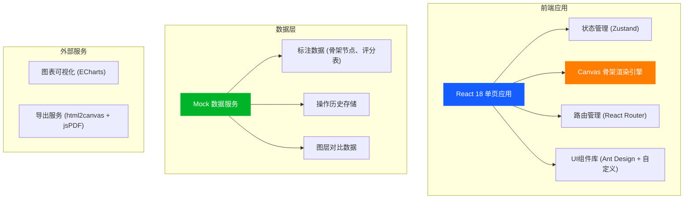
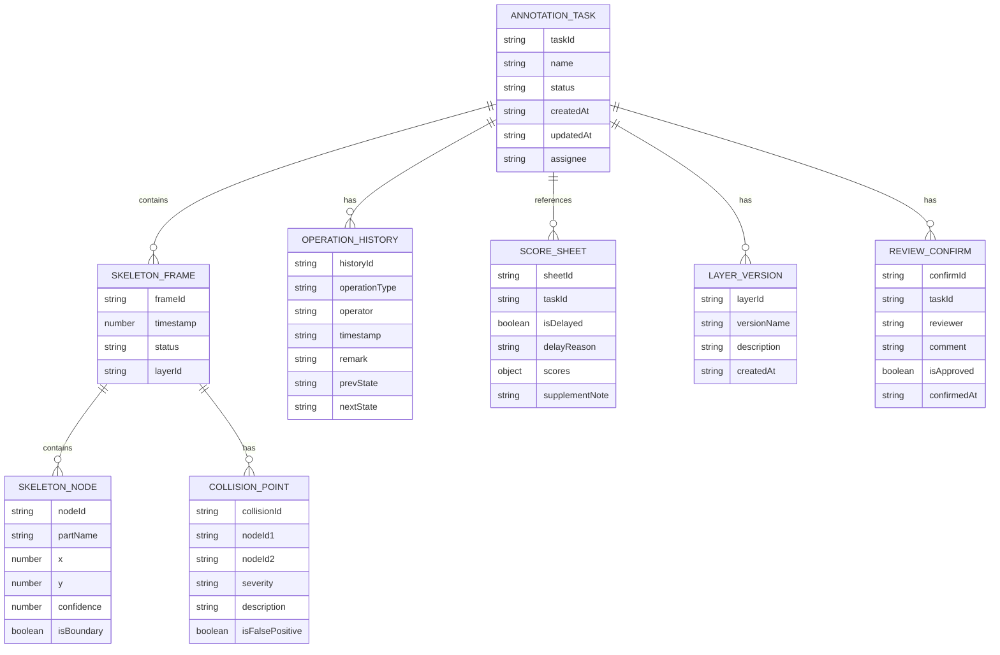

## 1. 架构设计



## 2. 技术描述

- **前端框架**：React@18 + TypeScript@5 + Vite@5
- **样式方案**：TailwindCSS@3 + CSS 变量主题系统
- **状态管理**：Zustand（轻量级、支持时间旅行调试）
- **路由**：React Router@6
- **UI组件**：Ant Design@5 + 自定义业务组件
- **画布渲染**：原生 Canvas 2D API（性能优先）
- **图表**：ECharts@5
- **导出**：html2canvas + jsPDF
- **数据**：完整 Mock 数据，模拟真实业务场景（旧表、漏填、坏数据）

## 3. 路由定义

| 路由 | 页面用途 |
|------|----------|
| / | 首页/项目列表，展示待处理标注任务 |
| /annotate/:id | 标注工作台，核心标注操作页面 |
| /review/:id | 复核关卡，边界失败+撤销重开+结算 |
| /data | 数据管理，重复运行+补录+人工确认 |
| /export/:id | 导出中心，预览和下载报告 |

## 4. 数据模型

### 4.1 核心数据结构



### 4.2 真实样例数据设计

**样例数据包含以下真实场景问题：**

1. **旧表数据**：2023年遗留评分表，字段格式不统一
2. **补录备注**：评分表晚到，人工补录"2024-03-15 安全科 张工补录"
3. **漏填单位**：角度数据缺少"°"，距离数据缺少"cm"
4. **坏数据**：某帧骨架节点坐标异常（x=-9999），模拟设备传输错误
5. **边界误判**：左膝与地面距离1.2cm，系统判定碰撞但实际未碰撞
6. **重复标注**：同一批次数据因评分表更新需重新标注2次

### 4.3 Mock 数据示例

```typescript
// 骨架节点类型定义
interface SkeletonNode {
  id: string;
  name: string;          // 中文名称，如"头顶"、"左肩"
  x: number;
  y: number;
  confidence: number;    // 置信度 0-1
  part: 'head' | 'torso' | 'arm' | 'leg';
}

// 碰撞点类型定义
interface CollisionPoint {
  id: string;
  nodes: [string, string];
  distance: number;      // 实际距离
  threshold: number;     // 判定阈值
  severity: 'warning' | 'danger' | 'boundary';
  isFalsePositive: boolean;
  reason: string;        // 通俗语言描述原因
}

// 操作历史类型定义
interface OperationRecord {
  id: string;
  type: 'annotate' | 'undo' | 'redo' | 'supplement' | 'confirm' | 'reopen';
  operator: string;
  timestamp: string;
  description: string;   // 通俗描述，如"撤销了左膝关节标注"
  before?: any;
  after?: any;
}
```

## 5. 核心模块设计

### 5.1 Canvas 骨架渲染引擎

```typescript
// 核心渲染类
class SkeletonCanvas {
  private ctx: CanvasRenderingContext2D;
  private scale: number = 1;
  private offset: { x: number; y: number } = { x: 0, y: 0 };
  private currentLayer: 'before' | 'after' | 'split' = 'after';
  
  // 支持缩放平移
  public zoom(factor: number, center: { x: number; y: number }): void;
  public pan(dx: number, dy: number): void;
  
  // 图层切换时保持视口同步
  public setLayer(layer: 'before' | 'after' | 'split'): void;
  
  // 绘制骨架
  private drawSkeleton(nodes: SkeletonNode[], bones: [string, string][]): void;
  
  // 绘制碰撞边界
  private drawCollisions(collisions: CollisionPoint[]): void;
  
  // 绘制网格背景
  private drawGrid(): void;
}
```

### 5.2 状态管理设计

```typescript
// Zustand Store 定义
interface AnnotationState {
  // 数据
  currentTask: AnnotationTask | null;
  frames: SkeletonFrame[];
  currentFrameIndex: number;
  collisions: CollisionPoint[];
  history: OperationRecord[];
  layers: LayerVersion[];
  activeLayerId: string;
  
  // 操作
  loadTask: (taskId: string) => Promise<void>;
  updateNode: (nodeId: string, x: number, y: number) => void;
  undo: () => void;
  redo: () => void;
  supplementScore: (data: Partial<ScoreSheet>) => void;
  confirmBoundary: (collisionId: string, approved: boolean, comment: string) => void;
  reRunAnnotation: () => void;
  exportReport: (format: 'html' | 'pdf') => Promise<void>;
  switchLayer: (layerId: string) => void;
}
```

### 5.3 导出报告设计

**友好导出原则：**
1. 所有字段使用中文全称，不使用缩写（如不用`bbox`，用"边界框"）
2. 重复标注原因用自然语言说明，如"因评分表延迟到达，需补充标注第3-5帧"
3. 边界案例展示前后对比图
4. 包含操作时间线，便于追溯
5. 区分"专业版"和"简化版"，简化版隐藏技术细节

## 6. 性能优化要点

1. **Canvas 渲染优化**：使用离屏 Canvas 预绘制静态元素，仅重绘变化部分
2. **数据懒加载**：帧数据按需加载，避免一次性加载全部数据
3. **历史记录快照**：使用 Immer 实现不可变数据，支持高效时间旅行
4. **虚拟滚动**：操作历史列表使用虚拟滚动，支持千条记录流畅展示
5. **防抖节流**：缩放平移操作使用节流，输入框使用防抖
