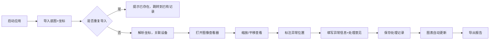
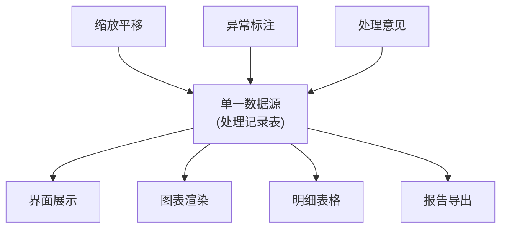

## 1. 产品概述

显微图像计数画板是面向康复训练师的医学图像标注与分析工具，解决传统"表格颜色+口头约定"模式下结论无法追溯、数据不一致的问题。以"设备清单"为主线，实现从图像导入、标注分析到导出报告的全链路数据统一与可审计。

### 核心价值
- **单一数据源**：界面、图表、报告、导出全部来自同一批处理记录，杜绝各算各的
- **全链路追溯**：评审老师可从任一异常记录反向追溯到底图、设备、处理意见
- **导入幂等**：同一批底图坐标重复导入不产生冲突结论
- **用户友好**：导出报告用通俗语言，文档精简到4步操作

## 2. 核心功能

### 2.1 用户角色

| 角色 | 注册方式 | 核心权限 |
|------|----------|----------|
| 康复训练师 | 本地账号 | 导入图像、标注异常、查看图表、导出报告、复核数据 |
| 评审老师 | 本地账号 | 查看全部数据、追溯异常链路、复核结论 |

### 2.2 功能模块

1. **看板首页**：设备清单总览、异常统计、快捷操作入口
2. **设备管理**：设备清单的增删改查，关联底图记录
3. **图像导入**：底图批量导入、自动去重、坐标解析
4. **图像标注**：缩放平移、异常标注、处理意见记录
5. **图表分析**：异常分布、设备统计、趋势分析（与明细表同源）
6. **报告导出**：Excel/HTML格式，通俗语言解释异常原因
7. **追溯审计**：异常→处理记录→底图→设备→处理意见 全链路追踪
8. **用户指南**：精简4步操作说明（启动、导入、查异常、导出）

### 2.3 页面详情

| 页面名称 | 模块名称 | 功能描述 |
|----------|----------|----------|
| 看板首页 | 数据概览 | 设备总数、异常数、待复核数、快捷导入/导出按钮 |
| 看板首页 | 异常分布图表 | 按设备、按严重程度的异常统计柱状图/饼图 |
| 看板首页 | 最近异常列表 | 最新标注的异常记录，点击可追溯 |
| 设备管理 | 设备列表 | 设备清单表格，支持搜索、筛选、编辑 |
| 设备管理 | 设备详情 | 关联底图列表、历史异常、处理意见汇总 |
| 图像导入 | 导入表单 | 拖拽上传、批量导入、坐标解析、去重提示 |
| 图像标注 | 图像查看器 | 缩放(滚轮)、平移(拖拽)、异常标注(点击) |
| 图像标注 | 异常标注面板 | 严重程度、颜色代码、技术原因、通俗解释、处理意见 |
| 图表分析 | 统计图表 | 异常趋势、设备对比、颜色分布（与明细联动） |
| 图表分析 | 数据明细 | 可筛选的异常明细表，与图表数据完全同源 |
| 报告导出 | 导出配置 | 选择格式(Excel/HTML)、选择范围、预览 |
| 追溯审计 | 链路追踪 | 可视化展示异常→处理→底图→设备的完整链路 |
| 追溯审计 | 处理意见 | 查看/添加处理意见，永久留痕不可删除 |
| 用户指南 | 操作说明 | 启动、导入、查看异常、导出结果 4步极简说明 |

## 3. 核心流程

### 3.1 康复训练师标注流程

### 3.2 评审老师追溯流程

### 3.3 数据一致性保障

## 4. 用户界面设计

### 4.1 设计风格

**设计基调：专业、严谨、可信（医疗科研场景）**
- **主色调**：深蓝 `#1e40af`（专业、信任）
- **辅助色**：
  - 正常：墨绿 `#166534`
  - 轻度异常：琥珀 `#d97706`
  - 中度异常：橙红 `#ea580c`
  - 严重异常：深红 `#dc2626`
- **中性色**： slate 系列（从 `#0f172a` 到 `#f8fafc`）
- **字体**：
  - 标题：Noto Serif SC（稳重、专业）
  - 正文：Noto Sans SC（清晰、易读）
  - 数据/代码：JetBrains Mono（等宽、精确）
- **布局风格**：左侧导航 + 右侧内容区，卡片式信息分组
- **交互风格**：克制的微动画，数据变化时的平滑过渡，悬停反馈清晰
- **图标**：lucide-react 线性图标，保持简约一致

### 4.2 页面设计概览

| 页面名称 | 模块名称 | UI 元素 |
|----------|----------|----------|
| 看板首页 | 数据概览 | 4个统计卡片（设备、异常、待复核、今日处理），渐变背景，数字动效 |
| 看板首页 | 图表区 | 双栏布局：左饼图（异常分布）、右柱状图（设备对比），悬浮显示详情 |
| 看板首页 | 最近异常 | 表格，每行可点击追溯，异常级别用颜色条标识 |
| 图像标注 | 图像查看器 | 占据页面70%宽度，工具栏悬浮在顶部（缩放、平移、标注、重置） |
| 图像标注 | 异常面板 | 右侧30%宽度，表单式布局，颜色预警与异常级别联动 |
| 追溯审计 | 链路图 | 水平时间线布局，节点可点击展开，连线动画 |
| 报告导出 | 导出预览 | 类 Word 文档预览，突出异常原因的通俗解释 |

### 4.3 响应式设计

- **桌面优先**：1280px 以上最优体验，主内容区最小宽度 1024px
- **平板适配**：左侧导航可折叠，图表区自适应堆叠
- **触摸优化**：按钮最小 44px，支持双指缩放和平移
- **打印适配**：报告页面专门优化打印样式，隐藏导航和交互元素

### 4.4 无障碍设计

- 所有交互元素支持键盘导航
- 颜色对比度 ≥ 4.5:1（WCAG AA 标准）
- 异常级别除颜色外，同时用文字和图标标识
- 表单字段有明确的 label 和错误提示
