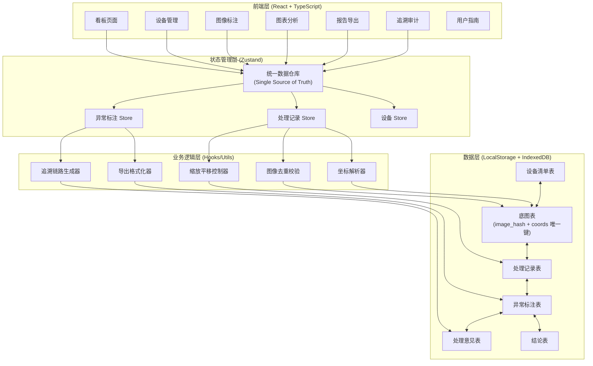
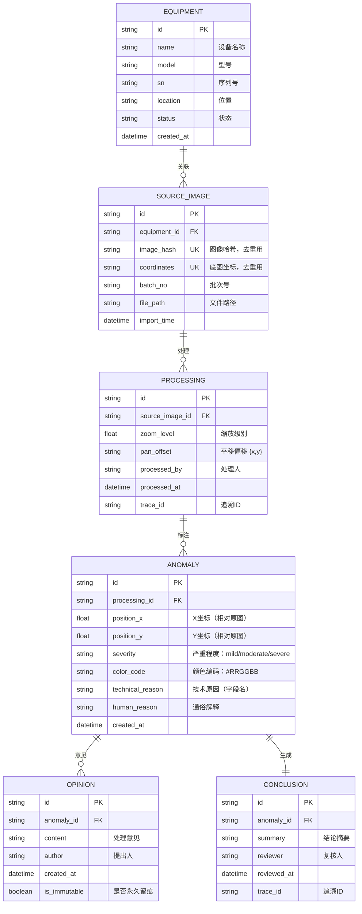

## 1. 架构设计



## 2. 技术选型

- **前端框架**：React 18 + TypeScript 5
- **构建工具**：Vite 5
- **样式方案**：TailwindCSS 3
- **状态管理**：Zustand（轻量级，单一数据源）
- **路由**：React Router DOM 6
- **图表库**：Recharts（React 友好，与数据联动性好）
- **图标**：Lucide React
- **导出**：SheetJS (xlsx) + 原生 Blob
- **本地存储**：IndexedDB (idb) + LocalStorage
- **图像操作**：Canvas API（原生，缩放平移性能好）

## 3. 路由定义

| 路由 | 页面 | 用途 |
|------|------|------|
| `/` | Dashboard | 看板首页：数据概览、图表、最近异常 |
| `/equipment` | EquipmentList | 设备清单列表 |
| `/equipment/:id` | EquipmentDetail | 设备详情：关联底图、历史异常 |
| `/import` | ImageImport | 图像导入：批量上传、去重校验 |
| `/annotate/:processingId` | ImageAnnotate | 图像标注：缩放、平移、异常标注 |
| `/charts` | Charts | 图表分析：同源数据的图表+明细 |
| `/export` | Export | 报告导出：格式选择、预览、下载 |
| `/trace/:anomalyId` | TraceView | 追溯审计：全链路追溯视图 |
| `/guide` | UserGuide | 用户指南：4步操作说明 |

## 4. 数据模型

### 4.1 ER 图



### 4.2 关键约束

1. **唯一键约束**：`SOURCE_IMAGE(image_hash, coordinates)` 联合唯一，确保同一底图+坐标不重复导入
2. **外键约束**：全链路通过外键关联，确保追溯完整性
3. **不可删除**：`OPINION` 表一旦创建不可删除，只能追加
4. **单一数据源**：所有展示、分析、导出均通过 `PROCESSING` 表关联查询，绝不独立计算

## 5. 核心模块设计

### 5.1 统一数据仓库 (Zustand Store)

```typescript
interface AppState {
  equipment: Equipment[];
  sourceImages: SourceImage[];
  processings: Processing[];
  anomalies: Anomaly[];
  opinions: Opinion[];
  conclusions: Conclusion[];
  
  // 派生数据（基于原始数据计算，确保同源）
  getAnomaliesByEquipment: (equipmentId: string) => Anomaly[];
  getProcessingByImage: (imageId: string) => Processing[];
  getTraceChain: (anomalyId: string) => TraceChain;
  getChartData: () => ChartData;
  getExportData: (filters: ExportFilters) => ExportRow[];
  
  // 操作方法
  addEquipment: (eq: Omit<Equipment, 'id'>) => void;
  importImages: (images: Omit<SourceImage, 'id'>[]) => ImportResult;
  saveProcessing: (p: Omit<Processing, 'id'>) => void;
  addAnomaly: (a: Omit<Anomaly, 'id'>) => void;
  addOpinion: (o: Omit<Opinion, 'id' | 'is_immutable'>) => void;
  addConclusion: (c: Omit<Conclusion, 'id'>) => void;
}
```

### 5.2 导入去重逻辑

```typescript
function deduplicateImport(
  newImages: Omit<SourceImage, 'id'>[],
  existingImages: SourceImage[]
): {
  toImport: Omit<SourceImage, 'id'>[];
  duplicates: { existing: SourceImage; imported: Omit<SourceImage, 'id'> }[];
} {
  const existingKeys = new Set(
    existingImages.map(img => `${img.image_hash}|${img.coordinates}`)
  );
  
  const toImport: Omit<SourceImage, 'id'>[] = [];
  const duplicates: { existing: SourceImage; imported: Omit<SourceImage, 'id'> }[] = [];
  
  for (const img of newImages) {
    const key = `${img.image_hash}|${img.coordinates}`;
    if (existingKeys.has(key)) {
      const existing = existingImages.find(e => `${e.image_hash}|${e.coordinates}` === key)!;
      duplicates.push({ existing, imported: img });
    } else {
      toImport.push(img);
      existingKeys.add(key);
    }
  }
  
  return { toImport, duplicates };
}
```

### 5.3 缩放平移控制器

```typescript
interface ViewState {
  zoom: number;      // 缩放级别 0.1 - 10
  panX: number;      // X 轴平移
  panY: number;      // Y 轴平移
}

class ImageViewController {
  private canvas: HTMLCanvasElement;
  private viewState: ViewState = { zoom: 1, panX: 0, panY: 0 };
  private onChange: (state: ViewState) => void;
  
  // 所有操作都记录到同一批处理记录
  handleWheel(e: WheelEvent) {
    // 计算新缩放级别
    const delta = -e.deltaY * 0.001;
    this.viewState.zoom = Math.max(0.1, Math.min(10, this.viewState.zoom + delta));
    this.syncToProcessingRecord();
  }
  
  handleMouseMove(e: MouseEvent, isDragging: boolean) {
    if (isDragging) {
      this.viewState.panX += e.movementX;
      this.viewState.panY += e.movementY;
      this.syncToProcessingRecord();
    }
  }
  
  // 同步到处理记录（唯一数据源）
  private syncToProcessingRecord() {
    this.onChange(this.viewState);
    // 通过 Zustand 更新到统一 Store
  }
}
```

### 5.4 导出格式化器

```typescript
// 技术术语 -> 通俗语言映射
const REASON_TRANSLATIONS: Record<string, string> = {
  'COLOR_CHANNEL_OUTLIER_R': '红色通道数值超出正常范围',
  'COLOR_CHANNEL_OUTLIER_G': '绿色通道数值超出正常范围',
  'COLOR_CHANNEL_OUTLIER_B': '蓝色通道数值超出正常范围',
  'INTENSITY_ABOVE_THRESHOLD': '亮度超过正常上限',
  'INTENSITY_BELOW_THRESHOLD': '亮度低于正常下限',
  'TEXTURE_IRREGULARITY': '纹理模式异常，与周围区域不一致',
  'EDGE_DETECTION_ANOMALY': '边缘轮廓不清晰或不规则',
  'GRADIENT_ABNORMALITY': '颜色过渡不自然，存在突变',
};

function formatExportRow(anomaly: Anomaly, processing: Processing, equipment: Equipment): ExportRow {
  return {
    '设备名称': equipment.name,
    '设备型号': equipment.model,
    '设备序列号': equipment.sn,
    '底图坐标': processing.sourceImage?.coordinates || '',
    '处理时间': formatDate(processing.processed_at),
    '处理人': processing.processed_by,
    '异常位置': `(${anomaly.position_x.toFixed(2)}, ${anomaly.position_y.toFixed(2)})`,
    '严重程度': {
      'mild': '轻度',
      'moderate': '中度',
      'severe': '严重'
    }[anomaly.severity],
    '异常颜色': anomaly.color_code,
    '异常原因（通俗说明）': REASON_TRANSLATIONS[anomaly.technical_reason] || anomaly.human_reason,
    '处理意见': getLatestOpinion(anomaly.id)?.content || '待处理',
    '追溯编号': anomaly.id,
  };
}
```

## 6. 项目结构

```
src/
├── components/
│   ├── Layout/
│   │   ├── Sidebar.tsx
│   │   └── Header.tsx
│   ├── common/
│   │   ├── StatCard.tsx
│   │   ├── DataTable.tsx
│   │   └── StatusBadge.tsx
│   ├── charts/
│   │   ├── AnomalyPieChart.tsx
│   │   ├── EquipmentBarChart.tsx
│   │   └── TrendLineChart.tsx
│   ├── image/
│   │   ├── ImageViewer.tsx
│   │   ├── ImageCanvas.tsx
│   │   └── AnomalyMarker.tsx
│   ├── trace/
│   │   ├── TraceTimeline.tsx
│   │   └── TraceNode.tsx
│   └── export/
│       ├── ExportPreview.tsx
│       └── ExportForm.tsx
├── pages/
│   ├── Dashboard.tsx
│   ├── EquipmentList.tsx
│   ├── EquipmentDetail.tsx
│   ├── ImageImport.tsx
│   ├── ImageAnnotate.tsx
│   ├── Charts.tsx
│   ├── Export.tsx
│   ├── TraceView.tsx
│   └── UserGuide.tsx
├── store/
│   └── useAppStore.ts          # 统一数据仓库
├── hooks/
│   ├── useImageProcessing.ts   # 图像处理 Hook
│   ├── useDeduplication.ts     # 去重逻辑 Hook
│   ├── useTraceChain.ts        # 追溯链路 Hook
│   └── useExportData.ts        # 导出数据 Hook
├── utils/
│   ├── imageHash.ts            # 图像哈希计算
│   ├── coordinateParser.ts     # 坐标解析
│   ├── exportFormatter.ts      # 导出格式化
│   └── idb.ts                  # IndexedDB 封装
├── types/
│   └── index.ts                # 全部 TypeScript 类型定义
├── data/
│   └── mockData.ts             # 演示数据
├── App.tsx
├── main.tsx
└── index.css

shared/
└── types.ts                    # 前后端共享类型（预留）

api/                            # 后端 API（预留，目前纯前端）
└── index.ts
```

## 7. 性能与数据一致性保障

### 7.1 单一数据源策略

1. **所有读取操作**：通过 `useAppStore` 的 selector 获取派生数据，不允许组件内部计算
2. **所有写入操作**：通过 `useAppStore` 的 action 方法，确保写入时同时更新索引
3. **计算缓存**：使用 Zustand 的 `subscribe` 或 `reselect` 模式缓存派生数据

### 7.2 数据持久化

1. **IndexedDB**：存储图像数据、处理记录等大数据
2. **LocalStorage**：存储用户偏好、视图状态
3. **自动同步**：Store 变更自动同步到持久化层

### 7.3 性能优化

1. **Canvas 渲染**：图像操作全部走 Canvas，避免 DOM 渲染瓶颈
2. **虚拟滚动**：长表格使用虚拟滚动
3. **按需加载**：图像数据懒加载，处理记录分页
4. **防抖节流**：缩放、平移操作节流，避免频繁更新
