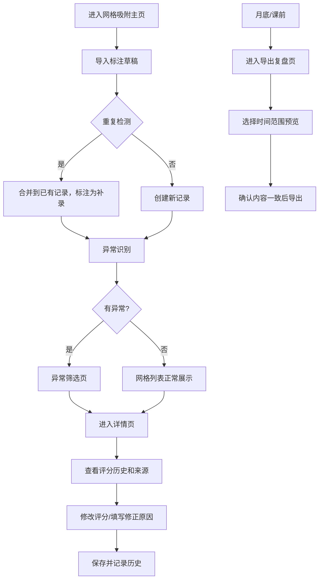

## 1. 产品概述

物流月台装载草图标注审核系统，用于管理和审核物流月台装载作业的标注数据。解决评分表修改后历史结论追溯、重复导入冲突、离线素材异常筛选等核心问题。目标用户为物流运营人员和审核员，提供从导入、审核到复盘导出的全流程管理。

## 2. 核心功能

### 2.1 用户角色
| 角色 | 注册方式 | 核心权限 |
|------|----------|----------|
| 运营人员 | 系统内置 | 导入标注草稿、日常审核、补录处理 |
| 审核员 | 系统内置 | 修改评分、查看历史、导出复盘报告 |

### 2.2 功能模块
1. **网格吸附主页**：日常入口，以卡片网格展示所有装载草图记录
2. **导入模块**：支持离线素材批量导入，自动去重和冲突检测
3. **异常筛选**：导入后自动识别缺失素材、评分冲突等异常
4. **详情页**：查看记录来源、评分历史、处理意见
5. **评分模块**：修改评分表，自动记录历史版本和修正原因
6. **导出复盘**：月底/课前导出审核报告，确保界面与文件一致

### 2.3 页面详情
| 页面名称 | 模块名称 | 功能描述 |
|----------|----------|----------|
| 网格吸附主页 | 记录卡片网格 | 展示所有装载记录，支持快速筛选和搜索 |
| 网格吸附主页 | 导入区域 | 拖拽/点击导入标注草稿文件，显示导入进度 |
| 异常筛选页 | 异常列表 | 按类型（素材缺失、评分冲突、重复导入）筛选异常记录 |
| 记录详情页 | 基础信息 | 展示记录来源、批次号、时间戳 |
| 记录详情页 | 评分历史 | 时间线展示每次评分修改、修改人、修正原因 |
| 记录详情页 | 处理意见 | 记录审核意见和补录说明 |
| 导出复盘页 | 报告生成 | 选择时间范围生成复盘报告，预览后导出 |

## 3. 核心流程

用户日常操作流程：从网格吸附主页进入 → 导入新批次标注草稿 → 系统自动检测重复和异常 → 筛选异常记录 → 点击进入详情页查看来源和历史 → 修改评分并填写修正原因 → 月底/课前进入导出页面生成复盘报告 → 确认导出内容与界面一致后下载。

## 4. 用户界面设计

### 4.1 设计风格
- 主色：工业蓝 `#1e40af`，辅色：警示橙 `#d97706`，成功绿 `#059669`
- 中性色：石板灰系列，适合数据密集型界面
- 按钮风格：方角扁平，边框清晰，强调功能性
- 字体：标题使用 `JetBrains Mono` 等宽字体体现工业感，正文使用 `Inter`
- 布局：严格的网格系统，卡片边界清晰，信息密度高但不拥挤
- 图标：使用 lucide-react 线性图标，保持简洁专业
- 整体风格：实用主义工业风，拒绝花哨装饰，一切为功能服务

### 4.2 页面设计概述
| 页面名称 | 模块名称 | UI元素 |
|----------|----------|--------|
| 网格吸附主页 | 顶部操作栏 | 搜索框、导入按钮、筛选标签、导出入口 |
| 网格吸附主页 | 记录网格 | 固定宽度卡片，hover浮起，状态标签角标 |
| 网格吸附主页 | 导入进度条 | 显示导入总数、成功数、异常数 |
| 异常筛选页 | 侧边筛选栏 | 按异常类型、时间范围、批次筛选 |
| 异常筛选页 | 异常列表 | 表格形式，高亮异常字段 |
| 记录详情页 | 时间线 | 垂直时间线展示评分历史，每次修改附带原因 |
| 记录详情页 | 评分面板 | 评分表单项，修改时强制填写原因 |
| 导出复盘页 | 预览区域 | 实时预览导出内容，与界面数据对比校验 |

### 4.3 响应性
- 桌面端优先设计，支持1280px以上分辨率
- 侧边筛选栏在小屏幕转为顶部折叠面板
- 表格在移动端转为卡片列表
- 所有可点击区域不小于44x44px

### 4.4 动效设计
- 导入进度条平滑过渡动画
- 异常记录高亮闪烁提示（1次）
- 评分历史时间线逐项淡入
- 卡片hover状态轻微上浮+阴影加深
- 页面切换采用淡入淡出过渡
