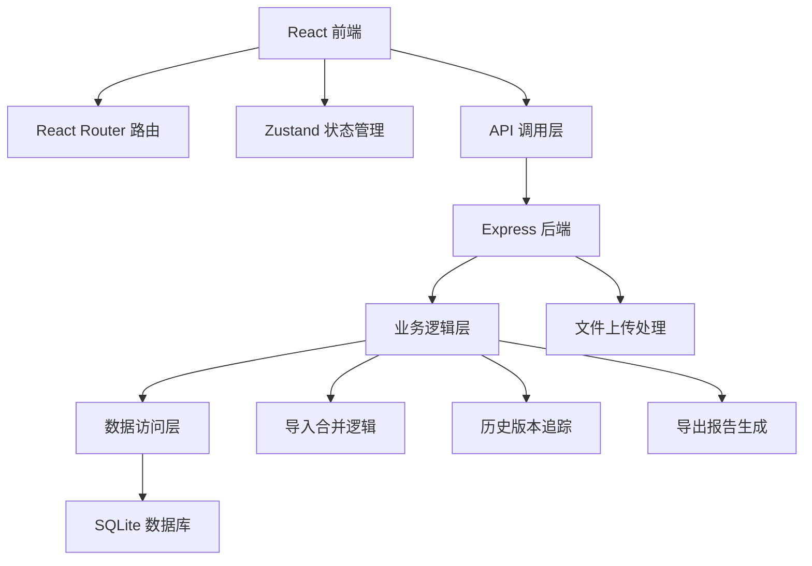
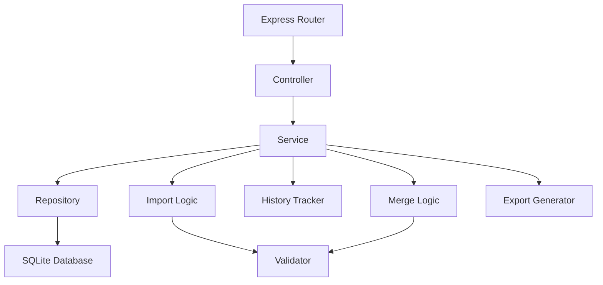
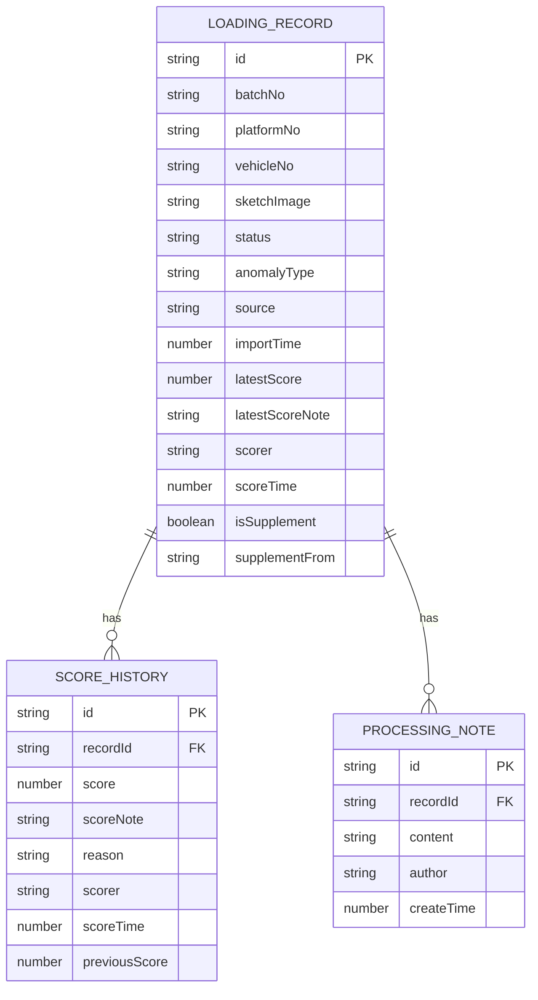

## 1. 架构设计



## 2. 技术描述
- 前端：React@18 + TypeScript + Vite
- 状态管理：Zustand
- 路由：React Router DOM v6
- 样式：TailwindCSS 3
- 图标：lucide-react
- 后端：Express@4 + TypeScript
- 数据库：SQLite + better-sqlite3
- 初始化工具：vite-init
- 文件处理：multer 用于文件上传，xlsx 用于Excel导入导出

## 3. 路由定义
| 路由 | 用途 |
|------|------|
| / | 网格吸附主页（日常入口） |
| /anomalies | 异常筛选页 |
| /record/:id | 记录详情页 |
| /export | 导出复盘页 |

## 4. API 定义

### 类型定义
```typescript
// 装载草图记录
interface LoadingRecord {
  id: string;
  batchNo: string;
  platformNo: string;
  vehicleNo: string;
  sketchImage?: string;
  status: 'pending' | 'approved' | 'rejected' | 'anomaly';
  anomalyType?: 'missing_material' | 'score_conflict' | 'duplicate';
  source: string;
  importTime: number;
  latestScore: number;
  latestScoreNote: string;
  scorer: string;
  scoreTime: number;
  isSupplement: boolean;
  supplementFrom?: string;
}

// 评分历史
interface ScoreHistory {
  id: string;
  recordId: string;
  score: number;
  scoreNote: string;
  reason: string;
  scorer: string;
  scoreTime: number;
  previousScore?: number;
}

// 处理意见
interface ProcessingNote {
  id: string;
  recordId: string;
  content: string;
  author: string;
  createTime: number;
}

// 导入结果
interface ImportResult {
  total: number;
  success: number;
  duplicates: number;
  anomalies: number;
  records: LoadingRecord[];
}

// 导出报告
interface ExportReport {
  period: string;
  totalRecords: number;
  approved: number;
  rejected: number;
  anomalies: number;
  averageScore: number;
  records: LoadingRecord[];
  exportTime: number;
}
```

### API 端点
| 方法 | 路径 | 描述 |
|------|------|------|
| POST | /api/import | 导入标注草稿文件 |
| GET | /api/records | 获取记录列表（支持筛选） |
| GET | /api/records/:id | 获取单条记录详情 |
| GET | /api/records/:id/history | 获取评分历史 |
| PUT | /api/records/:id/score | 更新评分（需填写原因） |
| POST | /api/records/:id/notes | 添加处理意见 |
| GET | /api/anomalies | 获取异常记录列表 |
| POST | /api/export | 生成导出报告 |
| GET | /api/export/:id/download | 下载报告文件 |

## 5. 服务端架构



## 6. 数据模型

### 6.1 ER 图


### 6.2 DDL 语句
```sql
CREATE TABLE loading_records (
  id TEXT PRIMARY KEY,
  batch_no TEXT NOT NULL,
  platform_no TEXT NOT NULL,
  vehicle_no TEXT NOT NULL,
  sketch_image TEXT,
  status TEXT NOT NULL DEFAULT 'pending',
  anomaly_type TEXT,
  source TEXT NOT NULL,
  import_time INTEGER NOT NULL,
  latest_score INTEGER,
  latest_score_note TEXT,
  scorer TEXT,
  score_time INTEGER,
  is_supplement INTEGER NOT NULL DEFAULT 0,
  supplement_from TEXT,
  created_at INTEGER NOT NULL,
  updated_at INTEGER NOT NULL
);

CREATE INDEX idx_records_batch ON loading_records(batch_no);
CREATE INDEX idx_records_status ON loading_records(status);
CREATE INDEX idx_records_platform ON loading_records(platform_no);
CREATE UNIQUE INDEX idx_records_unique ON loading_records(batch_no, platform_no, vehicle_no);

CREATE TABLE score_history (
  id TEXT PRIMARY KEY,
  record_id TEXT NOT NULL,
  score INTEGER NOT NULL,
  score_note TEXT,
  reason TEXT NOT NULL,
  scorer TEXT NOT NULL,
  score_time INTEGER NOT NULL,
  previous_score INTEGER,
  FOREIGN KEY (record_id) REFERENCES loading_records(id)
);

CREATE INDEX idx_history_record ON score_history(record_id);

CREATE TABLE processing_notes (
  id TEXT PRIMARY KEY,
  record_id TEXT NOT NULL,
  content TEXT NOT NULL,
  author TEXT NOT NULL,
  create_time INTEGER NOT NULL,
  FOREIGN KEY (record_id) REFERENCES loading_records(id)
);

CREATE INDEX idx_notes_record ON processing_notes(record_id);
```

## 7. 核心业务规则

1. **重复导入检测**：使用 batch_no + platform_no + vehicle_no 作为唯一键，重复导入时自动合并为补录，不创建新记录
2. **评分历史强制记录**：每次修改评分必须填写修正原因，系统自动保存旧分数和新分数
3. **导出一致性校验**：导出前对比界面展示数据与数据库数据，不一致时提示用户
4. **异常识别规则**：
   - 素材缺失：sketch_image 为空
   - 评分冲突：同一记录有多条未处理的评分历史
   - 重复导入：检测到唯一键冲突
5. **状态流转**：pending → (导入异常) → anomaly → (处理后) → pending → (评分) → approved/rejected
