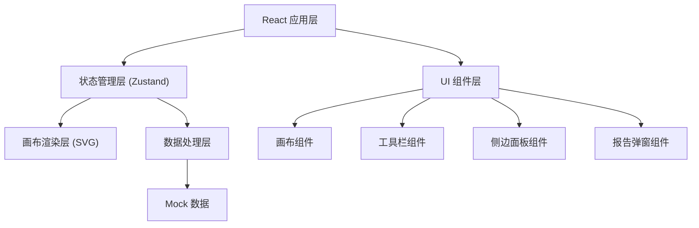

## 1. 架构设计



---

## 2. 技术描述

- **前端框架**: React@18 + TypeScript + Vite
- **状态管理**: Zustand (轻量级状态管理，支持历史记录/撤销重做)
- **样式方案**: TailwindCSS@3 + CSS 变量
- **画布渲染**: 原生 SVG + React 事件绑定
- **图标库**: Lucide React
- **后端**: 无（纯前端应用，使用本地 Mock 数据）
- **数据持久化**: LocalStorage（可选）

---

## 3. 路由定义

| 路由 | 页面/组件 | 用途 |
|------|-----------|------|
| `/` | 主应用页面 | 消防疏散箭头校验主界面 |

---

## 4. 核心数据结构

### 4.1 TypeScript 类型定义

```typescript
// 疏散箭头记录
interface ArrowRecord {
  id: string;
  x: number;
  y: number;
  direction: number; // 角度 0-360
  status: 'normal' | 'flipped' | 'warning' | 'pending';
  timestamp: number;
  remark?: string;
  isManualRemark: boolean;
}

// 画布状态
interface CanvasState {
  records: ArrowRecord[];
  selectedId: string | null;
  filter: {
    status: string[];
    timeRange: [number, number] | null;
  };
  history: HistoryState;
}

// 历史记录（用于撤销/重做）
interface HistoryState {
  past: ArrowRecord[][];
  future: ArrowRecord[][];
}

// 导出报告
interface ExportReport {
  summary: string;
  explanation: string;
  problemList: ProblemItem[];
  exportTime: string;
}

interface ProblemItem {
  id: string;
  type: string;
  description: string;
  remark?: string;
  isUsable: boolean;
}
```

---

## 5. 状态管理设计

### 5.1 Zustand Store 结构

```typescript
useStore = {
  // 数据状态
  records: ArrowRecord[],
  selectedId: string | null,
  filter: FilterConfig,
  
  // 操作方法
  selectRecord: (id: string | null) => void,
  updateRecord: (id: string, updates: Partial<ArrowRecord>) => void,
  addRecord: (record: ArrowRecord) => void,
  deleteRecord: (id: string) => void,
  addRemark: (id: string, remark: string) => void,
  
  // 历史记录
  undo: () => void,
  redo: () => void,
  canUndo: boolean,
  canRedo: boolean,
  
  // 筛选
  setFilter: (filter: Partial<FilterConfig>) => void,
  filteredRecords: ArrowRecord[],
  
  // 导出
  generateReport: () => ExportReport,
}
```

---

## 6. 核心模块设计

### 6.1 画布交互模块
- SVG 渲染箭头轨迹
- 拖拽事件处理（mousedown → mousemove → mouseup）
- 坐标翻转检测算法
- 实时状态更新触发

### 6.2 历史记录模块
- Immer 支持不可变更新
- 操作快照存储
- 撤销/重做栈管理
- 最大历史记录数限制

### 6.3 报告生成模块
- 普通话解释模板
- 问题清单自动分类
- 人工备注原样保留
- 可复制文本格式化

### 6.4 筛选模块
- 多条件组合筛选
- 状态筛选（正常/翻转/警告/待复核）
- 时间范围筛选
- 实时更新画布显示

---

## 7. 目录结构

```
src/
├── components/
│   ├── Canvas/          # 画布组件
│   ├── Toolbar/         # 工具栏
│   ├── SidePanel/       # 侧边面板
│   ├── FilterPanel/     # 筛选面板
│   ├── ReportModal/     # 报告弹窗
│   └── common/          # 通用组件
├── store/
│   └── useCanvasStore.ts # Zustand store
├── types/
│   └── index.ts         # TypeScript 类型
├── utils/
│   ├── detection.ts     # 坐标翻转检测
│   ├── history.ts       # 历史记录管理
│   └── report.ts        # 报告生成
├── data/
│   └── mockData.ts      # Mock 数据
├── App.tsx
└── main.tsx
```

