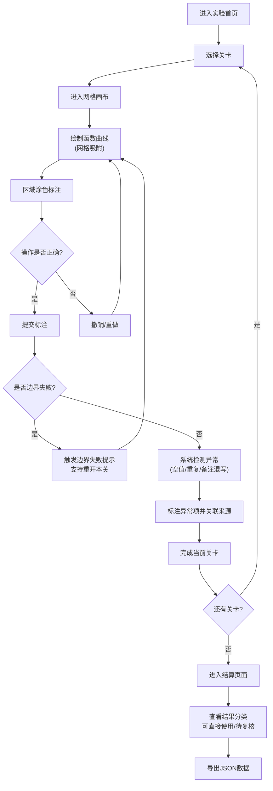

## 1. 产品概述

"数学函数涂色实验"是一款面向数学教学与赛事评审的交互式函数图像标注工具。用户通过在网格坐标系中绘制数学函数曲线，对特定区域进行涂色标注，完成实验任务。系统提供撤销重做、网格吸附、异常标注等核心功能，确保操作精确性和数据可追溯性。

- 主要用途：数学函数教学实验、赛事作品评审、函数图像标注练习
- 目标用户：学生、教师、赛事运营人员、评审老师
- 核心价值：将抽象的数学函数可视化，提供精确的标注工具，支持完整的操作溯源和评审流程

## 2. 核心功能

### 2.1 用户角色

| 角色 | 使用场景 | 核心权限 |
|------|----------|----------|
| 实验操作者 | 完成函数涂色实验 | 绘制函数、涂色标注、撤销重做、导出结果 |
| 赛事运营 | 准备实验材料、处理复核请求 | 上传底图坐标、管理异常标注、处理复核 |
| 评审老师 | 评审实验结果 | 查看标注、区分可直接使用/待复核项、导出评审意见 |

### 2.2 功能模块

1. **实验主界面**：网格坐标系、函数绘制工具栏、颜色选择器、操作控制区
2. **关卡系统**：2个关卡（基础绘制 + 边界失败验证），含撤销重开机制
3. **撤销重做**：完整的操作历史记录，支持无限步撤销/重做
4. **网格吸附**：绘制点自动吸附到最近网格交点，确保坐标精度
5. **异常标注**：对空值、重复、备注混写等问题进行标记，关联来源材料
6. **结算页面**：实验结果汇总，清晰区分可直接使用项和待复核项
7. **导出功能**：导出JSON格式标注数据，确保与界面摘要一致

### 2.3 页面详情

| 页面名称 | 模块名称 | 功能描述 |
|---------|----------|----------|
| 实验首页 | 关卡选择 | 显示可用关卡，展示关卡进度和状态 |
| 实验主界面 | 网格画布 | 显示带坐标的网格，支持函数绘制和涂色 |
| 实验主界面 | 工具栏 | 画笔、颜色选择、撤销/重做、重开、导出按钮 |
| 实验主界面 | 异常标注面板 | 列出当前标注中的异常项，支持标记和备注 |
| 结算页面 | 结果汇总 | 展示实验完成情况、标注统计、异常项清单 |
| 结算页面 | 评审区分 | 用不同颜色标识"可直接使用"和"待复核"项 |

## 3. 核心流程

## 4. 用户界面设计

### 4.1 设计风格

- **整体风格**：学术实验风格，极简主义与科技感结合
- **主色调**：深海蓝 #0F3B5F，用于导航和标题
- **辅助色**：青色 #2DD4BF（可直接使用标识）、琥珀橙 #F59E0B（待复核标识）、玫红 #EC4899（边界失败提示）
- **中性色**：象牙白 #FAF9F6 背景、石板灰 #475569 文字
- **字体**：展示字体 Playfair Display（数学公式感）、正文字体 Fira Code（代码/数据感）
- **按钮风格**：扁平带细边框，悬停时轻微上浮 + 阴影，圆角 4px
- **布局风格**：左侧工具栏 + 中央画布 + 右侧异常面板的三栏布局
- **图标**：使用 lucide-react 线性图标，保持简洁一致

### 4.2 页面设计概述

| 页面名称 | 模块名称 | UI元素 |
|---------|----------|--------|
| 实验首页 | 关卡卡片 | 卡片式布局，每关显示名称、状态图标、完成进度，hover时轻微放大 |
| 实验主界面 | 网格画布 | 浅灰色网格线，坐标刻度显示，函数曲线用彩色绘制，涂色区域半透明 |
| 实验主界面 | 工具栏 | 垂直排列的图标按钮，选中状态用主色填充，未选中用轮廓 |
| 实验主界面 | 异常面板 | 列表形式，每项左侧用彩色圆点标识异常类型，右侧显示来源材料链接 |
| 结算页面 | 结果统计 | 大字号数字显示，分两栏对比"可直接使用"和"待复核"数量 |
| 结算页面 | 标注详情 | 表格形式，每行可点击展开查看来源材料和异常说明 |

### 4.3 响应式设计

- **桌面端优先**：三栏布局，最小支持 1280px 宽度
- **平板适配**：工具栏移至顶部，异常面板可折叠
- **触摸优化**：按钮最小尺寸 44x44px，画布支持双指缩放

### 4.4 动效设计

- 页面加载：各模块从下往上依次淡入，间隔 100ms
- 绘制反馈：涂色区域填充时有渐变动画（0.3s）
- 撤销重做：画布上有"时光倒流/前进"的轨迹回退/重现动效
- 边界失败：红色光晕从边界处扩散，伴随轻微震动
- 状态切换：可直接使用/待复核标签切换时有颜色过渡动画
