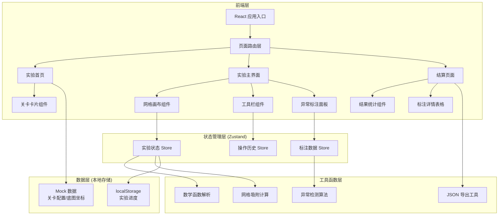
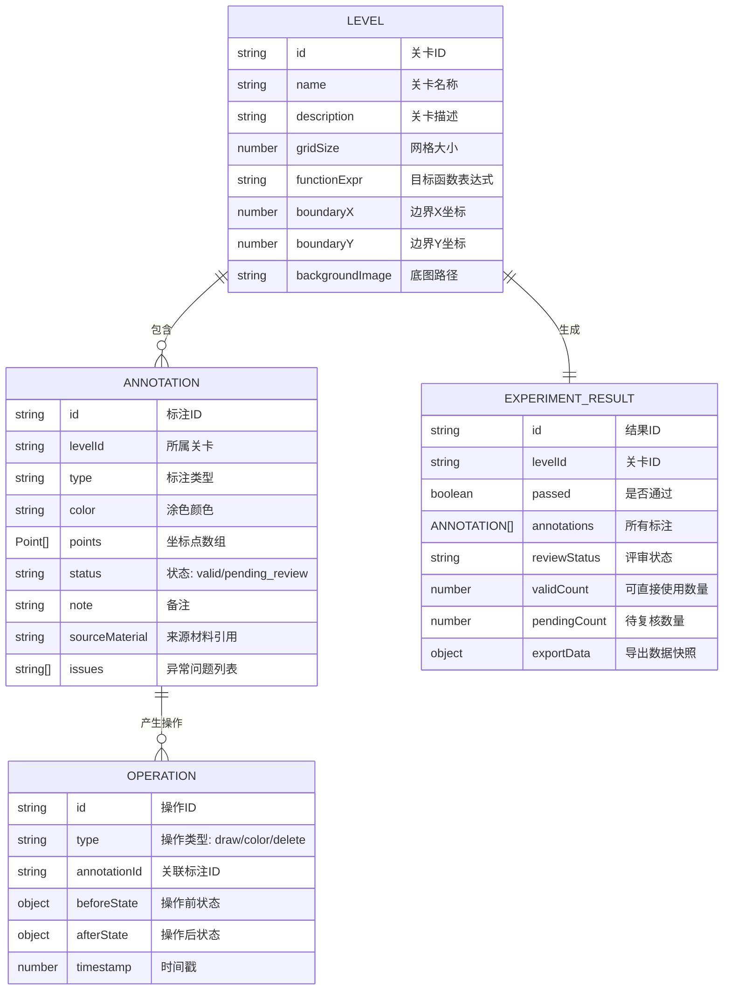

## 1. 架构设计



## 2. 技术描述

- **前端框架**：React@18 + TypeScript
- **构建工具**：Vite@5
- **样式方案**：Tailwind CSS@3
- **状态管理**：Zustand
- **路由管理**：React Router DOM@6
- **图标库**：Lucide React
- **画布实现**：HTML5 Canvas API
- **数据持久化**：localStorage
- **后端服务**：无（纯前端应用，使用 Mock 数据）

## 3. 路由定义

| 路由 | 页面 | 说明 |
|------|------|------|
| `/` | 实验首页 | 关卡选择入口 |
| `/experiment/:levelId` | 实验主界面 | 函数绘制与涂色标注 |
| `/result` | 结算页面 | 实验结果汇总与评审 |

## 4. 数据模型

### 4.1 数据模型定义



### 4.2 TypeScript 类型定义

```typescript
interface Point {
  x: number;
  y: number;
}

interface Level {
  id: string;
  name: string;
  description: string;
  gridSize: number;
  targetFunction: string;
  boundary: { x: number; y: number };
  backgroundImage?: string;
  status: 'locked' | 'unlocked' | 'completed' | 'failed';
}

type AnnotationStatus = 'valid' | 'pending_review';

interface Annotation {
  id: string;
  levelId: string;
  type: 'curve' | 'region';
  color: string;
  points: Point[];
  status: AnnotationStatus;
  note: string;
  sourceMaterial: string;
  issues: AnnotationIssue[];
}

type IssueType = 'empty_value' | 'duplicate' | 'mixed_note' | 'out_of_boundary';

interface AnnotationIssue {
  type: IssueType;
  description: string;
  sourceReference: string;
}

interface Operation {
  id: string;
  type: 'draw' | 'color' | 'delete' | 'modify';
  annotationId: string;
  beforeState: Partial<Annotation>;
  afterState: Partial<Annotation>;
  timestamp: number;
}

interface ExperimentResult {
  id: string;
  levelId: string;
  passed: boolean;
  annotations: Annotation[];
  validCount: number;
  pendingCount: number;
  exportData: ExportData;
  completedAt: number;
}

interface ExportData {
  version: string;
  experimentId: string;
  summary: {
    totalAnnotations: number;
    validCount: number;
    pendingCount: number;
    boundaryFailed: boolean;
  };
  annotations: Annotation[];
  exportedAt: number;
}
```

### 4.3 Mock 数据结构

关卡配置数据（位于 `src/data/levels.ts`）：

```typescript
export const LEVELS: Level[] = [
  {
    id: 'level-1',
    name: '基础函数绘制',
    description: '绘制 y = x² 函数曲线并对指定区域涂色',
    gridSize: 20,
    targetFunction: 'y = x^2',
    boundary: { x: 5, y: 5 },
    status: 'unlocked'
  },
  {
    id: 'level-2',
    name: '边界失败验证',
    description: '尝试在边界外绘制，体验边界失败机制与重开功能',
    gridSize: 20,
    targetFunction: 'y = sin(x)',
    boundary: { x: 3, y: 3 },
    status: 'unlocked'
  }
];
```

异常标注样例数据（位于 `src/data/mockAnnotations.ts`）：

```typescript
export const MOCK_ANNOTATIONS: Annotation[] = [
  {
    id: 'anno-1',
    levelId: 'level-1',
    type: 'curve',
    color: '#2DD4BF',
    points: [{ x: 0, y: 0 }, { x: 1, y: 1 }, { x: 2, y: 4 }],
    status: 'valid',
    note: '标准抛物线绘制',
    sourceMaterial: '教材第三章第2节',
    issues: []
  },
  {
    id: 'anno-2',
    levelId: 'level-1',
    type: 'region',
    color: '#F59E0B',
    points: [{ x: 0, y: 0 }, { x: 2, y: 0 }, { x: 2, y: 4 }, { x: 0, y: 4 }],
    status: 'pending_review',
    note: '',
    sourceMaterial: '练习册P23',
    issues: [{
      type: 'empty_value',
      description: '备注为空，请补充说明涂色区域的含义',
      sourceReference: '标注草稿第3行'
    }]
  }
];
```
