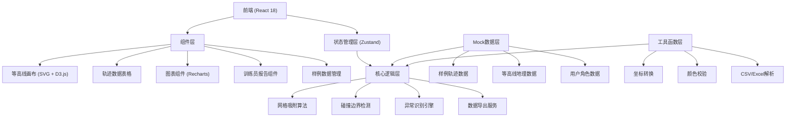
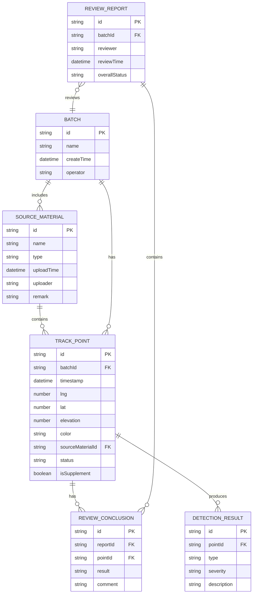

## 1. 架构设计



## 2. 技术描述

- **前端框架**：React 18 + TypeScript 5
- **构建工具**：Vite 5
- **状态管理**：Zustand 4（单一数据源，确保图表/明细/下载数据同源）
- **样式方案**：Tailwind CSS 3 + CSS Variables
- **图标库**：Lucide React
- **数据可视化**：
  - D3.js 7（等高线绘制、地理计算）
  - Recharts 2（统计图表）
- **数据处理**：
  - PapaParse 5（CSV解析）
  - SheetJS (xlsx) 0.18（Excel导入导出）
- **项目初始化**：vite-init react-ts 模板

## 3. 路由定义

| 路由路径 | 页面名称 | 主要功能 |
|-----------|----------|----------|
| `/` | 临摹看板主页 | 等高线画布、轨迹绘制、碰撞检测、吸附对比 |
| `/report` | 训练员报告页 | 问题溯源、复核工作台、审计报告导出 |
| `/samples` | 样例数据中心 | 场景样例库、坏数据演示 |

## 4. 核心类型定义

```typescript
// 轨迹点数据结构
interface TrackPoint {
  id: string;
  timestamp: number;
  lng: number;
  lat: number;
  elevation: number;
  color: string;
  sourceMaterial: string;
  operator: string;
  status: 'normal' | 'out-of-bounds' | 'color-invalid' | 'missing-unit' | 'supplementary';
  isSupplement: boolean;
  supplementNote?: string;
  originalLng?: number;
  originalLat?: number;
  snappedLng?: number;
  snappedLat?: number;
  boundaryCollision?: {
    boundaryId: string;
    distance: number;
    type: 'inside' | 'outside' | 'crossing';
  };
}

// 材料来源
interface SourceMaterial {
  id: string;
  name: string;
  type: 'old-form' | 'supplementary' | 'field-note';
  uploadTime: number;
  uploader: string;
  remark?: string;
}

// 等高线数据
interface ContourData {
  id: string;
  coordinates: [number, number][];
  elevation: number;
}

// 保护区边界
interface Boundary {
  id: string;
  name: string;
  coordinates: [number, number][];
  type: 'core' | 'buffer' | 'experimental';
}

// 全局状态
interface AppState {
  currentBatchId: string;
  trackPoints: TrackPoint[];
  sourceMaterials: SourceMaterial[];
  contours: ContourData[];
  boundaries: Boundary[];
  gridSize: number;
  isSnappingEnabled: boolean;
  selectedPointId: string | null;
  filters: {
    status: string[];
    sourceMaterial: string[];
  };
  comparisonMode: 'none' | 'split' | 'overlay';
}

// 异常检测结果
interface DetectionResult {
  pointId: string;
  type: 'boundary' | 'color' | 'missing' | 'format';
  severity: 'error' | 'warning' | 'info';
  description: string;
  sourceMaterialId: string;
}

// 训练员报告
interface ReviewReport {
  id: string;
  batchId: string;
  reviewer: string;
  reviewTime: number;
  conclusions: {
    pointId: string;
    result: 'pass' | 'reject' | 'pending';
    comment?: string;
  }[];
  overallStatus: 'approved' | 'rejected' | 'pending';
}
```

## 5. 数据模型

### 5.1 实体关系图



### 5.2 核心算法说明

**网格吸附算法 (Grid Snapping):
```
输入: 原始坐标 (lng, lat), 网格大小 gridSize
1. 将经纬度转换为平面坐标系 (墨卡托投影)
2. 计算网格索引: gridX = floor(x / gridSize), gridY = floor(y / gridSize)
3. 吸附后坐标: snappedX = gridX * gridSize + gridSize / 2, snappedY = gridY * gridSize + gridSize / 2
4. 转换回经纬度坐标
5. 存储 originalLng/Lat 和 snappedLng/Lat 用于对比
```

**碰撞边界检测 (Boundary Collision Detection):**
```
输入: 轨迹点 P, 边界多边形 B
1. 使用射线法判断 P 是否在 B 内部
2. 计算 P 到 B 各边的最短距离
3. 判断类型:
   - 距离 < 0 且 |距离| > threshold → 'inside' (核心区越界)
   - 距离 > 0 且 距离 < threshold → 'crossing' (边界附近)
   - 距离 > threshold → 'outside' (正常)
4. 关联边界ID和距离用于报告溯源
```

**颜色越界检测 (Color Validation):**
```
输入: 颜色值 color (hex/rgb)
1. 解析颜色为 HSV 空间
2. 检查是否在允许的颜色集合内
3. 检查亮度值是否在 [0.2, 0.8] (避免过暗或过亮
4. 对异常颜色标记为 'color-invalid'
```

## 6. 模块结构

```
src/
├── components/
│   ├── canvas/
│   │   ├── ContourCanvas.tsx      # 等高线画布组件
│   │   ├── TrackLayer.tsx       # 轨迹图层
│   │   ├── BoundaryLayer.tsx    # 边界图层
│   │   ├── GridLayer.tsx        # 网格图层
│   │   └── ComparisonView.tsx      # 吸附对比视图
│   ├── table/
│   │   ├── TrackTable.tsx       # 轨迹数据表格
│   │   └── FilterBar.tsx         # 过滤工具栏
│   ├── charts/
│   │   ├── QualityGauge.tsx       # 质量仪表盘
│   │   ├── ElevationChart.tsx    # 海拔趋势图
│   │   └── AnomalyHeatmap.tsx  # 异常热力图
│   ├── report/
│   │   ├── SourceCard.tsx         # 材料来源卡片
│   │   ├── ReviewPanel.tsx       # 复核工作台
│   │   └── ReportGenerator.tsx  # 报告生成器
│   └── common/
│       ├── Header.tsx
│       ├── Layout.tsx
│       └── Button.tsx
├── hooks/
│   ├── useTrackDetection.ts     # 轨迹检测逻辑
│   ├── useGridSnapping.ts     # 网格吸附逻辑
│   ├── useBoundaryCheck.ts       # 边界碰撞检测
│   └── useDataExport.ts     # 数据导出
├── store/
│   └── useAppStore.ts       # Zustand 全局状态
├── utils/
│   ├── coordinate.ts         # 坐标转换
│   ├── colorValidator.ts      # 颜色校验
│   ├── geoCalculation.ts    # 地理计算
│   └── fileParser.ts        # 文件解析
├── data/
│   ├── contours/            # 等高线数据
│   ├── boundaries/          # 边界数据
│   └── samples/             # 样例数据
├── pages/
│   ├── Dashboard.tsx
│   ├── Report.tsx
│   └── Samples.tsx
├── types/
│   └── index.ts
└── App.tsx
```

## 7. 数据一致性保证

为确保"图表、明细、下载结果来自同一批数据"，采用单一数据源架构：

1. **单一状态源**：所有数据统一存储在 Zustand store 的 `trackPoints`
2. **不可变更新**：所有修改通过 store action 进行，确保数据变更可追踪
3. **时间戳版本**：每次数据变更更新 `dataVersion`，组件订阅版本号触发重渲染
4. **导出时快照**：下载功能直接从当前 store 状态生成，不经过中间转换
5. **变更历史**：记录每次操作历史，支持回滚和审计

```typescript
// 状态变更动作示例
const useAppStore = create<AppState & Actions>((set, get) => ({
  trackPoints: [],
  dataVersion: 0,
  
  updatePoint: (pointId, updates) => {
    set((state) => ({
      trackPoints: state.trackPoints.map(p => 
        p.id === pointId ? { ...p, ...updates, _updatedAt: Date.now() } : p
      ),
      dataVersion: state.dataVersion + 1
    }));
  },
  
  exportData: () => {
    const { trackPoints, sourceMaterials, dataVersion } = get();
    return {
      version: dataVersion,
      exportTime: Date.now(),
      trackPoints,
      sourceMaterials
    };
  }
}));
```
