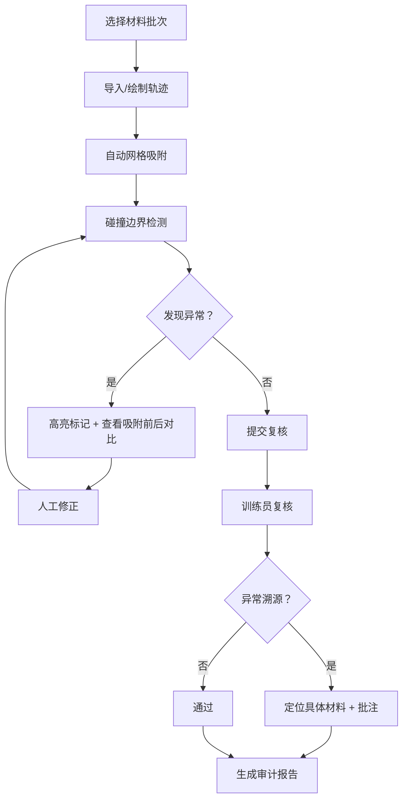

## 1. 产品概述

地图等高线临摹器是一款面向文保讲解员的专业数据校验工具，用于复核野外轨迹记录中的碰撞边界误判问题。工具将真实轨迹数据可视化呈现于等高线画布上，通过智能算法自动识别越界、颜色异常、数据残缺等问题，并提供可追溯的复核报告，帮助训练员快速定位问题来源。

- **目标用户**：文保讲解员（一线使用者）、训练员（复核管理者）
- **核心价值**：将混乱的纸质/Excel轨迹记录转化为可校验的数字化流程，实现"问题可定位、修改可追溯、报告可审计"
- **解决痛点**：真实工作场景中旧表、补录、漏填、误判混杂，人工复核效率低且易遗漏

## 2. 核心功能

### 2.1 用户角色

| 角色 | 登录方式 | 核心权限 |
|------|----------|----------|
| 文保讲解员 | 工号登录 | 上传轨迹、临摹操作、标记问题、下载结果 |
| 训练员 | 工号登录 | 复核记录、生成报告、查看问题溯源、导出审计数据 |

### 2.2 功能模块

1. **临摹看板主页**：等高线画布、轨迹绘制、网格吸附、碰撞边界检测
2. **数据明细面板**：轨迹点列表、异常标记、编辑补录、批量操作
3. **可视化图表区**：轨迹趋势图、异常分布热力图、质量评分仪表盘
4. **训练员报告页**：问题溯源分析、材料来源追溯、复核结论、导出下载
5. **样例数据中心**：内置真实场景样例（旧表格式、补录备注、漏填单位、颜色越界）

### 2.3 页面详情

| 页面名称 | 模块名称 | 功能描述 |
|----------|----------|----------|
| 临摹看板 | 等高线画布 | SVG绘制等高线地图，支持缩放平移，显示保护区边界 |
| 临摹看板 | 轨迹绘制工具 | 支持手动描点、导入GPX/Excel、自动吸附网格 |
| 临摹看板 | 碰撞检测层 | 实时高亮越界点，支持撤销/重做，显示吸附前后对比 |
| 数据明细 | 轨迹点表格 | 显示时间、坐标、海拔、颜色、来源材料、状态标记 |
| 数据明细 | 异常过滤器 | 按越界/颜色/缺项/补录等维度筛选 |
| 可视化图表 | 质量仪表盘 | 显示完整率、准确率、异常率三项核心指标 |
| 可视化图表 | 趋势分析图 | 轨迹海拔变化曲线，标注异常区间 |
| 训练员报告 | 问题溯源表 | 每条异常关联到具体材料编号、录入人、录入时间 |
| 训练员报告 | 复核工作台 | 支持批注、通过/打回、批量复核 |
| 样例中心 | 场景样例库 | 提供6种真实场景样例，含故意混入的坏数据 |

## 3. 核心流程

文保讲解员日常操作流程：
1. 选择当日工作批次，关联原始材料（旧表/补录表/现场记录）
2. 导入或手动绘制轨迹，系统自动应用网格吸附
3. 系统实时检测碰撞边界、颜色越界、数据缺项等问题
4. 讲解员可查看吸附前后对比，手动修正误判
5. 确认后提交复核，图表、明细、下载文件同步更新
6. 训练员收到复核任务，通过报告页查看每条异常的来源材料
7. 训练员出具复核结论，生成可下载的审计报告

## 4. 用户界面设计

### 4.1 设计风格

**整体美学方向：复古测绘工作台风格**
- 主色调：赭石色 (#8B4513) + 墨黑色 (#1A1A1A) + 宣纸米白 (#F5F0E6)
- 辅色调：朱砂红 (#C41E3A) 标记越界，石青蓝 (#2E5EAA) 标记正常，藤黄 (#E6A817) 标记补录
- 字体：标题用"Noto Serif SC"（仿宋体），正文用"Noto Sans SC"
- 按钮风格：圆角4px，细边框，按下有轻微凹陷效果，模拟印章质感
- 整体质感：画布区域添加宣纸纹理背景，边框用仿木刻线条
- 特殊效果：异常点有"朱砂圈注"动画，提交按钮有"钤印"效果

### 4.2 页面设计概述

| 页面名称 | 模块名称 | UI元素 |
|----------|----------|--------|
| 临摹看板 | 等高线画布 | 宣纸底纹、墨色等高线、朱砂边界、可拖拽轨迹点 |
| 临摹看板 | 吸附对比条 | 左右分屏，左侧吸附前，右侧吸附后，中间可拖动分隔线 |
| 数据明细 | 轨迹表格 | 仿旧表格线，异常行背景淡红，补录行背景淡黄 |
| 可视化图表 | 质量仪表盘 | 三个圆形仪表，指针动画，刻度用毛笔字风格 |
| 训练员报告 | 溯源卡片 | 每张卡片对应一份材料，显示异常数量、录入人、时间戳 |
| 样例中心 | 场景卡片 | 卡片带做旧边缘效果，悬停显示"混入坏数据"标签 |

### 4.3 响应性

- 桌面端为主设计，三栏布局：左侧工具 + 中间画布 + 右侧明细
- 平板端折叠为两栏，工具和明细可抽屉式呼出
- 移动端保留核心查看功能，编辑操作引导至桌面端
- 所有表格支持横向滚动，图表自适应容器宽度

### 4.4 动效设计

- 页面加载：宣纸展开效果，内容从中央向四周渐显
- 异常标记：朱砂圈从点向外扩散2次后稳定
- 吸附操作：轨迹点平滑移动到网格点，伴随轻微"嗒"声反馈
- 报告生成：卷轴展开动画，最后盖上红色"报告专用章"
- 按钮悬停：边框颜色加深，文字略微上浮1px
