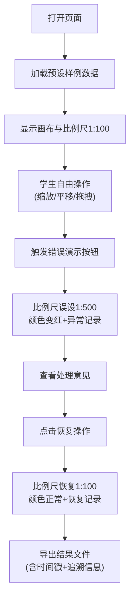

## 1. 产品概述

水族馆展缸平面排布教学工具 - 通过交互式地图编辑演示比例尺错用等常见错误，帮助学生理解空间规划中的数据规范问题。以真实的"旧表补录"场景为载体，展示颜色规则、操作记录追溯等专业工作方法。

## 2. 核心功能

### 2.1 用户角色
| 角色 | 注册方式 | 核心权限 |
|------|----------|----------|
| 学生用户 | 无需注册，浏览器直接访问 | 体验完整演示流程、操作画布、查看处理记录、导出结果 |
| 教师用户 | 无需注册 | 可重置演示、查看完整追溯链路 |

### 2.2 功能模块
1. **主画布页**：SVG交互式画布、展缸排布、比例尺显示、网格吸附
2. **操作记录面板**：缩放、平移、吸附操作共享同一批记录
3. **样例演示向导**：预置样例数据、错误操作演示、错误恢复演示
4. **颜色规则说明**：异常标注、处理意见、可追溯链路
5. **导出模块**：带时间戳的文件命名、友好说明文案、异常追溯信息

### 2.3 页面详情
| 页面名称 | 模块名称 | 功能描述 |
|---------|----------|----------|
| 主画布页 | 工具栏 | 缩放按钮、平移切换、网格吸附开关、重置、导出 |
| 主画布页 | SVG画布 | 展缸图形拖拽、比例尺参考线、背景网格、颜色标注 |
| 主画布页 | 左侧面板 | 样例列表、颜色规则说明、异常快速跳转 |
| 主画布页 | 底部面板 | 处理记录时间线、错误操作标记、恢复操作标记 |
| 导出预览 | 导出弹窗 | 文件名预览、内容摘要、下载按钮 |

## 3. 核心流程

用户打开页面 → 自动加载"海洋馆二楼展缸旧表"样例 → 查看比例尺标注（1:100）→ 拖拽展缸观察网格吸附 → 触发"错误操作"（比例尺误设为1:500）→ 观察颜色变化和异常提示 → 执行"恢复操作" → 查看完整处理记录 → 导出带追溯信息的结果文件

## 4. 用户界面设计

### 4.1 设计风格
- **主色调**：深海蓝 (#0F4C75) 作为主色，配合浅蓝渐变背景，营造水族馆氛围
- **强调色**：
  - 正常：墨绿 (#27AE60) - 表示合规
  - 警告：琥珀橙 (#F39C12) - 表示备注/补录
  - 错误：珊瑚红 (#E74C3C) - 表示比例尺错误/漏填
  - 恢复：薄荷绿 (#48C9B0) - 表示已修正
- **字体**：标题用 "ZCOOL QingKe HuangYou" 手写风格字体增加亲和力，正文用 "Noto Sans SC" 保证可读性
- **布局**：三栏布局 - 左侧规则面板、中间画布区、底部记录时间线
- **动效**：错误发生时红色边框脉冲动画，恢复时绿色扩散涟漪

### 4.2 页面设计概述
| 页面名称 | 模块名称 | UI元素 |
|---------|----------|--------|
| 主画布页 | 规则面板 | 颜色色块+说明卡片、可折叠、异常项高亮 |
| 主画布页 | SVG画布 | 网格背景、展缸矩形带标签、比例尺线段标注 |
| 主画布页 | 工具栏 | 悬浮圆角按钮组、图标+文字、hover阴影效果 |
| 主画布页 | 记录时间线 | 横向时间轴、节点带颜色标记、hover显示详情 |
| 导出弹窗 | 内容区 | 文件名（带时间戳）、内容摘要列表、追溯二维码 |

### 4.3 响应性
- 桌面端：三栏完整布局，画布区域自适应
- 平板端：左侧规则面板可折叠为图标栏
- 移动端：纵向堆叠，画布优先显示，面板改为底部抽屉

### 4.4 非3D场景
本项目为2D SVG交互场景，不涉及3D内容。
